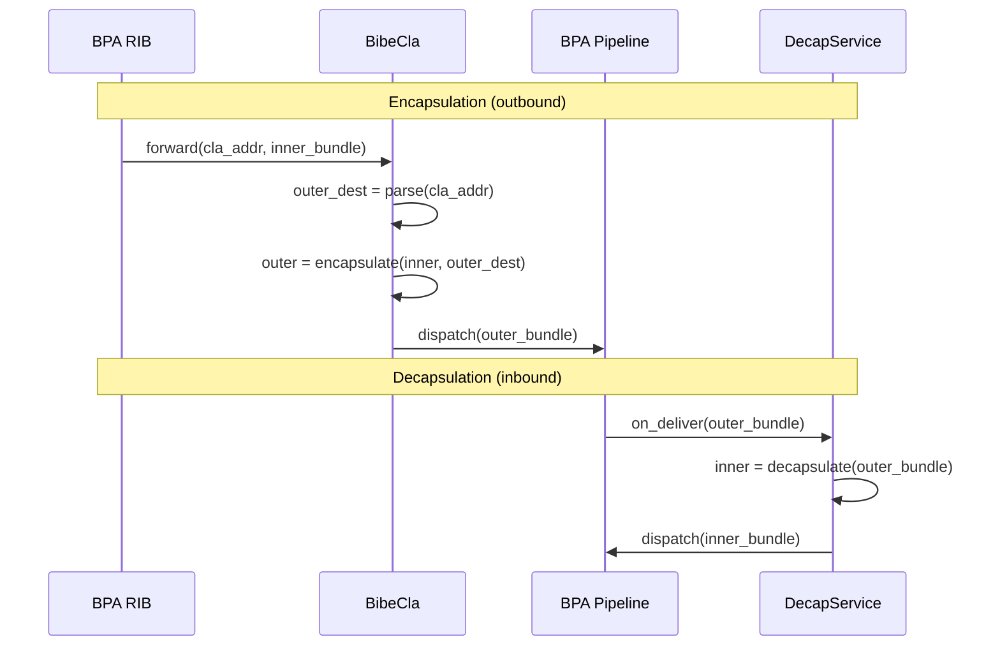
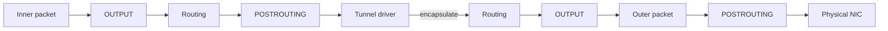
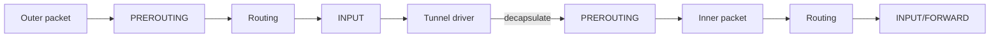
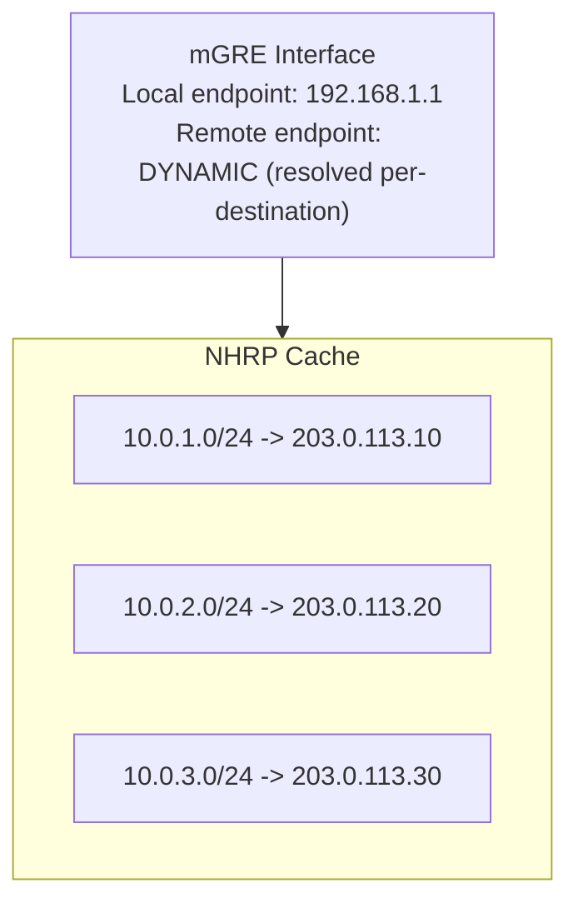
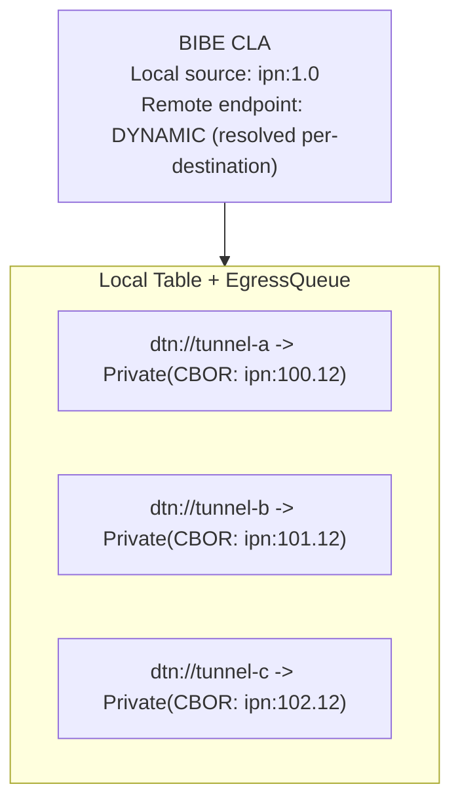

```mermaid
flowchart LR
    IB["Inner bundle"] --> Ingress1["Ingress"] --> Route1["Route"] --> Deliver1["Deliver"]
    Deliver1 -->|"Deliver filters"| EncapService
    EncapService -->|"encapsulate"| Dispatch1["CLA.dispatch()"]
    Dispatch1 --> Ingress2["Ingress"]
    Ingress2 --> OB["Outer bundle"]
    OB --> Route2["Route"] --> Egress1["Egress"] --> RealCLA["Real CLA"] --> Network
```

```mermaid
flowchart LR
    OB["Outer bundle"] --> Ingress1["Ingress"] --> Route1["Route"] --> Deliver1["Deliver"]
    Deliver1 -->|"Deliver filters"| DecapService
    DecapService -->|"decapsulate"| Dispatch1["CLA.dispatch()"]
    Dispatch1 --> Ingress2["Ingress"]
    Ingress2 --> IB["Inner bundle"]
    IB --> Route2["Route"] --> Out1["local delivery or forward"]
```

```mermaid
flowchart LR
    IB["Inner bundle"] --> Ingress1["Ingress"] --> Route1["Route"] --> Egress1["Egress"]
    Egress1 -->|"Egress filters"| Fwd["BibeCla.forward(cla_addr, bundle)"]
    Fwd -->|"encapsulate\n(parse cla_addr -> outer dest)"| Dispatch1["CLA.dispatch()"]
    Dispatch1 --> Ingress2["Ingress"]
    Ingress2 --> OB["Outer bundle"]
    OB --> Route2["Route"] --> Egress2["Egress"] --> RealCLA["Real CLA"] --> Network
```

# hardy-bibe Design

Bundle-in-Bundle Encapsulation (BIBE) for the Hardy BPA.

## Design Goals

- **Tunnel abstraction.** Provide transparent bundle tunneling - inner bundles traverse the tunnel without modification, and applications are unaware of encapsulation.

- **Correct filter semantics.** Ensure encapsulation triggers egress filters (forwarding path), not deliver filters. This matches how IP tunnel interfaces work and preserves filter semantics.

- **Standard routing integration.** Use the existing RIB and peer infrastructure rather than requiring new routing mechanisms. Tunnels should be configurable via standard `via` routes.

- **NHRP-like multipoint.** Support multiple tunnel destinations through a single CLA, analogous to Linux mGRE with NHRP resolution.

## Architecture Overview

BIBE uses a **hybrid architecture**: a CLA for encapsulation, a Service for decapsulation.



Encapsulation is triggered via `CLA.forward()` when the RIB routes a bundle to a virtual peer. Decapsulation occurs when outer bundles are delivered to the registered decap service endpoint.

## Key Design Decisions

### Hybrid Architecture (CLA + Service)

The hybrid architecture (CLA for encapsulation, Service for decapsulation) was chosen over a pure Service approach for several reasons:

1. **Correct filter behavior.** Encapsulation is forwarding, not delivery. Inner bundles on the encap path trigger Egress filters, matching IP tunnel semantics.

2. **Natural RIB integration.** Virtual peers integrate with existing local table infrastructure. No RIB changes required.

3. **Flexible routing.** Multiple tunnel destinations via virtual peers, not multiple service instances.

4. **Simpler registration.** One service (decap) + one CLA, instead of two services + one CLA.

A pure CLA approach was rejected because decapsulation requires receiving locally-destined bundles, which only Services can do.

### Virtual Peers for Tunnel Destinations

Each tunnel destination is registered as a "virtual peer" with the CLA. This mirrors how Linux handles multipoint GRE tunnels with NHRP/DMVPN:

| NHRP/DMVPN | BIBE Virtual Peers |
|------------|-------------------|
| mGRE interface | BIBE CLA |
| NHRP cache | Local table + EgressQueue |
| Protocol address → NBMA address | NodeId → ClaAddress::Private |
| `ip nhrp map 10.0.1.0/24 203.0.113.10` | `add_tunnel(dtn://tunnel1, ipn:100.12)` |

The BPA's local table serves the same role as NHRP - resolving "where I want to go" (Via Eid) to "where to encapsulate to" (ClaAddress).

Routes use standard `via` syntax:

```
# static_routes file
ipn:200.* via dtn://tunnel1
ipn:300.* via dtn://tunnel2
```

The tunnel destination is encoded in the peer's ClaAddress at registration time, not in the route.

### ClaAddress::Private for Tunnel Endpoints

Tunnel destinations are encoded as CBOR-serialized EIDs within `ClaAddress::Private`. This reuses the existing ClaAddress infrastructure without requiring new address types. The `forward()` implementation decodes the CBOR to determine the outer bundle's destination.

## Standards Compliance

- RFC 9171 Section 3.2 (bundles tunnelled through encapsulating bundles)
- draft-ietf-dtn-bibect (BIBE Convergence Layer)

## Integration

### With hardy-bpa

BIBE registers two components with the BPA:

- `BibeCla` registered as CLA named "bibe"
- `DecapService` registered at a configured service endpoint

Virtual peers are registered via `add_tunnel()` which calls `sink.add_peer()`.

### With hardy-bpa-server

hardy-bpa-server does not integrate BIBE: it has no `bibe` feature or configuration section. An embedder builds a `Bibe` from a `bibe::Config` (tunnel source, decap service id, tunnels) and calls `Bibe::register`.

---

## Appendix: Architecture Analysis

Two architectures were evaluated for BIBE. A pure CLA approach was also considered but found non-viable for decapsulation (CLAs cannot receive locally-destined bundles).

### Option A: Service+CLA (Not Selected)

**Components:**

- EncapService: Registered at encap endpoint (e.g., `ipn:1.10`)
- DecapService: Registered at decap endpoint (e.g., `ipn:1.11`)
- BibeCla: dispatch() only, forward() returns Error

**Encapsulation flow:**



**Decapsulation flow:**



**Characteristics:**

- Tunnel destination specified in service configuration
- Inner bundle on encap path triggers **Deliver** filters
- Two service registrations + one CLA registration
- Route config points to service EID, not CLA

---

### Option B: Hybrid (Selected)

**Components:**

- BibeCla: forward() does encapsulation, dispatch() injects result
- DecapService: Registered at decap endpoint (e.g., `ipn:100.12`)

**Encapsulation flow:**



**Decapsulation flow:**


**Characteristics:**

- Tunnel destination encoded in ClaAddress at peer registration
- Inner bundle on encap path triggers **Egress** filters
- One service registration + one CLA registration
- Route config uses standard `via` syntax (virtual peer resolves to CLA)

---

### Why Pure CLA Doesn't Work

A pure CLA approach (no services) was considered but is not viable:

1. **Decap requires local delivery**: Outer bundles are destined for a local endpoint
2. **CLAs don't receive local traffic**: `forward()` handles outgoing bundles only
3. **No interception mechanism**: Without a Service, there's no way to receive the outer bundle for decapsulation

The fundamental asymmetry:

- **Encap**: Outgoing path → CLA.forward() is natural
- **Decap**: Incoming path → requires local delivery, i.e., Service

---

## Comparison

| Aspect | Service+CLA | Hybrid |
|--------|-------------|--------|
| **Encap trigger** | Deliver to service | CLA.forward() |
| **Decap trigger** | Deliver to service | Deliver to service |
| **Tunnel dest config** | Service config | ClaAddress at peer registration |
| **Route config style** | `via ipn:1.10` | `via dtn://tunnel1` (virtual peer) |
| **Filters on encap** | **Deliver** filters | **Egress** filters |
| **Filters on decap** | Deliver filters | Deliver filters |
| **Registrations** | 2 Services + 1 CLA | 1 Service + 1 CLA |
| **Multiple tunnels** | Multiple service configs | Multiple virtual peers |

---

## Filter Behavior Analysis

### Which Filters Should Run on Encap?

The key architectural question is: what type of operation is encapsulation?

**Service+CLA interpretation**: Encap is "local delivery" to a tunnel service

- Inner bundle triggers **Deliver** filters
- The tunnel endpoint is treated as a local application

**Hybrid interpretation**: Encap is "forwarding" through a tunnel CLA

- Inner bundle triggers **Egress** filters
- The tunnel is treated as a convergence layer

### Linux Netfilter Analogy

Linux handles tunnel interfaces (GRE, IPIP, IPsec) with a clear model:

**Outgoing (encapsulation):**



- Inner packet goes through OUTPUT/POSTROUTING (egress path)
- NOT through INPUT (local delivery)
- Encapsulation is a forwarding operation, not delivery

**Incoming (decapsulation):**



- Outer packet goes through INPUT (local delivery to tunnel driver)
- Inner packet re-enters at PREROUTING (treated as new packet)
- Decapsulation endpoint IS a local delivery target

### Mapping to BIBE

| Linux Netfilter | BIBE Equivalent | Service+CLA | Hybrid |
|-----------------|-----------------|-------------|--------|
| OUTPUT/POSTROUTING (encap) | Egress filters | ✗ Deliver | ✓ Egress |
| INPUT (decap outer) | Deliver filters | ✓ Deliver | ✓ Deliver |
| PREROUTING (decap inner) | Ingress filters | ✓ Ingress | ✓ Ingress |

**Conclusion**: The hybrid approach matches Linux netfilter semantics for tunnel handling.

---

## Routing Flexibility

### Service+CLA: Static Tunnel Destination

Tunnel destination is fixed in service configuration (not shown). Routes point to service endpoints:

```
# static_routes file
# Each service instance has a fixed tunnel destination in its config

ipn:300.* via ipn:100.42    # To tunnel A (service configured for ipn:200.1)
ipn:400.* via ipn:100.43    # To tunnel B (service configured for ipn:200.2)
```

To support multiple tunnel destinations, you need multiple service instances, each with its own endpoint and configured destination.

### Hybrid: Multiple Tunnels via Virtual Peers

Register virtual peers at startup, then routes use standard `via` syntax:

```rust
// Register virtual peers (in bpa-server initialization)
bibe.add_tunnel(NodeId::new("dtn://tunnel-a"), Eid::new("ipn:200.12")).await?;
bibe.add_tunnel(NodeId::new("dtn://tunnel-b"), Eid::new("ipn:201.12")).await?;
bibe.add_tunnel(NodeId::new("dtn://tunnel-c"), Eid::new("ipn:202.12")).await?;
```

```
# static_routes file
# Routes point to virtual peers - tunnel destination is in ClaAddress

ipn:300.* via dtn://tunnel-a    # Tunnel to ipn:200.12
ipn:400.* via dtn://tunnel-b    # Tunnel to ipn:201.12
ipn:500.* via dtn://tunnel-c    # Tunnel to ipn:202.12
```

**Advantages of hybrid:**

- Standard `via` routing pattern
- Tunnel lifecycle = peer lifecycle
- Single CLA handles all tunnels
- NHRP-like resolution model (local table resolves NodeId → ClaAddress)

---

## Linux NHRP/DMVPN Parallel

The virtual peers approach closely mirrors how Linux handles multipoint GRE tunnels with NHRP (Next Hop Resolution Protocol), as used in DMVPN deployments.

### Point-to-Point vs Multipoint

**Point-to-point GRE**: One interface, one fixed remote endpoint

```bash
ip tunnel add gre1 mode gre local 192.168.1.1 remote 10.0.0.1
```

**Multipoint GRE (mGRE)**: One interface, many destinations via resolution

```bash
ip tunnel add mgre0 mode gre local 192.168.1.1  # No remote specified
```

With mGRE, the encapsulation destination is resolved per-packet using NHRP.

### NHRP Resolution Model



**Flow**: Route lookup → mGRE interface → NHRP resolution → encapsulate to resolved endpoint

### BIBE Virtual Peers Model



**Flow**: Route lookup → Via(Eid) → Local table resolution → encapsulate to resolved endpoint

### Mapping

| NHRP/DMVPN | BIBE Virtual Peers |
|------------|-------------------|
| mGRE interface | BIBE CLA |
| NHRP cache | Local table + EgressQueue |
| Protocol address | NodeId (Via target) |
| NBMA address | ClaAddress::Private |
| `ip nhrp map 10.0.1.0/24 203.0.113.10` | `add_tunnel(dtn://tunnel-a, ipn:100.12)` |

### Significance

This parallel validates the virtual peers approach:

1. **Established pattern**: Multipoint tunneling with address resolution is a proven model (DMVPN is widely deployed)

2. **Existing infrastructure**: The BPA's local table already serves the NHRP role - resolving "where I want to go" (Via Eid) to "where to encapsulate" (ClaAddress)

3. **Not a workaround**: Virtual peers isn't a hack to work around RIB limitations - it's the architecturally correct pattern for multipoint tunneling

4. **Future extensibility**: Like NHRP can learn mappings dynamically, BIBE could potentially support dynamic tunnel discovery in the future

---

## Data Flow: Complete Example

### Encapsulation

```
1. Application sends bundle:
   - Source: ipn:1.5
   - Destination: ipn:200.1
   - Payload: "Hello"

2. BPA routes bundle:
   - Pattern "ipn:200.*" matches
   - Route: Via(dtn://tunnel1)
   - Local table: dtn://tunnel1 → Forward(bibe_peer_id)

3. Bundle queued to BIBE peer's EgressQueue
   - EgressQueue has ClaAddress::Private(<CBOR-encoded ipn:100.12>)

4. Egress filters run on inner bundle

5. BibeCla.forward(queue, cla_addr, inner_bundle):
   - Decode CBOR from ClaAddress → outer destination = ipn:100.12
   - Build outer bundle:
     - Source: ipn:1.0 (tunnel source)
     - Destination: ipn:100.12
     - Payload: BIBE-PDU [0, 0, 0, inner_bundle_bytes]
   - Call dispatch(outer_bundle)

6. Outer bundle enters BPA via Ingress:
   - Ingress filters run on outer bundle

7. BPA routes outer bundle:
   - Pattern "ipn:100.*" matches
   - Route: Via(ipn:100) → tcpclv4 peer
   - Local table resolves to tcpclv4 peer_id

8. Egress filters run on outer bundle

9. tcpclv4.forward(queue, addr, outer_bundle):
   - Transmitted over TCP to node 100 at 10.0.0.1:4556
```

### Decapsulation (at node 100)

```
1. Outer bundle arrives via tcpclv4:
   - Source: ipn:1.0 (tunnel source from sender)
   - Destination: ipn:100.12
   - Payload: BIBE-PDU [0, 0, 0, inner_bundle_bytes]

2. Ingress filters run on outer bundle

3. BPA routes outer bundle:
   - Destination ipn:100.12 is local service
   - Deliver to DecapService

4. Deliver filters run on outer bundle

5. DecapService.on_deliver(outer_bundle):
   - Parse outer bundle
   - Extract payload → BIBE-PDU [transmission-id, total-length, offset, segment]
   - For complete bundles (all zeros): extract inner bundle bytes from segment
   - Zero-copy slice of inner bundle
   - Call cla.dispatch(inner_bundle)

6. Inner bundle enters BPA via Ingress:
   - Ingress filters run on inner bundle
   - origin CLA = "bibe" (identifies tunnel traffic)

7. BPA routes inner bundle:
   - Destination: ipn:200.1
   - Route to local service or forward as appropriate
```

---

## Security Considerations

### BPSec Handling

**BIBE does not apply BPSec directly.** Security is handled by the BPA:

- **Inner bundle BPSec**: Preserved as-is (inner bundle is opaque payload)
- **Outer bundle BPSec**: A matter for the BPA's fixed BPSec machinery at the egress boundary — designed but not yet built, so the BPA signs and encrypts nothing on the way out today — and never a registered filter: Egress Rewriters cannot create or edit BIBs or BCBs (see the bpa crate's [Filter Subsystem Design](../../bpa/docs/filter_subsystem_design.md#bpsec-roles-at-the-boundaries))

This separation allows:

- End-to-end security on inner bundle (source to final destination)
- Hop-by-hop security on outer bundle (tunnel endpoints)

### Filter Identification

Filters can identify tunnel traffic:

```rust
// In a filter (`metadata` is the bundle's `BundleMetadata`)
if let Origin::Ingress { cla, .. } = metadata.origin()
    && &**cla == "bibe"
{
    // This bundle came from BIBE decapsulation
}
```

This allows policies like:

- Skip certain filters for tunnel traffic
- Apply additional validation to decapsulated bundles
- Log tunnel traffic separately

### Trust Model

- Inner bundle source is **not verified by BIBE** - it's opaque payload
- Outer bundle source is the tunnel endpoint (verified by Ingress filters/BPSec)
- Inner bundle authenticity relies on inner bundle's own BPSec (if present)

---

## Bundle Format

### BIBE-PDU

The outer bundle payload is a BIBE-PDU, a 4-element CBOR array:

```cbor
BIBE-PDU = [
  transmission-id: positive CBOR int,
  total-length: positive CBOR int,
  segmented-offset: positive CBOR int,
  encapsulated-bundle-segment: definite-length CBOR byte string,
]
```

For complete (non-segmented) bundles, `transmission-id`, `total-length`, and `segmented-offset` are all set to zero. This adds 3 bytes overhead but simplifies processing since BIBE-PDU is always a 4-element array, and enables future segmentation support.

A PDU with any non-zero field is a segment of a larger bundle. Until segmentation is implemented, the decapsulation service rejects such PDUs rather than dispatch a partial bundle as if it were complete.

**Example (complete bundle):**

```cbor
[0, 0, 0, h'<inner-bundle-bytes>']
```

**Future segmentation support:**
When segmentation is implemented, the fields will be used as follows:

- `transmission-id`: Unique identifier for reassembly
- `total-length`: Total length of the original bundle
- `segmented-offset`: Byte offset of this segment within the original bundle

### Outer Bundle Flags

- `is_admin_record`: false (BIBE bundles are not administrative records)
- Other flags: the `Builder` defaults; only the lifetime is inherited from the inner bundle

---

## Future Work

1. **Fragmentation handling**: What if outer bundle exceeds path MTU?
2. **Status report generation**: Tunnel-level failure reports
3. **Multi-hop tunnels**: Nested encapsulation
4. **Tunnel metrics**: Performance monitoring

---

## Appendix: Rejected Alternatives

### Pure CLA (No Services)

Rejected because decapsulation requires receiving locally-destined bundles, which only Services can do. CLAs handle outgoing traffic via `forward()`.

### Service-Only (No CLA)

Would require using ServiceSink.send() for injecting processed bundles. This works but:

- send() is for bundles originating from the service
- dispatch() (CLA) is semantically correct for bundles entering from "outside"
- CLA ingress records the receiving CLA (`Origin::Ingress { cla, .. }`) for filter identification
