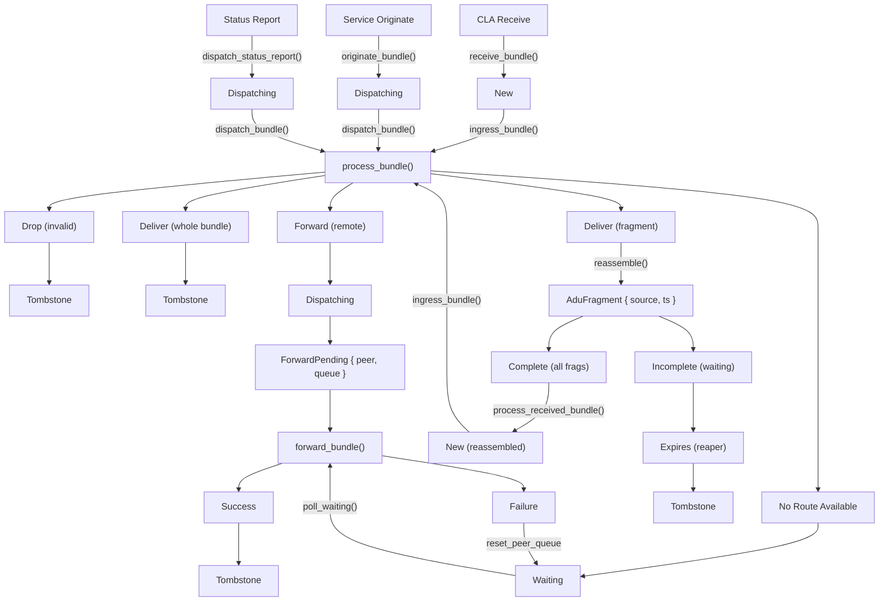

# Bundle Processing State Machine Design

This document describes the bundle processing state machine in the BPA dispatcher, which tracks bundles as they transit through the processing pipeline using `metadata::BundleStatus`.

## Related Documents

- **[Routing Design](routing_subsystem_design.md)**: RIB lookup and forwarding decisions in `process_bundle()`
- **[Filter Subsystem Design](filter_subsystem_design.md)**: Filter hooks that run at various state transitions
- **[Policy Subsystem Design](policy_subsystem_design.md)**: Queue assignment in `ForwardPending` status
- **[Storage Subsystem Design](storage_subsystem_design.md)**: Bundle persistence and crash recovery mechanisms

## Overview

The dispatcher implements a state machine that governs bundle lifecycle from ingress to final disposition. Bundle state is persisted via the metadata storage backend, enabling crash recovery and resumption of in-flight bundles.

## Bundle States

The `BundleStatus` enum (defined in `bpa/src/metadata.rs`) defines all possible states:

| State | Description |
|-------|-------------|
| `New` | Initial state when bundle is first received and stored |
| `Dispatching` | Bundle queued in dispatch queue awaiting processing |
| `ForwardPending { peer, queue }` | Bundle waiting to be forwarded via a specific CLA peer |
| `AduFragment { source, timestamp }` | Fragment awaiting reassembly with other fragments |
| `Waiting` | Bundle awaiting routing opportunity (no current route available) |
| `WaitingForService { source }` | Status report (or similar) awaiting registration of the originating service |

## State Transition Diagram



## Detailed State Transitions

### Phase 1: Bundle Ingestion

**Entry Point:** `receive_bundle()` (`ingress.rs`)

1. Bundle received from CLA
2. `process_received_bundle()` handles validation and storage:
   - CBOR pre-check (reject empty, BPv6, non-array data)
   - `RewrittenBundle::parse()` with full processing (block removal, canonicalization, BPSec)
   - Bundle data stored (or replaced if reassembly pre-saved it)
   - Invalid bundles dropped with status report where possible — errors are **not** returned to the CLA
   - Metadata inserted with status **`New`**
3. `ingress_bundle()` runs the Ingress filter and routes

**Origination Entry Point:** `originate_bundle()` (`local.rs`)

1. Service creates bundle via Builder or CheckedBundle
2. **Originate Filter Hook** runs in-memory (may drop)
3. Bundle stored with status **`Dispatching`** (skips Ingress filter)
4. `dispatch_bundle()` queues directly for routing

**Reassembly Entry Point:** `reassemble()` (`reassemble.rs`)

1. ADU fragments collected and reassembled
2. `process_received_bundle()` re-parses with full processing
3. `ingress_bundle()` runs the Ingress filter and routes (via `Box::pin` to break async recursion)

**Ingress Processing:** `ingress_bundle()` (`ingress.rs`)

- **Ingress Filter Hook** execution (may drop bundle) — see [Filter Subsystem Design](filter_subsystem_design.md)
- Persist any filter mutations (crash-safe ordering)
- Checkpoint: status transitions to `Dispatching`
- Proceeds to `process_bundle()`

### Phase 2: Routing Decision

**Router:** `process_bundle()` (`dispatch.rs`)

The routing lookup determines the next state. See [Routing Design](routing_subsystem_design.md) for details on the RIB lookup algorithm and peer resolution.

| Route Result | Action | State Transition |
|--------------|--------|------------------|
| Drop | Bundle invalid/rejected | `Dispatching` → Tombstone |
| Admin Endpoint | Administrative handling (or `WaitingForService` if target service not registered) | `Dispatching` → Tombstone or `WaitingForService` |
| Local Delivery (no fragments) | Deliver to service | `Dispatching` → Tombstone |
| Local Delivery (fragments) | Fragment reassembly | `Dispatching` → `AduFragment` |
| Forward to CLA Peer | Queue for forwarding | `Dispatching` → `ForwardPending` |
| No Route Available | Wait for route | `Dispatching` → `Waiting` |

Note: Bundle enters `process_bundle()` in `Dispatching` status after the Ingress filter checkpoint.

### Phase 3: Forwarding Pipeline

See [Routing Design](routing_subsystem_design.md) for details on peer table structure and queue assignment.

**Dispatch Queue:** `dispatch_bundle()` (`dispatch.rs`)

- Bundle already in **`Dispatching`** status (from Ingress checkpoint)
- Bundle sent to dispatch queue channel

**CLA Peer Queue:** (`cla/peers.rs`)

- Status transitions to **`ForwardPending { peer, queue }`**
- Bundle enters CLA-specific priority queue (see [Routing Design: Queue Assignment](routing_subsystem_design.md#queue-assignment))

**Forward Execution:** `forward_bundle()` (`forward.rs`)

1. Load bundle data from store
2. Update extension blocks (Hop Count, Previous Node, Bundle Age)
3. **Egress Filter Hook** execution — see [Filter Subsystem Design](filter_subsystem_design.md)
4. Pass to CLA for transmission

| Result | Action | State Transition |
|--------|--------|------------------|
| Success | Bundle forwarded | `ForwardPending` → Tombstone |
| Failure (No Neighbor) | Re-queue for routing | `ForwardPending` → `Waiting` |

### Phase 4: Fragment Reassembly

**Reassembly:** `reassemble()` (`reassemble.rs`)

- Status transitions to **`AduFragment { source, timestamp }`**
- Fragment collected in ADU reassembly store
- Monitored by `poll_adu_fragments()`

| Condition | Action | State Transition |
|-----------|--------|------------------|
| All fragments received | Reassemble and run full receive pipeline | `AduFragment` → `New` (new bundle) |
| Fragments incomplete | Wait for more fragments | Remains `AduFragment` |
| Lifetime expired | Drop all fragments | `AduFragment` → Tombstone |

When all fragments arrive, the reassembled data is re-parsed via `process_received_bundle()` using `RewrittenBundle::parse()` (Full mode) to apply block removal, canonicalization, and BPSec validation. The reassembled bundle then runs the Ingress filter via `ingress_bundle()` (using `Box::pin` to break the recursive async type cycle).

### Phase 5: Waiting State

**Wait Monitoring:** `poll_waiting()` (`dispatch.rs`)

- Bundles in `Waiting` state periodically re-evaluated
- When route becomes available: `Waiting` → `Dispatching`
- If lifetime expires: `Waiting` → Tombstone

### Phase 6: WaitingForService State

**Entry:** `administrative_bundle()` (`admin.rs`) — when a status report (or other admin bundle) targets a service that is not yet registered, the bundle is set to `WaitingForService { source: report.bundle_id.source }`, persisted, and watched.

**Wait Monitoring:** `poll_service_waiting()` (`dispatcher/mod.rs`) — when a service registers, the service registry calls `poll_service_waiting(&service_id)`; matching bundles are loaded and re-dispatched via `dispatch_bundle()`, so the status report is delivered or re-queued.

| Condition | Action | State Transition |
|-----------|--------|------------------|
| Service registers | Re-dispatch bundle | `WaitingForService` → deliver or re-queue |
| Lifetime expires | Reaper drops bundle | `WaitingForService` → Tombstone |

## Persistence Points

Bundle state is persisted at these critical moments:

| Location | Status After | Function |
|----------|--------------|----------|
| CLA ingress storage | `New` | `process_received_bundle()` |
| After Ingress filter | `Dispatching` | `ingress_bundle()` |
| Originated bundle storage | `Dispatching` | `originate_bundle()` |
| Waiting state | `Waiting` | `process_bundle()` |
| Status report, service not registered | `WaitingForService` | `administrative_bundle()` |
| CLA queue entry | `ForwardPending` | `Sender::send()` |
| Fragment accumulation | `AduFragment` | `adu_reassemble()` |
| Filter mutations | Various | `ingress_bundle()` |

## Error Handling and Recovery

### Lifetime Expiration

**Monitor:** Reaper Task (`reaper.rs`)

- Maintains ordered cache of bundles by expiry time
- Triggers `drop_bundle(bundle, ReasonCode::LifetimeExpired)`
- Applies to all states except bundles being actively processed

### Hop Count Exceeded

**Check:** `ingress_bundle()` (`ingress.rs`) via Ingress filter

- Validates hop count during ingress
- Triggers `drop_bundle(bundle, ReasonCode::HopLimitExceeded)`

### Data Loss During Processing

**Detection:** Various locations

- `load_data()` fails (data missing from storage)
- Action: `drop_bundle(bundle, None)` (silent deletion)

### Duplicate Bundle Detection

**Point 1:** CLA receive (`ingress.rs`)

- `store.insert_metadata()` returns false in `process_received_bundle()`
- Duplicate discarded without further processing

**Point 2:** Restart recovery (`restart.rs`)

- Bundle already in metadata store
- Spurious copy deleted

### CLA Forwarding Failures

**Location:** `forward_bundle()` (`forward.rs`)

- `reset_peer_queue(peer)` called
- All `ForwardPending { peer, _ }` bundles transition to `Waiting`
- Bundles re-evaluated by `poll_waiting()`

### Fragment Reassembly Failures

**Location:** `reassemble()` (`reassemble.rs`)

- Reassembled data runs through `process_received_bundle()` which handles parse failures internally (logs, drops, generates status report where possible)
- If reassembly itself fails (corrupt/misaligned fragments), fragments are cleaned up by `adu_reassemble()`

## Channel-Based Status Management

The dispatcher uses channels with embedded status for efficient state tracking. Each channel is configured with an expected `BundleStatus`, and bundles are automatically transitioned to that status when sent through the channel. This provides implicit persistence checkpoints without explicit status management at each call site.

See `src/storage/channel.rs` for the `ChannelShared` implementation.

**Channel Types:**

| Channel | Status | Consumer |
|---------|--------|----------|
| Dispatch Queue | `Dispatching` | `run_dispatch_queue()` |
| CLA Peer Queues | `ForwardPending { peer, queue }` | CLA peer handlers |

**Channel States:**

- **Open:** In-memory channel accepts direct sends (fast path)
- **Draining:** Channel full, draining from storage (slow path)
- **Congested:** New bundles arrived during drain
- **Closing:** Channel shutting down

## Recovery Architecture

### Dual Storage System

1. **Bundle Storage:** Binary blob data (configurable backend)
2. **Metadata Storage:** Bundle state + references (configurable backend)

### Recovery Process (`recover.rs`)

1. `start_metadata_storage_recovery()` — Backend preparation (marks all entries unconfirmed)
2. `bundle_storage_recovery()` — Scan all bundle data
   - Each bundle validated with `ParsedBundle::parse()` (Preserve mode — integrity check only, no block removal or canonicalization)
   - `restart_bundle()` called per bundle to reconcile with metadata
3. `metadata_storage_recovery()` — Find unconfirmed metadata (data missing or deleted as junk)
   - Reports deletion with `DepletedStorage` reason code

### Restart Results

| Result | Condition | Action |
|--------|-----------|--------|
| Resumable | Data + metadata exist and match | Resume from checkpoint status |
| Orphan | Data exists, metadata missing | Full receive pipeline (`process_received_bundle` + `ingress_bundle`) |
| Duplicate | Extra copy of existing bundle | Delete spurious copy |
| Junk | Unparseable data | Delete data (orphaned metadata caught by phase 3) |

## Crash Safety Strategy

1. **Save data before metadata:** Ensures data not lost if metadata insert fails
2. **Save before delete:** Ensures old data preserved if new save fails
3. **Tombstone pattern:** Metadata tombstoned last to allow recovery
4. **Lazy expiry:** Expired bundles dropped during processing, not proactively

## Concurrency Model

### Task Pools

- `processing_pool` (BoundedTaskPool): Rate-limits parallel filter execution and dispatch queue consumers
- `tasks` (TaskPool): Dispatcher and storage maintenance tasks

Bundle ingress runs inline in the caller's context (no separate spawn). For CLA ingress, backpressure comes from the RpcProxy's handler pool. For dispatch queue consumers and recovery, from the dispatcher's processing pool spawns.

### Synchronization Primitives

- Bundle cache (LRU): Mutex-protected in-memory data
- Reaper cache: Mutex-protected expiry queue (BTreeSet)
- Metadata entries: Mutex-protected storage entries
- Channels: Bounded channels for producer/consumer

### Async Patterns

- `spawn!()` macro for task spawning
- `await` points for I/O operations
- `select_biased!()` for multi-branch waiting
- `Notify` for wakeup signals

## Filter Execution and Crash Safety

### Overview

The dispatcher supports filter hooks at various points in the bundle lifecycle. Filters can
inspect bundles (read-only) or mutate them (read-write). This section documents the crash
safety guarantees for filter execution.

For filter traits, registration API, and execution model, see [Filter Subsystem Design](filter_subsystem_design.md).

### Filter Hooks

| Hook | Location | Execution | Persistence |
|------|----------|-----------|-------------|
| **Ingress** | `ingress_bundle()` | Inline (caller context) | Always (checkpoint to `Dispatching`) |
| **Originate** | `run_originate_filter()` | Inline (caller context) | None (bundle stored after filter) |
| **Deliver** | `deliver_bundle()` | Inline (before delivery) | None (bundle dropped after) |
| **Egress** | `forward_bundle()` | Inline (after dequeue) | None (bundle leaving node) |

### Checkpoint Model

`BundleStatus` serves as a **checkpoint marker** for crash recovery. The status indicates
"processing up to this point is complete - on restart, resume from here."

```
┌─────────────────────────────────────────────────────────────────────────┐
│                         CHECKPOINT MODEL                                │
├─────────────────────────────────────────────────────────────────────────┤
│                                                                         │
│   CLA Ingress:                                                          │
│     [Receive] ──► [Status: New] ──► [Ingress Filter] ──►                │
│                    (checkpoint)                                         │
│     ──► [Status: Dispatching] ──► [process_bundle()] ──► [Next State]   │
│          (checkpoint)                                                   │
│                                                                         │
│   Service Origination:                                                  │
│     [Originate Filter] ──► [Status: Dispatching] ──► [process_bundle()] │
│                             (checkpoint, skips Ingress filter)          │
│                                                                         │
│   On restart:                                                           │
│     • Status=New        → Run Ingress filter, then route                │
│     • Status=Dispatching → Skip filters, go directly to routing         │
│                                                                         │
└─────────────────────────────────────────────────────────────────────────┘
```

### Ingress Filter Crash Safety

The Ingress filter runs inline within `ingress_bundle()` in the caller's context. For CLA
ingress, the caller is already running on the RpcProxy's `BoundedTaskPool`; for reassembly,
the caller is already running on the dispatcher's processing pool. This provides natural
backpressure without a separate spawn.

If a crash occurs during or after the Ingress filter but before the status changes, the
bundle would still be in `New` status. Without proper checkpointing, the Ingress filter
would re-run on restart, potentially applying mutations twice.

**Solution:** Transition to `Dispatching` immediately after Ingress filter completes, before calling `process_bundle()`. This checkpoint is always persisted, even if the filter made no mutations. If the filter modified bundle data, the new data is saved before the old is deleted (crash-safe ordering).

See `ingress_bundle()` in `src/dispatcher/ingress.rs` for implementation.

### Originate Filter Crash Safety

The Originate filter runs **synchronously** within `originate_bundle()`, which is called by
both `local_dispatch()` and `local_dispatch_raw()`. The filter operates on an **in-memory
bundle that has not yet been stored**. The caller is blocked waiting for the result.

This design provides clean crash semantics:

- **Crash before/during filter:** Nothing persisted, caller sees failure, can retry
- **Crash after filter but before store:** Nothing persisted, caller sees failure, can retry
- **Crash after store:** Bundle is in system with `Dispatching` status, routing resumes on restart

No checkpoint is needed because:

1. The bundle isn't stored until after the filter passes
2. The caller handles retry semantics
3. Originated bundles store with `Dispatching` status, so restart skips the Ingress filter entirely

The `originate_bundle()` function in `src/dispatcher/local.rs` implements this pattern:

1. Wrap bundle with initial metadata and **`Dispatching`** status (in-memory only)
2. Run Originate filter (may modify metadata like flow_label)
3. Store bundle and metadata atomically
4. Queue directly for routing via `dispatch_bundle()` (Ingress filter is skipped)

The `local_dispatch()` wrapper handles timestamp collisions by retrying with a new timestamp, while `local_dispatch_raw()` uses a fixed bundle ID without retry.

### Deliver Filter Crash Safety

The Deliver filter runs immediately before local delivery, after which the bundle is dropped.
No persistence is needed because:

1. The bundle is about to be deleted anyway
2. If crash occurs, the bundle will be re-processed from its last checkpoint
3. Re-running the Deliver filter is acceptable (idempotent delivery assumed)

See `deliver_bundle()` in `src/dispatcher/local.rs` for implementation.

### Restart Behavior

On restart, `restart_bundle()` examines the bundle status to determine where to resume:

| Status | Recovery Action |
|--------|-----------------|
| `New` | Run `ingress_bundle()` → Ingress filter → routing (CLA-received bundles only) |
| `Dispatching` | Skip filters, run `process_bundle()` directly |
| `ForwardPending` | Re-queue for CLA transmission |
| `Waiting` | Re-add to waiting pool for route polling |
| `WaitingForService` | Re-dispatch so status report is re-evaluated (deliver or re-queue) |
| `AduFragment` | Re-add to fragment reassembly |

### Why No Originate Checkpoint?

Originated bundles don't need a separate checkpoint state because:

1. **Delayed persistence:** The bundle isn't stored until after the Originate filter passes
2. **Caller handles failure:** If crash before store completes, caller gets no response and can retry
3. **Single persist operation:** Filter-modified metadata is preserved in the single `store()` call
4. **Direct to Dispatching:** Originated bundles store with `Dispatching` status and queue directly
   for routing via `dispatch_bundle()`, skipping the Ingress filter entirely

The transaction boundary for originated bundles is:

- Caller gets `Ok(bundle_id)` → Bundle stored with `Dispatching` status and queued for routing
- Caller gets `Err` or crash → Nothing persisted, caller can retry

## Notes

- Fragment reassembly creates a new bundle with fresh `New` status (re-parsed with `RewrittenBundle::parse()` in full mode)
- The reaper monitors all bundles except those in active `New` processing
- Channel status management provides automatic persistence on queue transitions
