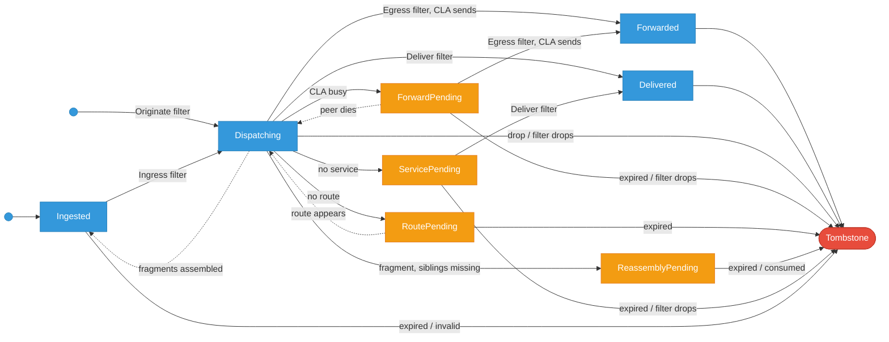

# Bundle State Machine Design

This document defines the bundle state machine, the states a bundle can be in, the transitions between them, and the crash recovery semantics.

## Related Documents

- **[Storage Subsystem Design](storage_subsystem_design.md)**: Persistence model for bundle state
- **[Filter Subsystem Design](filter_subsystem_design.md)**: Filter hooks and checkpoint ordering

## Problems with the current implementation

### 1. No transition validation

Any code can assign any state:

```rust
bundle.metadata.status = BundleStatus::Dispatching;
```

There is no check that the bundle was in a valid source state.

### 2. Persistence is a separate call

After changing the status field, the caller must remember to persist:

```rust
bundle.metadata.status = BundleStatus::Waiting;
self.store.update_status(&mut bundle, &BundleStatus::Waiting).await;
```

If the persistence call is forgotten, in-memory state and storage diverge.

### 3. State transitions in the wrong layer

The storage layer (`channel::Sender`) performs state transitions. `channel::Sender::send()` auto-updates the bundle status to the channel's target state. State machine logic belongs in the dispatcher, not in storage plumbing.

### 4. Inconsistent naming

The enum is `BundleStatus` but represents processing state, not protocol status. Variant names mix tenses (`New`, `Dispatching`, `Waiting`, `ForwardPending`).

### 5. Missing outcome states

The current design goes directly from `Dispatching`/`ForwardPending` to tombstone without a checkpoint. A crash after CLA transmission or local delivery but before tombstoning causes duplicate sends or deliveries on recovery.

### 6. Unnecessary re-processing

`RoutePending` bypasses `Dispatching` and duplicates the dispatch fan-out. `ServicePending` re-runs the Ingress filter on bundles that already passed it.

## State machine

### States

Rename `BundleStatus` to `BundleState`.

**Hot path**, the states every transit bundle follows:

| State         | Situation                                 | Recovery                     |
| ------------- | ----------------------------------------- | ---------------------------- |
| `Ingested`    | Entered system, stored but unprocessed    | Re-run ingestion             |
| `Dispatching` | Ingress filter passed, undergoing routing | Skip ingress, re-route       |
| `Forwarded`   | CLA confirmed transmission                | Tombstone (don't re-send)    |
| `Delivered`   | Local service received payload            | Tombstone (don't re-deliver) |
| `Tombstone`   | Consumed / deleted (terminal)             | -                            |

**Waiting for event**, bundle idle, waiting for an external condition:

| State                              | Waiting for          | Resolves to                              |
| ---------------------------------- | -------------------- | ---------------------------------------- |
| `ForwardPending { peer, queue }`   | CLA ready to send    | `Forwarded` (send)                       |
| `RoutePending`                     | Route in RIB         | RIB result (no persist to `Dispatching`) |
| `ReassemblyPending { source, ts }` | Sibling fragments    | `Tombstone` (consumed)                   |
| `ServicePending { service }`       | Service registration | `Delivered` (deliver directly)           |

With custody transfer enabled, `Forwarded` and `Delivered` become durable states. The bundle stays until a custody acknowledgment arrives.

```rust
pub enum BundleState {
    // Hot path
    Ingested,
    Dispatching,
    Forwarded,
    Delivered,

    // Waiting for event
    ForwardPending { peer: u32, queue: Option<u32> },
    RoutePending,
    ReassemblyPending { source: Eid, timestamp: CreationTimestamp },
    ServicePending { service: Eid },
}
```

### Transition graph



> **Legend**: :blue_circle: hot path, :orange_circle: waiting for event, :red_circle: terminal. Solid arrows = forward transitions. Dotted arrows = re-entry into dispatch logic (no persist).

### Filter hooks

Four filter hooks, each on a specific edge:

- **Originate**: `→ Dispatching` (local bundles only, skips `Ingested` and Ingress)
- **Ingress**: `Ingested → Dispatching` (CLA bundles only)
- **Egress**: at send time. `Dispatching → Forwarded` and `ForwardPending → Forwarded` (always fresh, runs with extension block updates)
- **Deliver**: `Dispatching → Delivered` and `ServicePending → Delivered`

Any filter can drop the bundle → `Tombstone`.

**Originate crash safety**: the Originate filter runs in-memory on a bundle that has not yet been stored. No checkpoint is needed. Crash before store = nothing persisted, caller retries. Crash after store = bundle enters `Dispatching` directly.

### Edges

- **Ingested → Dispatching**: validate lifetime, validate hop count, run Ingress filter, persist checkpoint
- **Ingested → Tombstone**: expired, hop limit exceeded, or Ingress filter drops
- **Dispatching → Forwarded**: RIB lookup returns `Forward(peer)`, CLA available. Run Egress filter, update extension blocks (Previous Node, Hop Count, Bundle Age), CLA transmits, persist checkpoint
- **Dispatching → ForwardPending**: RIB lookup returns `Forward(peer)` but CLA is busy or peer not connected. Bundle queued, no filter yet
- **Dispatching → RoutePending**: RIB lookup returns no route, bundle watched for expiry
- **Dispatching → ReassemblyPending**: RIB lookup returns `Deliver` and bundle is a fragment, siblings still missing
- **Dispatching → Ingested** (reassembly): RIB lookup returns `Deliver`, bundle is a fragment, all siblings present. Reassemble, waiting fragments tombstoned, reassembled whole enters as new `Ingested`
- **Dispatching → ServicePending**: RIB lookup returns `AdminEndpoint` but target service not registered
- **Dispatching → Delivered**: RIB returns `Deliver` (whole bundle), run Deliver filter, payload to local service, persist checkpoint
- **Dispatching → Tombstone**: RIB returns `Drop`, or admin record delivered, or filter drops
- **ForwardPending → Forwarded**: CLA becomes available. Run Egress filter, update extension blocks, CLA transmits
- **ForwardPending → Dispatching**: peer dies, re-enter dispatch for new RIB lookup (may find alternate route)
- **ForwardPending → Tombstone**: expired, or Egress filter drops
- **Forwarded → Tombstone**: delete data, tombstone metadata (immediate without custody, on custody ack with custody transfer)
- **Delivered → Tombstone**: delete data, tombstone metadata
- **RoutePending → Dispatching** (logical, no persist): `poll_waiting()` picks up bundle when RIB changes, runs RIB lookup and transitions directly to the outcome. Bundle stays `RoutePending` in storage until the outcome is persisted. Crash recovers to `RoutePending`
- **ReassemblyPending → Tombstone**: fragment expires while waiting, or consumed when a later fragment completes the set
- **ServicePending → Delivered**: target service registers, run Deliver filter, payload to service. No dispatch needed, service is already known
- **ServicePending → Tombstone**: expired, or Deliver filter drops

### Hot path persists

| Persist | Operation                                | Checkpoint                          |
| ------- | ---------------------------------------- | ----------------------------------- |
| 1       | `save_data()`                            | Bundle bytes stored                 |
| 2       | `insert_metadata()`                      | Bundle tracked (Ingested)           |
| 3       | `update_metadata()`                      | Ingress filter passed (Dispatching) |
| 4       | `update_status()`                        | Forwarded or Delivered              |
| 5       | `delete_data()` + `tombstone_metadata()` | Bundle consumed                     |

5 storage round-trips per bundle on the hot path.

### Performance considerations

Possible reductions to the 5 hot-path persists:

- **Combine persists 1+2** (save data + insert metadata): single transaction in PostgreSQL; parallel I/O for localdisk+SQLite
- **Skip persist 3** (Dispatching checkpoint): accept re-running ingress filter on crash. Saves one persist if ingress filter is cheap
- **Async persist 5** (cleanup): `Forwarded`/`Delivered` → `Tombstone` in a background sweep instead of inline. The bundle is "done" at persist 4
- **Skip persist 4** (Forwarded/Delivered): accept duplicate sends/delivers on crash. Only viable without custody transfer

Best case: 3 persists (store, outcome, async cleanup) or 2 inline (store, outcome) with background cleanup.

Event state re-entry skips persists:
- `RoutePending` and `ForwardPending` (peer dies) re-enter dispatch logic without persisting `Dispatching`. On crash they recover to their event state and re-poll
- `ForwardPending → Forwarded` and `ServicePending → Delivered` resolve directly to their outcome. Routing decision already made, no re-dispatch

### Crash safety

The `Forwarded` checkpoint narrows but cannot eliminate the duplicate
window:

1. `CLA.forward()`, data sent to peer
2. Persist `Forwarded`
3. Delete data + tombstone

A crash between steps 1 and 2 leaves the bundle in `Dispatching`, recovery re-sends, duplicate. This is inherent (CLA send + persist cannot be atomic without 2PC). DTN receivers must deduplicate regardless.

With custody transfer, `Forwarded` becomes a durable state. The bundle stays until a custody acknowledgment arrives.

#### Persistence ordering

- Save data before metadata: ensures data is not lost if metadata insert fails
- Save before delete: ensures old data is preserved if new save fails
- Tombstone last: metadata tombstoned after data deleted, allows recovery

#### Recovery behavior

On restart, `restart_bundle()` examines the persisted state to determine where to resume:

| State | Recovery action |
|-------|-----------------|
| `Ingested` | Re-run ingestion (validate, Ingress filter) |
| `Dispatching` | Skip ingress, re-route via `process_bundle()` |
| `Forwarded` | Tombstone immediately (already sent, don't re-send) |
| `Delivered` | Tombstone immediately (already delivered, don't re-deliver) |
| `ForwardPending` | Re-queue for CLA peer transmission |
| `RoutePending` | Resume `poll_waiting()` |
| `ReassemblyPending` | Resume reassembly polling |
| `ServicePending` | Deliver when service becomes available |

Bundle data found on disk without matching metadata is treated as an orphan and re-ingested. Metadata without matching data is reported as depleted storage. Unparseable data is deleted as junk.

### Open questions

- **CLA try-send API**: the hot path (`Dispatching → Forwarded`) requires the CLA to attempt a send and report success/busy synchronously. The current code always queues via `ForwardPending`. A try-send API is needed to skip the queue when the CLA is idle
- **Fragment duplicate detection**: the reassembled bundle reuses the original (pre-fragmentation) bundle ID. If that ID already exists as a tombstone, the metadata store rejects it. Reassembly must check for this
- **Bulk re-dispatch on peer death**: when a peer dies, all its `ForwardPending` bundles re-enter dispatch. The RIB must be updated before re-dispatch to avoid routing back to the dead peer

## Implementation

### Private state field

The `metadata.state` field is not public. External code reads through `bundle.state()` which returns `&BundleState`.

### Controlled construction

| Constructor                                   | Purpose                              | Persists |
| --------------------------------------------- | ------------------------------------ | -------- |
| `Bundle::try_new(bpv7, data, ingress, store)` | Bundle ingress (CLA or local)        | Yes      |
| `Bundle::draft(bpv7)`                         | Pre-filter path (originate, reports) | No       |
| `Bundle::recover(bpv7, metadata)`             | Crash recovery from storage          | No       |

### Channel behavior

The channel does not transition bundles. It asserts the bundle is already in the expected state. The caller transitions before sending.

### Implementation options

#### Option A: Transitions on Bundle

Transition methods live on `Bundle` and take `&Store`. Each method validates, applies, and persists in one call.

```rust
bundle.forward(&store, peer, queue).await?;
bundle.deliver(&store).await?;
```

**Pros:** One call per transition, impossible to forget persistence. Simple call sites.
**Cons:** Bundle depends on Store. Transition methods are async. Harder to unit test without a Store.

#### Option B: Pure state machine + Store applies

Transition validation lives on `BundleState` as pure functions (no I/O). The Store applies the validated transition and persists.

```rust
let next = bundle.state().forward(peer, queue)?;
store.apply(&mut bundle, next).await;
```

**Pros:** Bundle is a plain data type. State machine is pure logic, fully testable with unit tests.
**Cons:** Two calls per transition, caller can forget the second.

#### Option C: Dispatcher owns transitions

A `transitions.rs` in the dispatcher module holds methods that validate, apply, and persist.

```rust
self.transition_forward(&mut bundle, peer, queue).await?;
```

**Pros:** Bundle and Store stay decoupled. All transition logic in one place.
**Cons:** Transition methods on Dispatcher, not on the data they modify.

### Naming

| Old                               | New                              |
| --------------------------------- | -------------------------------- |
| `BundleStatus`                    | `BundleState`                    |
| `BundleStatus::New`               | `BundleState::Ingested`          |
| `BundleStatus::Dispatching`       | `BundleState::Dispatching`       |
| `BundleStatus::ForwardPending`    | `BundleState::ForwardPending`    |
| `BundleStatus::Waiting`           | `BundleState::RoutePending`      |
| `BundleStatus::AduFragment`       | `BundleState::ReassemblyPending` |
| `BundleStatus::WaitingForService` | `BundleState::ServicePending`    |
| - (new)                           | `BundleState::Forwarded`         |
| - (new)                           | `BundleState::Delivered`         |
| `metadata.status`                 | `metadata.state` (via accessor)  |

### Migration

1. Add the new `BundleState` enum and `state.rs`
2. Add backward-compatible alias `pub type BundleStatus = BundleState`
3. Migrate callers file by file (each PR compiles independently)
4. Remove the alias once all callers are migrated
5. Update storage backends (sqlite, postgres) enum names
6. Update test fixtures
