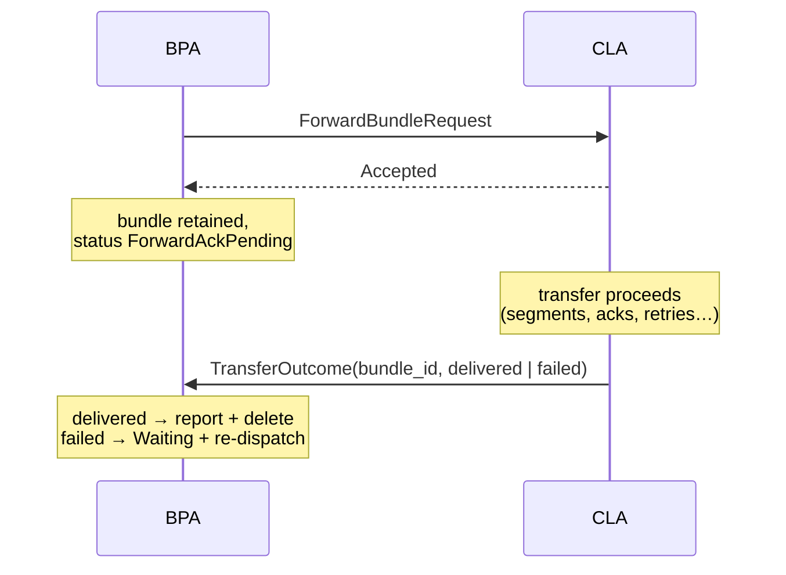

# CLA Deferred Transfer Outcomes — Design

**Status:** Draft for iteration

A backward-compatible extension to the BPA↔CLA contract letting a reliable CLA acknowledge a forward when it takes *ownership* of the bundle, and report the transfer's real outcome — delivered or failed — later, out-of-band. Motivated by `hardy-test-cla` (`docs/test-cla-design.md` §4.3) but a core interface capability: `tcpclv4` has the same problem today, and any reliable convergence layer will.

## Problem

The current contract is a single request/response exchange: `ForwardBundleRequest` → `Sent` | `NoNeighbour` | error. `Sent` is terminal — the dispatcher reports the bundle forwarded and deletes it immediately (`bpa/src/dispatcher/forward.rs`). This forces a reliable CLA into one of two bad positions:

- **Hold the call until the outcome is known.** This is what `tcpclv4` does: `forward` returns only after the peer's final `XFER_ACK` (`tcpclv4/src/session.rs`, `forward_to_peer`/`send_once`). But a pending call pins real resources — a slot in the BPA's bounded processing pool for the call's duration, and in the gRPC deployment a proxy handler permit from a pool hardcoded to `available_parallelism()` (`proto/src/proxy.rs`). At terrestrial RTT this is invisible; at high bandwidth-delay product, throughput collapses to pool-size-per-RTT. A channel emulator modelling Mars OWLT makes the collapse total, but a real long-fat link has the same shape.
- **Return `Sent` early.** The pools stay fluid, but the CLA has no way to say that an accepted transmission later failed: the BPA has already deleted the bundle. A late convergence-layer failure becomes silent end-to-end loss — against the store-and-forward doctrine that only explicit policy drops a bundle.

The missing piece is the signal every reliable convergence layer natively has (LTP session reports, TCPCLv4 transfer acks) expressed at the BPA interface: *an accepted transfer's outcome, reported when it is known, without holding a call open.*

## Design

Split acceptance from outcome:

- `ForwardBundleResult` gains an `Accepted` variant: the CLA has taken ownership of the bundle; the outcome follows. `Sent` and `NoNeighbour` keep today's terminal semantics — fire-and-forget CLAs (`file-cla`, unreliable links) are untouched, and deferral is a per-transfer choice made by the CLA.
- The `Sink` gains a transfer-outcome method: unsolicited, CLA→BPA, carrying the bundle ID and `Completed` or `Failed`.
- **The correlation key is the bundle ID** — the same `hardy_bpv7::bundle::Id` the Application trait already uses for status notifications and `cancel`, with the same `to_key()`/`from_key()` string encoding on the wire. No new identifier namespace is needed: RFC 9171 bundle IDs are globally unique (fragments included — offset and ADU length are part of the ID), and the BPA never has more than one transfer of a bundle outstanding, because a bundle in `ForwardAckPending` is not eligible for re-dispatch until its outcome resolves. `forward` passes the ID alongside the bundle bytes so the CLA can echo it back opaquely — no CLA ever parses a bundle to learn it.

Verdict timing doubles as flow control: a CLA at capacity simply withholds its next offer verdict. Because the BPA drives each peer queue with a single egress poller (`queue_architecture.md`), one withheld verdict pauses that peer's drain at the cost of a single pool slot — bounded, deliberate backpressure that leaves the queue in storage where it belongs — while every accepted transfer pipelines. Pipelining depth is thereby governed by the CLA's admission policy, with no BPA-side concurrency changes: the pathological hold this design removes is per-transfer × RTT, not the one-per-peer pause.

### Outcome semantics at the BPA

Every `Accepted` resolves in exactly one of four ways:

- **`Completed`** → what `Sent` does today: report forwarded, delete.
- **`Failed`** → the bundle is re-enqueued to Dispatch for a fresh routing decision; if dispatch finds nowhere to go, it parks in `Waiting` through the normal path. This is **per-bundle**, unlike the synchronous failure paths' whole-peer-queue reset: a deferred failure is bundle-scoped evidence about one transfer, not link-scoped evidence about the peer. It targets Dispatch rather than `Waiting` because `Waiting`'s semantic is "I tried to route and there was nowhere to go" (`queue_architecture.md`) — not this bundle's situation — and parking there would need the RIB gate fired, re-sweeping every waiting bundle for one failure. The mechanism is deliberately un-damped: retry pacing under repeated failure is a policy concern (the TestCla Q1 evidence feeds it), and the loop period has a natural floor in the convergence layer's failure-discovery latency.
- **CLA unregistration** (including gRPC stream teardown) → every unresolved transfer is outcome-unknown → `Waiting`, re-forwarded at the next opportunity.
- **Bundle lifetime expiry** → expiry wins, as everywhere else in the store; a subsequently arriving outcome for the unknown ID is logged and ignored.

An outcome is honoured only if the named bundle is currently `ForwardAckPending` via a peer of the reporting CLA; anything else — already resolved, expired, another CLA's transfer — is logged and dropped. Outcomes ride the same ordered stream as every other message, so a well-behaved CLA cannot race itself.

There is deliberately no BPA-side guard timer for CLAs that never resolve a transfer: bundle lifetime already bounds retention, and unregistration sweeps the rest. A CLA that sits on transfers merely converts them to expiry drops — visible, attributable, and its own bug.

**Failure does not assert non-delivery.** A deferred failure may be delivered-but-acknowledgement-lost; the far end may already hold the bundle when the sender re-forwards. Receiving-side deduplication absorbs this, and the BPA must tolerate it — this is a property of every reliable CL, now visible at the interface.

### Bundle state

A new `BundleStatus` variant, `ForwardAckPending { peer }`, mirroring `ForwardPending`:

- Persisted by metadata storage like any other status (backend encodings updated in step).
- Restart replay resets it to `Waiting` exactly as `ForwardPending` is reset today — peer IDs and CLA registrations do not survive a restart, so the outcome can never arrive (`bpa/src/dispatcher/restart.rs`).
- Outcome resolution is a metadata-store lookup by bundle ID; the unregistration sweep resets `ForwardAckPending` per peer exactly as `reset_peer_queue` resets `ForwardPending` today. No auxiliary in-memory bookkeeping — the persisted status is the only state.

**Queue-architecture alignment** ([`queue_architecture.md`](queue_architecture.md)): `ForwardAckPending` is not a queue — it has no consumer and no meaningful ordering. In the current taxonomy it joins `AduFragment` in the holding-state category: bundles leave it only via a keyed external event (the outcome), a sweep (peer loss, restart), or the reaper (expiry). Under the proposed queue schema it maps to a third per-peer **ephemeral parking queue**, allocated at peer connect alongside the peer and CLA queues and released at disconnect, with no receiver attached. Everything then falls out of existing primitives: `enqueue` at acceptance is the atomic commit point; outcome resolution is bundle CRUD plus the queue-assignment check (which *is* the stale-outcome guard); and the generic ephemeral recovery — `move_queue(id >= threshold, Waiting)` — already implements both the restart replay and the disconnect sweep, so the extension adds no special-case recovery logic at all. Priority ordering in a parking queue is meaningless and harmless: nothing pops.

The retention cost is explicit: a bundle stays in the store from acceptance to outcome — bounded by the convergence-layer transfer duration, and hard-capped by bundle lifetime. That is the price of honest reliability accounting, and it is how BP/LTP stacks already behave (the bundle is not released until the LTP session completes).

### Proto mirror

In `cla.proto`:

- `ForwardBundleRequest` gains `string bundle_id`, formatted as in `service.proto` (the RFC 9171 key form, `bundle::Id::to_key()`); the CLA treats it as opaque.
- `ForwardBundleResponse.result` gains `google.protobuf.Empty accepted = 3;`.
- A new CLA→BPA request, `TransferOutcomeRequest { string bundle_id; oneof outcome { google.protobuf.Empty delivered; google.rpc.Status failed; } }`, with an empty response. The `failed` arm carries a `google.rpc.Status` so a reason travels opaquely; a structured reason vocabulary is deliberately deferred until there is evidence it is needed (see the TestCla discoverables log, Q7).
- **No capability negotiation.** Deferral is a per-bundle feature: whether to answer `accepted` or `sent` is the CLA's choice on each forward, so there is no registration-level flag and the proxy layers carry no negotiation state. Version skew degrades safely without it: a BPA that predates the extension maps the unknown `accepted` variant to a call error and re-queues the bundle, and any duplicate transmission is absorbed by receiver dedup. Skew in the other direction is a hard floor: the proto CLA client rejects a forward without a `bundle_id`, so a CLA built against the extension requires a BPA that sends it.

## Rejected alternatives

- **Status quo — hold the call.** Pool collapse at high bandwidth-delay product, as above. Also entangles transfer lifetime with call lifetime, so a BPA-side timeout policy would conflate slow links with dead ones.
- **Failure-only signal (no `Completed`).** Without a release signal the BPA must retain every forwarded bundle until lifetime expiry — an unbounded multiple of the transfer duration on high-rate nodes. The success leg is what makes retention affordable.
- **A CLA-minted transfer ID as the correlation key.** A fresh identifier namespace buys nothing the bundle ID does not already provide: the one-outstanding-transfer-per-bundle invariant makes the bundle ID unambiguous, the Application trait has already established bundle-ID keying for status notifications and `cancel`, and a dedicated ID forces bookkeeping on both sides — the CLA mints and maps, the BPA keeps a transfer-to-bundle map — that a store lookup replaces.
- **Reusing the RPC correlation `msg_id` as the transfer key.** The proxy's correlation IDs are connection-internal, released when the response lands, and per-parity; leaking them upward ties bundle accounting to transport plumbing.
- **An unbounded/configurable proxy handler pool** (treating this purely as a plumbing limit). It addresses the emulator's symptom but not the semantics: the BPA still deletes on `Sent`, so late failure still cannot be reported at all.

## Adopters

- **`tcpclv4`** — return `Accepted` once the transfer passes a bounded admission gate; report `Completed` on the final `XFER_ACK`, `Failed` on transfer refusal or session failure mid-transfer. Its RFC 9174 wire transfer IDs stay session-internal, mapped to bundle IDs by the session. Frees the held call and the pools with it; the win scales with the link's bandwidth-delay product.
- **`hardy-test-cla`** — the motivating consumer: reliable-mode channel emulation reports outcomes at the instant the sender-side CL entity would physically learn them (`docs/test-cla-design.md` §4.3, §5.4, §5.6).
- **`hardy-btpu`-based CLAs** (`btpu/docs/design.md`) — the strongest customer: a BTP-U link may be gated and intermittent, stalling the emission path for extended periods, so holding a call per transfer is untenable. `Accepted` releases the egress path while the bundle waits behind the scheduler; `Completed` maps to emission complete (with any link-layer reliability window drained); `Failed` maps to transfer cancel (e.g. lifetime expiry during an outage). Staging-depth admission is the flow-control idiom above: accept to depth, withhold the next verdict while the link is dark.
- **`file-cla`** — no change; terminal `Sent` remains correct for a fire-and-forget CL.

## Phasing

1. Trait surface + BPA state machine (`ForwardAckPending`, outcome handling, unregistration sweep, restart replay) with the in-memory metadata backend; unit and pipeline tests.
2. Proto + proxy plumbing + capability advertisement; gRPC integration tests.
3. `tcpclv4` adoption (separate change; independently valuable).
4. `hardy-test-cla` reliable mode consumes it (Phase 1 of that tool's plan).
