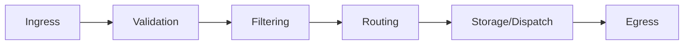
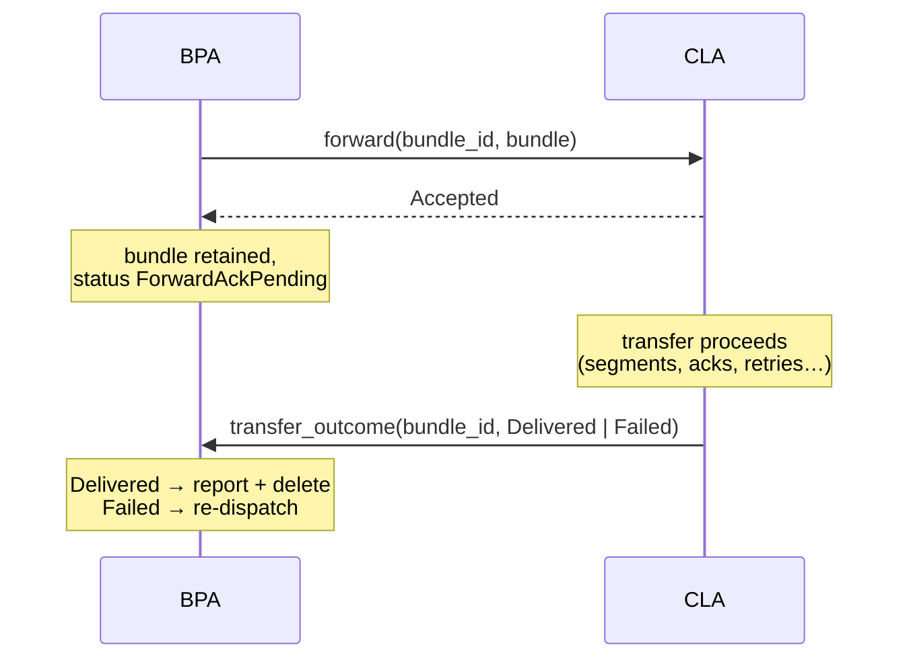

# hardy-bpa Design

Core bundle processing agent library implementing RFC 9171.

## Design Goals

- **Library-first architecture.** The BPA is a library, not an application. Applications like hardy-bpa-server embed the library and provide configuration, network binding, and integration with external systems. This separation allows the same BPA logic to run in different deployment contexts.

- **Trait-based extensibility.** Storage backends, convergence layer adaptors, application services, and egress policies are all defined as traits. Concrete implementations are injected at runtime, allowing operators to swap components without modifying core BPA code.

- **Parallel pipeline processing.** Bundle processing is parallelised across a bounded task pool. The pool size limits concurrent processing to prevent resource exhaustion while ensuring bundles don't queue indefinitely behind slow operations.

- **Crash-resilient storage.** Bundles must not be lost due to crashes or restarts. The storage subsystem persists bundle data before acknowledging receipt, uses status checkpoints to track processing progress, and recovers in-flight bundles on restart. This ensures bundles are never silently dropped, even during unexpected termination.

- **Zero-copy bundle handling.** Bundle payloads can be large (megabytes). The BPA uses `Bytes` (reference-counted byte buffers) throughout the pipeline, enabling bundle data to flow from ingress through storage to egress without copying. Slicing creates views into the same underlying buffer.

- **Dynamic runtime reconfiguration.** Routes, CLAs, services, and filters can be registered and unregistered at runtime without restart. This enables the BPA to adapt to changing network conditions—scheduled contacts, new peer discovery, and policy updates—without service interruption.

## Architecture Overview

The BPA processes bundles through a pipeline with several stages. Each bundle flows from ingress through routing decisions to either local delivery or forwarding.



The `Bpa` struct coordinates the major subsystems:

- **Store** coordinates data and metadata persistence with caching
- **RIB** maintains routing rules and triggers re-evaluation on changes
- **Dispatcher** the central processing hub (see below)
- **Registries** manage CLAs, services, filters, and keys

### Dispatcher as Central Hub

The `Dispatcher` is the central coordinator that orchestrates all bundle processing. It holds references to every registry and subsystem, routing bundles through the appropriate stages based on their state and destination.

```
                              ┌────────────────────────────────────┐
                              │            Dispatcher              │
                              │                                    │
   CLA Ingress ──────────────►│  ┌─────────┐      ┌─────────────┐  │
                              │  │ Filter  │      │   Service   │  │
   Service Egress ───────────►│  │Registry │      │  Registry   │  │
                              │  └─────────┘      └─────────────┘  │
                              │                                    │
                              │  ┌─────────┐      ┌─────────────┐  │
   Storage ◄─────────────────►│  │  Store  │      │     RIB     │  │
                              │  └─────────┘      └─────────────┘  │
                              │                                    │
                              │  ┌─────────┐      ┌─────────────┐  │
   CLA Egress ◄───────────────┤  │   CLA   │      │    Keys     │  │
                              │  │Registry │      │  Registry   │  │
                              │  └─────────┘      └─────────────┘  │
                              └────────────────────────────────────┘
```

This centralised design ensures consistent bundle handling across all paths (CLA ingress, service egress, restart recovery) while keeping subsystems decoupled from each other.

### Bundle Flow

A bundle entering from a CLA follows this path:

1. **Ingress**: CLA calls `Sink::dispatch()` with raw bytes and peer information
2. **Validation**: `process_received_bundle()` runs CBOR precheck and `RewrittenBundle::parse()` with full processing (block removal, canonicalization, BPSec). Invalid bundles are dropped internally with status reports — errors are never returned to the CLA
3. **Storage**: Bundle data and metadata persisted with `New` status
4. **Filtering**: `ingress_bundle()` runs Ingress filters, which may drop, modify, or mark the bundle. Status checkpointed to `Dispatching`
5. **Dispatch**: Destination examined — local delivery, admin endpoint, or forwarding
6. **Routing**: RIB lookup determines next hop for forwarding bundles
7. **Egress**: Bundle queued to CLA for transmission, egress filters applied

Locally-originated bundles (from services) run the Originate filter, store with `Dispatching` status, and skip the Ingress filter. Fragment reassembly shares the same `process_received_bundle()` path as CLA ingress, ensuring reassembled bundles get full-mode parsing and validation.

Failed bundles generate status reports where requested and permitted.

## Subsystem Design

The BPA's complexity is distributed across several subsystems, each documented separately:

- **[Storage Subsystem](storage_subsystem_design.md)** - Dual storage model with separate data and metadata backends, LRU caching, crash recovery, and expiration monitoring
- **[Bundle State Machine](bundle_state_machine_design.md)** - Bundle lifecycle states and transitions that serve as crash recovery checkpoints
- **[Routing](routing_subsystem_design.md)** - RIB structure, pattern matching, route priorities, and forwarding decisions
- **[Filter Subsystem](filter_subsystem_design.md)** - Hook points, filter ordering, and traffic modification
- **[Policy Subsystem](policy_subsystem_design.md)** - Egress queue management, traffic classification, and rate limiting

## Key Design Decisions

### Dual Storage Model

Bundle data and metadata are stored in separate backends with fundamentally different characteristics:

| Aspect | Metadata Storage | Bundle Storage |
|--------|------------------|----------------|
| Access pattern | Frequent queries, updates | Rare access (forward/deliver) |
| Data model | Relational (indexed by status, expiry, queue) | Blob (keyed by storage name) |
| Size | Small (hundreds of bytes per bundle) | Large (potentially megabytes) |
| Examples | hardy-sqlite-storage, hardy-postgres-storage | hardy-localdisk-storage, hardy-s3-storage |

This separation enables independent backend selection optimised for each access pattern. Metadata benefits from relational indexing for efficient status queries and queue management. Bundle data benefits from blob storage with optional memory mapping for large payloads.

See the storage backend packages for production implementations:

- [hardy-sqlite-storage](../../sqlite-storage/docs/design.md) - SQLite-based metadata storage
- [hardy-postgres-storage](../../postgres-storage/docs/design.md) - PostgreSQL metadata storage
- [hardy-localdisk-storage](../../localdisk-storage/docs/design.md) - Filesystem-based bundle storage
- [hardy-s3-storage](../../s3-storage/docs/design.md) - Amazon S3 bundle storage

### Application vs Service APIs

Two levels of service integration exist:

**Application** is the high-level API. Applications receive decoded payloads and send data that the BPA wraps in bundles. The Application API hides bundle structure, suitable for most user services.

**Service** is the low-level API. Services receive raw bundle bytes and construct bundles themselves using the Builder. The BPA still validates outbound bundles (services are not trusted), but this API enables system services like echo that need to inspect or modify bundle structure.

### Component Registry and Sink Pattern

External components (CLAs, services, future routing agents) are managed through a consistent architectural pattern combining Registries with paired traits.

#### Registry Pattern

Each component type has a dedicated Registry that manages registration, lifecycle coordination, and component-specific state. Registries create Sinks with weak back-references to avoid reference cycles.

| Registry | Component Trait | Sink Trait | Purpose |
|----------|-----------------|------------|---------|
| `cla::registry::Registry` | `Cla` | `cla::Sink` | Convergence layer adapters |
| `services::registry::Registry` | `Service` | `ServiceSink` | Low-level bundle services |
| `services::registry::Registry` | `Application` | `ApplicationSink` | High-level payload services |
| `filters::registry::Registry` | `Filter` | — | Traffic filtering (no Sink needed) |
| `keys::registry::Registry` | `KeyProvider` | — | BPSec key management |
| `rib::Rib` (via `rib::agent`) | `RoutingAgent` | `RoutingSink` | Dynamic routing protocols |

#### Bidirectional Sink Pattern

Components communicate with the BPA through paired traits: a primary trait implemented by the component, and a corresponding Sink trait provided by the BPA. The Sink provides methods to interact with the BPA (dispatch bundles, send data, manage state) without holding direct references to BPA internals. This indirection creates a stable interface that enables independent evolution, isolated testing, and transparent local/remote operation via the [`BpaRegistration`] trait.

#### Lifecycle

The Registry holds a strong reference to registered components. Disconnection is bidirectional: components can call `sink.unregister()` or drop their Sink, and the BPA can initiate shutdown calling `on_unregister()`. After disconnection, the Sink returns `Disconnected` errors for all operations.

See the [`BpaRegistration`] trait documentation for implementation requirements and recommended patterns.

[`BpaRegistration`]: ../src/bpa.rs

#### Authorization and Ownership

The Sink pattern provides **structural authorization enforcement**. Each component receives a Sink bound to its own resources, preventing cross-component interference without explicit authorization tokens.

**How it works:**

1. **Per-registration Sink**: Each registered component gets its own Sink instance containing weak references to that component's resources (e.g., `Weak<Service>`, the CLA's peer map).

2. **Scoped operations**: Sink methods operate only on the bound resources:
   - `ServiceSink::unregister()` unregisters only the service it was created for
   - `ServiceSink::cancel()` validates `bundle_id.source == service.service_id`
   - `cla::Sink::remove_peer()` operates on the CLA's own peer map

3. **No cross-access possible**: A component cannot affect another component's resources because it has no reference to them.

This design means **no authorization token is required** for ownership enforcement—it's enforced by the object reference graph. A malicious or buggy component can only affect its own registrations.

For deployments requiring additional authorization (namespace restrictions, audit logging), the gRPC layer can add identity validation at registration time. See the [hardy-proto design](../../proto/docs/design.md#trust-model) for details.

### Deferred CLA Transfer Outcomes

A reliable convergence layer natively learns whether each transfer succeeded (TCPCLv4 transfer acknowledgments, LTP session reports). The CLA contract expresses that signal without holding a call open: `forward` may answer `Accepted` — the CLA has taken ownership of the bundle — and report the real outcome later, out-of-band, via `Sink::transfer_outcome`.

Holding the forward call until the outcome is known pins a slot in the bounded processing pool (and, in the gRPC deployment, a proxy handler permit) for the full transfer duration, collapsing throughput to pool-size-per-round-trip on high bandwidth-delay-product links. Answering `Sent` early loses the failure signal entirely: the BPA deletes on `Sent`, so a late convergence-layer failure becomes silent end-to-end loss. Splitting acceptance from outcome removes the hold while keeping the store honest:



`Sent` and `NoNeighbour` keep their terminal semantics: deferral is a per-transfer choice made by the CLA on each forward — fire-and-forget CLAs like `file-cla` are untouched, and there is no registration-level capability flag or proxy negotiation state. A BPA that predates the extension maps the unknown `accepted` variant to a call error and re-queues the bundle, so version skew degrades safely.

**The correlation key is the bundle ID** — the same `hardy_bpv7::bundle::Id` the Application trait already uses for status notifications and `cancel`, with the same key encoding on the wire. RFC 9171 bundle IDs are globally unique (fragments included), and a bundle in `ForwardAckPending` is not eligible for re-dispatch until its outcome resolves, so the BPA never has more than one transfer of a bundle outstanding. `forward` passes the ID alongside the bundle bytes for the CLA to echo back opaquely; a CLA-minted transfer ID would only add mint-and-map bookkeeping on both sides that a store lookup replaces.

Every `Accepted` resolves in exactly one of four ways:

- **`Delivered`** — what `Sent` does today: report forwarded, delete.
- **`Failed`** — re-enqueued to Dispatch for a fresh routing decision, per-bundle: a deferred failure is bundle-scoped evidence about one transfer, not link-scoped evidence about the peer, so it does not reset the peer queue. A deferred failure does not assert non-delivery — the far end may hold the bundle with only the acknowledgment lost — and receiver-side deduplication absorbs the re-forward.
- **CLA unregistration** (including gRPC stream teardown) — every unresolved transfer is outcome-unknown, reset to `Waiting` and re-forwarded at the next opportunity.
- **Bundle lifetime expiry** — expiry wins, as everywhere else in the store.

An outcome is honoured only if the named bundle is currently `ForwardAckPending` via a peer of the reporting CLA; anything else — already resolved, expired, another CLA's transfer — is logged and dropped. There is deliberately no BPA-side guard timer for CLAs that never resolve a transfer: bundle lifetime bounds retention, unregistration sweeps the rest, and a CLA that sits on transfers merely converts them to visible, attributable expiry drops.

`ForwardAckPending { peer }` is persisted metadata status like any other, and is a holding state, not a queue (see [queue_architecture.md](queue_architecture.md)): bundles leave it only via the keyed outcome, a sweep (peer loss, or restart replay resetting it to `Waiting` exactly as `ForwardPending`, since registrations do not survive a restart), or the reaper. The persisted status is the only state — outcome resolution is a metadata lookup by bundle ID. The retention cost is explicit: a bundle stays in the store from acceptance to outcome, bounded by the transfer duration and hard-capped by bundle lifetime — the price of honest reliability accounting, and how BP/LTP stacks already behave.

Verdict timing doubles as flow control: a CLA at admission capacity simply withholds its next verdict. Each peer queue is drained by a single egress poller, so one withheld verdict pauses that peer's drain at the cost of a single pool slot while every accepted transfer pipelines — depth is governed by the CLA's admission policy, with no BPA-side concurrency changes. `tcpclv4` adopts exactly this shape (`max-outstanding-transfers`), and the TestCla tool's reliable channel emulation is the design's motivating consumer ([`docs/test-cla-design.md`](../../docs/test-cla-design.md) §4.3).

The wire mirror lives in `cla.proto`: `ForwardBundleRequest.bundle_id` (the RFC 9171 key form, opaque to the CLA), an `accepted` result variant, and the CLA→BPA `TransferOutcomeRequest` whose `failed` arm carries a `google.rpc.Status` so a failure reason travels opaquely.

### Routing Information Base

The RIB maintains routing rules as a priority-ordered collection of EID patterns mapping to actions. When a route changes, the RIB notifies a background task to re-evaluate bundles in `Waiting` status. This ensures bundles aren't stranded when new routes become available.

Routes are keyed by `(priority, pattern, action, source)` allowing multiple routes to the same destination through different CLAs. Priority ordering ensures deterministic selection when multiple routes match.

### Bounded Processing Pool

The `BoundedTaskPool` provides concurrency control for parallel filter execution and dispatch queue consumers. Bundle ingress runs inline in the caller's context rather than being spawned into the pool — backpressure for CLA ingress comes from the RpcProxy's handler pool, which limits concurrent gRPC handler tasks.

This layered backpressure model means CLAs that receive bundles faster than the BPA can process them experience slowdown at the gRPC dispatch call, which propagates to their network handling.

### Storage-Backed Queues

Internal queues (dispatch queue, per-peer egress queues) use a hybrid architecture that combines in-memory channels with persistent storage fallback:

```
┌──────────────────┐
│  Fast Path       │  In-memory bounded channel
│  (channel open)  │  Sub-millisecond latency
└────────┬─────────┘
         │ channel full
         ▼
┌──────────────────┐
│  Slow Path       │  Spill to metadata storage
│  (draining)      │  Background poller refills channel
└──────────────────┘
```

When the in-memory channel has capacity, sends complete immediately. When full, bundles are persisted to metadata storage with appropriate `BundleStatus` (e.g., `ForwardPending { peer, queue }`). A background task drains storage back into the channel when space becomes available.

This design provides:

- **Bounded memory usage**: Queue depth is limited regardless of bundle arrival rate
- **Crash recovery**: Queued bundles survive restarts via their persisted status
- **Backpressure**: Storage insertion rate naturally limits ingress when overwhelmed
- **Low latency**: Fast path avoids storage I/O for normal operation

See [Policy Subsystem Design](policy_subsystem_design.md#hybrid-channel-architecture) for implementation details.

## Integration

### With hardy-bpv7

The BPA uses all three parsing modes:

- `RewrittenBundle` for CLA ingress and fragment reassembly (untrusted, full validation with block removal)
- `CheckedBundle` for service input (semi-trusted, canonicalization only)
- `ParsedBundle` for restart recovery routing inspection

### With Storage Backends

Storage traits (`BundleStorage`, `MetadataStorage`) are injected by the embedding application. The library includes in-memory implementations for testing. Production backends include hardy-sqlite-storage and hardy-postgres-storage for metadata, and hardy-localdisk-storage and hardy-s3-storage for bundle data. The trait-based design allows additional backends without BPA changes.

### With hardy-proto

The gRPC interfaces defined in hardy-proto enable distributed deployment where CLAs and services run as separate processes communicating with the BPA over gRPC.

### Observability

The BPA is instrumented for observability through two mechanisms:

**Tracing**: The `instrument` feature enables `#[instrument]` attributes on key methods, providing structured span data for distributed tracing. The embedding application (e.g., hardy-bpa-server with hardy-otel) configures the tracing subscriber.

**Metrics**: The `metrics` crate provides hooks for counters, gauges, and histograms. Key processing events emit metrics that the embedding application can export to monitoring systems. Current coverage is foundational; expanding metric coverage across all subsystems is ongoing work.

This separation keeps the BPA library independent of specific observability backends while providing the hooks needed for production monitoring.

## Configuration

The `Config` struct controls BPA behaviour:

| Option | Default | Purpose |
|--------|---------|---------|
| `status_reports` | `false` | Enable RFC 9171 bundle status report generation |
| `poll_channel_depth` | 16 | Capacity of internal dispatch channels before falling back to storage |
| `processing_pool_size` | 4 × CPU cores | Maximum concurrent bundle processing tasks |
| `storage_config` | — | LRU cache settings (capacity, max cached bundle size) |
| `node_ids` | — | Local node identifiers (IPN and/or DTN schemes) |

Storage backends (`metadata_storage`, `bundle_storage`) are injected programmatically rather than configured, allowing the embedding application to select appropriate backends for its deployment context.

## Future Work

### Key Provider Infrastructure

The `keys` module provides a `KeyProvider` trait and registry for BPSec key management. The current implementation aggregates keys from registered providers but lacks configuration-driven key loading. Future work includes:

- Loading keys from configuration files
- Integration with external key management systems (HSMs, Vault)
- Key rotation and expiration handling

### Storage Priority and Eviction

When storage capacity is exhausted, bundles must be evicted. The filter subsystem can assign a `storage_priority` to bundles during ingress, enabling priority-based eviction policies. This infrastructure is planned but not yet implemented.

## Dependencies

The library is `no_std` compatible with a heap allocator, though full support is currently blocked by `flume` and `metrics` which require `std`. See the crate documentation for embedded target requirements.

Feature flags control optional functionality:

- **`tokio`** (default): Tokio async runtime. Implies `std`.
- **`rfc9173`**: RFC 9173 default security contexts via hardy-bpv7.
- **`std`**: Standard library support for time and collections.
- **`serde`**: Serialization support for configuration and metadata.
- **`instrument`**: Span instrumentation for async tasks.
- **`no-rfc9171-autoregister`**: Disable auto-registration of the RFC 9171 validity filter. Use this when the embedding application needs to register the filter with custom configuration.

Key external dependencies:

| Crate | Purpose |
|-------|---------|
| hardy-async | Async runtime abstraction |
| hardy-bpv7 | Bundle protocol implementation |
| hardy-eid-patterns | EID pattern matching for routing |
| lru | LRU cache for bundle data |
| time | Timestamp handling |
| tracing | Instrumentation |
| metrics | Performance metrics |

## Testing

- [Unit Test Plan](unit_test_plan.md) - BPA internal algorithms (routing, policy)
- [Component Test Plan](component_test_plan.md) - Pipeline integration, performance benchmarks
- [CLA Integration Tests](cla_integration_test_plan.md) - Generic CLA trait verification
- [Service Integration Tests](service_integration_test_plan.md) - Generic service trait verification
- [Storage Integration Tests](../../tests/storage/docs/test_plan.md) - Generic storage trait verification
- [Fuzz Test Plan](fuzz_test_plan.md) - Async pipeline stability
