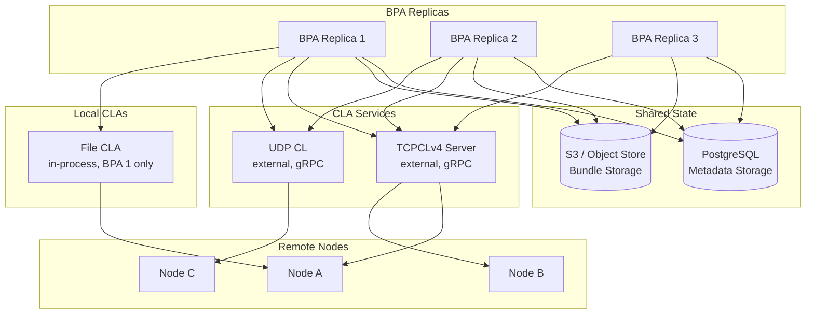
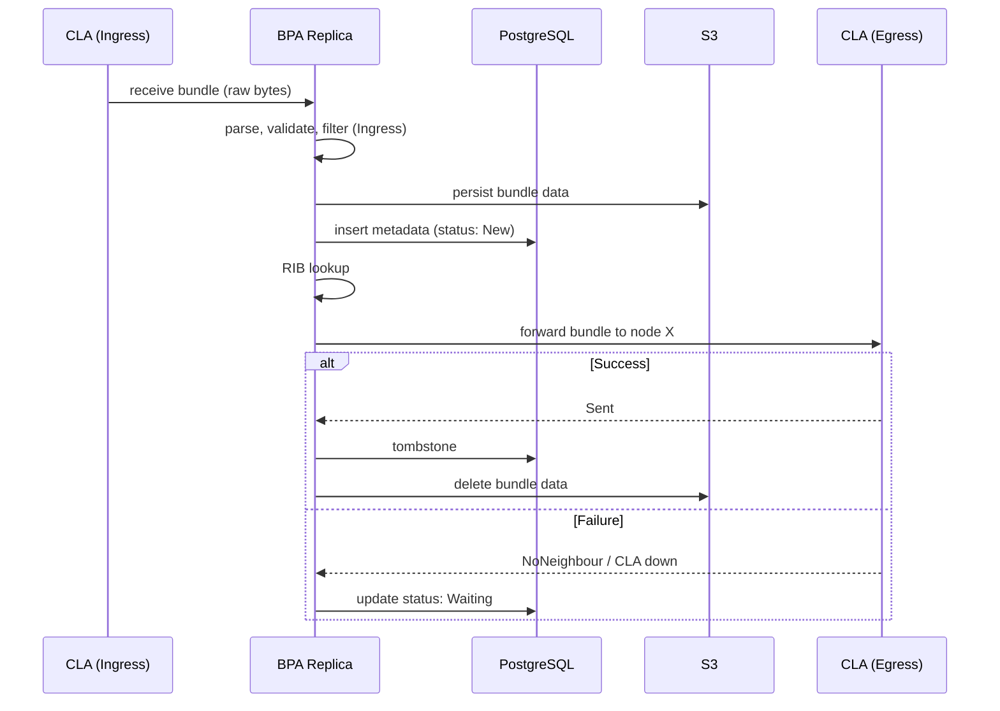
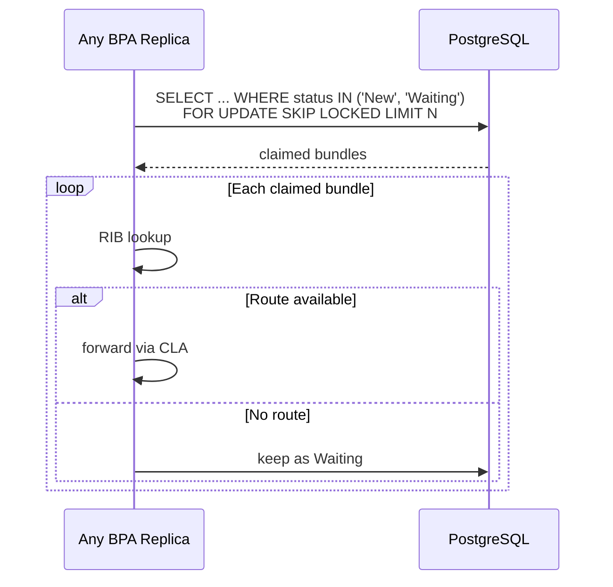
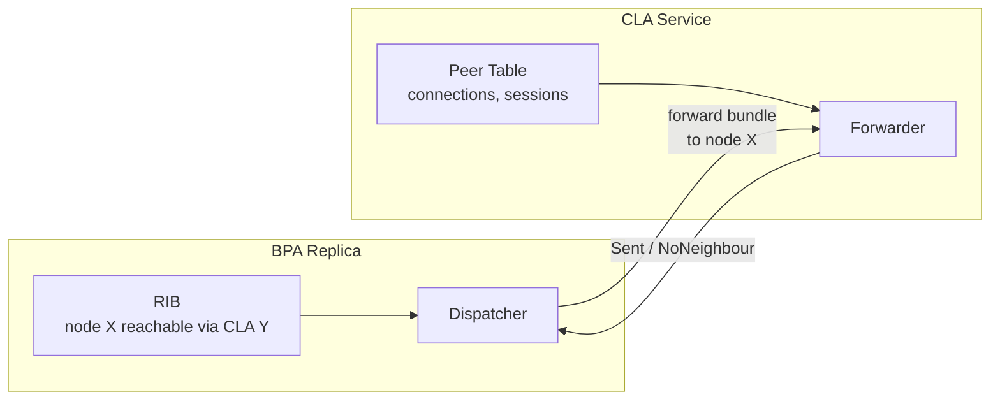

# Multi-Replica BPA Architecture

## Overview

In a multi-replica deployment, BPA instances share persistent state (PostgreSQL for metadata, S3/disk for bundle data) and forward bundles through CLA services. Each BPA replica is stateless for forwarding — peer management belongs to the CLAs.

## Deployment Topology

## Bundle Lifecycle

Only two persistent statuses:

- **New**: persisted, not yet forwarded (or crashed mid-dispatch)
- **Waiting**: forwarding failed, waiting for retry (route unavailable, CLA down, reassembly pending)

Both are claimable by any replica.

## Hot Path

The common case. Bundle arrives, gets processed in memory, persisted once for crash safety, forwarded immediately.

One storage write on the success path (persist + tombstone). No intermediate status transitions.

## Cold Path

Edge cases: route not yet available, reassembly in progress, CLA temporarily down. The bundle sits in storage as `Waiting` until conditions change.

PostgreSQL `FOR UPDATE SKIP LOCKED` is the work distribution mechanism. No external broker. If a replica crashes, its connection drops, the transaction rolls back, and the rows become claimable by other replicas automatically.

## Crash Recovery

No special recovery protocol. A crashed replica's bundles are either:

- **New**: persisted but never forwarded. Any replica claims and routes them on the next poll cycle.
- **Waiting**: already in the cold path. Any replica can claim them.

No stale peer references, no orphaned `ForwardPending` status, no replica-specific state in storage.

## CLA Ownership

- **BPA knows which CLA** (from RIB), not which peer or address.
- **CLA owns peer state**: TCP sessions, addresses, connection lifecycle.
- **BPA is stateless for forwarding**: no peer_id, no CLA address, no queue assignment in storage.

## Key Principles

- **Hot path is fast**: in-memory processing, one persist for crash safety, forward immediately.
- **Cold path is distributed**: PostgreSQL row locking distributes work across replicas. No broker.
- **Crash is invisible**: connection drop releases locks. Other replicas pick up the work.
- **Two statuses**: `New` (persisted, awaiting first dispatch) and `Waiting` (retry later). No `ForwardPending`, no `Dispatching`.
- **CLA is a service**: manages its own peers and connections. BPA delegates forwarding, doesn't micromanage.
- **Replicas don't coordinate**: same config, same CLAs, same RIB. Each processes what it receives. Shared storage handles the rest.
