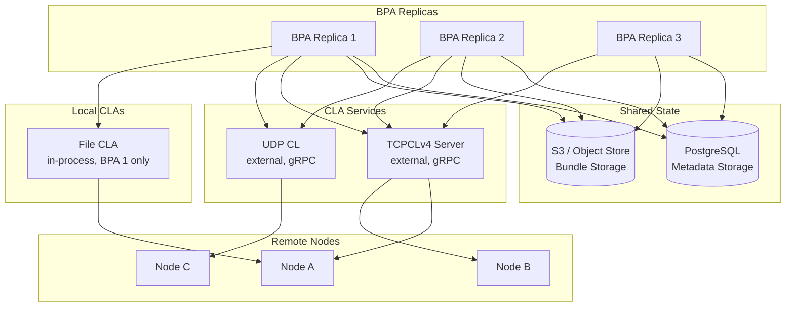
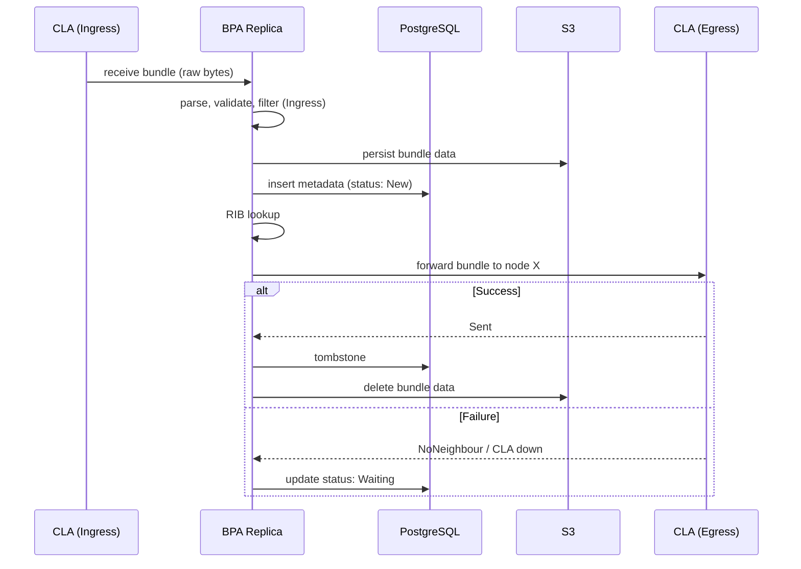
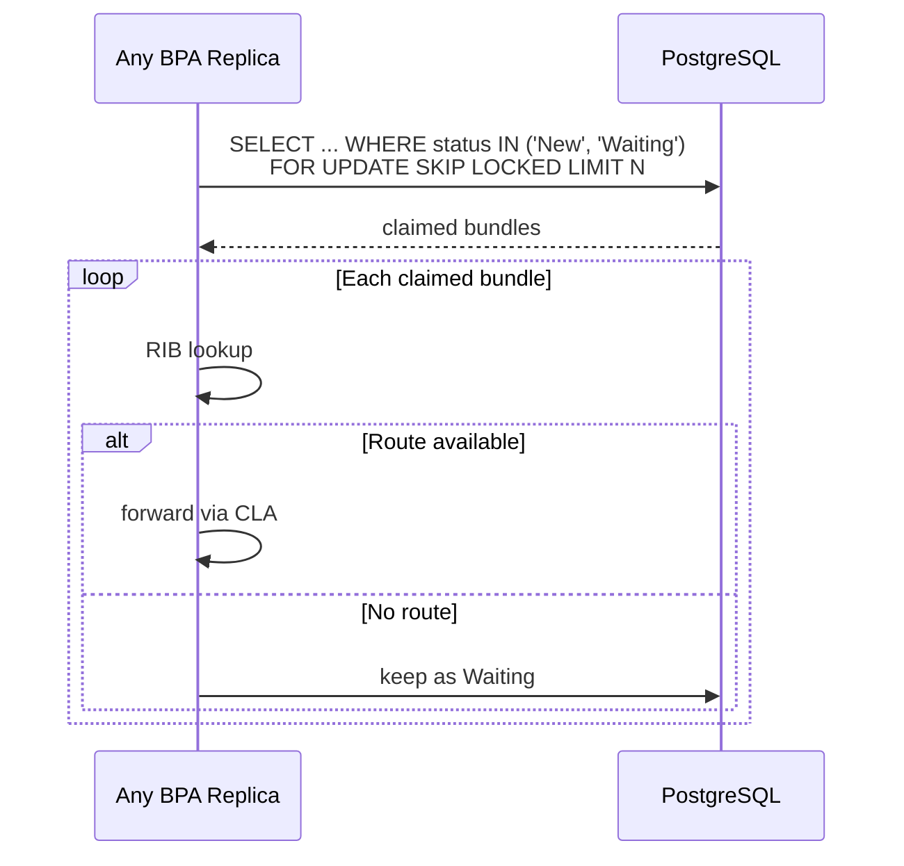
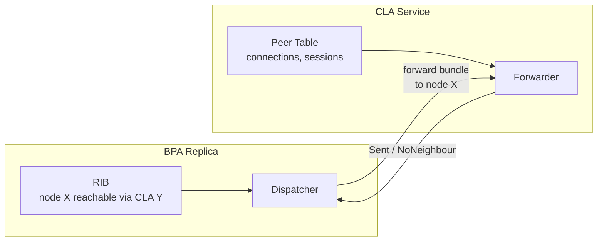

# Multi-Replica BPA Architecture

## Overview

In a multi-replica deployment, BPA instances share persistent state (PostgreSQL for metadata, S3/disk for bundle data) and forward bundles through CLA services. Each BPA replica is stateless for forwarding — peer management belongs to the CLAs.

## Deployment Topology

## Bundle Lifecycle

Only two persistent statuses:

- **New**: persisted, not yet forwarded (or crashed mid-dispatch)
- **Waiting**: forwarding failed, waiting for retry (route unavailable, CLA down, reassembly pending)

Both are claimable by any replica.

## Hot Path

The common case. Bundle arrives, gets processed in memory, persisted once for crash safety, forwarded immediately.

One storage write on the success path (persist + tombstone). No intermediate status transitions.

## Cold Path

Edge cases: route not yet available, reassembly in progress, CLA temporarily down. The bundle sits in storage as `Waiting` until conditions change.

PostgreSQL `FOR UPDATE SKIP LOCKED` is the work distribution mechanism. No external broker. If a replica crashes, its connection drops, the transaction rolls back, and the rows become claimable by other replicas automatically.

## Crash Recovery

No special recovery protocol. A crashed replica's bundles are either:

- **New**: persisted but never forwarded. Any replica claims and routes them on the next poll cycle.
- **Waiting**: already in the cold path. Any replica can claim them.

No stale peer references, no orphaned `ForwardPending` status, no replica-specific state in storage.

## CLA Ownership

- **BPA knows which CLA** (from RIB), not which peer or address.
- **CLA owns peer state**: TCP sessions, addresses, connection lifecycle.
- **BPA is stateless for forwarding**: no peer_id, no CLA address, no queue assignment in storage.

## Key Principles

- **Hot path is fast**: in-memory processing, one persist for crash safety, forward immediately.
- **Cold path is distributed**: PostgreSQL row locking distributes work across replicas. No broker.
- **Crash is invisible**: connection drop releases locks. Other replicas pick up the work.
- **Two statuses**: `New` (persisted, awaiting first dispatch) and `Waiting` (retry later). No `ForwardPending`, no `Dispatching`.
- **CLA is a service**: manages its own peers and connections. BPA delegates forwarding, doesn't micromanage.
- **Replicas don't coordinate**: same config, same CLAs, same RIB. Each processes what it receives. Shared storage handles the rest.

# Rick's Response

Okay - so this works for a very simple case, but it misses out a very important consideration: Flow Prioritisation:  Different bundles can have a different priority and must therefore be processed in the order of their priority, and different CLAs may support multiple prioritised queues.  

The current implementation keeps the prioritization logic inside the BPA via the EgressPolicy framework, this queries CLAs for how many queues they support, and builds (possibly complex) mapping of flow labels to CLA queues *per CLA peer*.  The selection of a queue is a result of the RIB lookup, so each bundle is assigned to an egress queue id per peer.

Fundementally the BPA is just a storgae-backed queue implementation, with 1 pre-RIB lookup queue, and N post-lookup queues.  Because bundles may stay in queues for a long time, and things can happen the CLAs, bundles can be ejected from queues (if the CLA disappears) and must therefore a fresh lookup must happen.

Because of this 'requeuing' the "before RIB lookup state" is actually split into "Checking new bundle state" (New) and "Queued for RIB lookup" (Dispatching) simply to avoid doing the new bundle filtering/rewriting multiple times for a bundle.

## Scaling BPAs

I do understand the need to scale BPA's by having multiple instances addressing a shared database - but I think your model of sharding is slightly incorrect.  Fundementally the "BPA" in a clustered deployment is actually the Postgres/S3 - i.e. the DB backed queues.  In order to support multiple instances of the bpa-server targetting the same DB, there must be state management so that a single BPA instance disconnecting resets the queue assignment for any CLAs locally registered to that BPA instance.

- Detection can be done via pg_notify and some really clever PG internals that will detect connection drops and issue pg_notify messages in SQL.
- The (Peer,Queue) pair associated with a Bundle status must include a BPA instance Id in the PG database schema, so resets can happen.

## My approach

My general approach to this problem is not to alter the inner workings of the BPA to make all queues purely in-memory, but instead perform the sharding in the Postgres storage backend - as every metadata update happens, the underlying rows of the DB record the BPA instance that actually set the status *when the BPA instance is important to the State* i.e. Egress queue assignment.

This avoids:
- Every CLA having to implement a wide number of flow-control policies - they are just managed by the BPA instance
- CLAs having to maintain bundle storage - the BPA storage manages bundles, and only after a CLA says it has sent it, does it get dropped from the database.
- Constant full re-evaluation of bundles, and double-filter rewriting

So:
- CLAs are truely stateless, and as simple as possible - as they are now
- Expensive bundle parsing and filtering operations are handled once - on input.

And sharding can be done by pushing the "multiple BPA instances" logic down into the storage layer.
