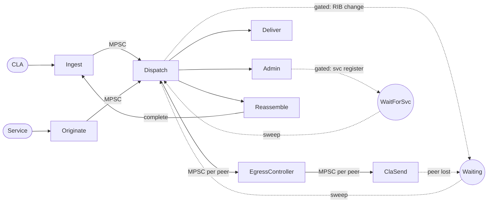

# BPA Queue Architecture

This document describes the BPA pipeline as a set of processing blocks
connected by queues, captures the design rationale for the current
implementation, and proposes an architecture for generalising the queue
system.

## Current Pipeline

The BPA pipeline can be understood as a set of stateless processing
blocks connected by durable queues. This structure is implicit in the
code — the `BundleStatus` enum acts as a queue assignment, the hybrid
channels provide storage-backed transport, and the processing stages
are separated by status transitions — but there is no formal queue
abstraction.



**Legend:** Solid lines = active queues (continuous consumers).
Dashed lines = gated queues (event-triggered sweep).
Circles = gated holding states.

### Processing blocks

- **Ingest** — receive from CLA, run ingress filters, checkpoint to
  storage
- **Originate** — receive from local service, run originate filters,
  checkpoint to storage
- **Dispatch** — RIB lookup, fan-out to deliver/admin/reassemble/wait
  queues. For forwarding, enqueues to a per-peer queue
- **EgressController** — consumer of per-peer queue. Classifies bundles,
  rate-limits and reorders by traffic class (HTB scheduling), enqueues
  to a per-peer CLA queue
- **ClaSend** — consumer of per-peer CLA queue. Updates extension blocks,
  runs egress filters, calls `CLA::send()`
- **Deliver** — decrypt payload, deliver to local service
- **Admin** — parse and route status reports
- **Reassemble** — accumulate fragments, re-ingest on completion

### Current queue types

**Active queues** have continuous consumers with storage-backed hybrid
channels (fast in-memory path with storage-backed slow path for
backpressure):

- **Dispatch** (`Dispatching`) — MPSC. Multiple producers (CLA reception,
  local origination, status reports, reassembly, gated queue sweeps).
  Single receiver task that spawns work into a `BoundedTaskPool` for
  concurrent processing
- **Egress** (`ForwardPending { peer, queue }`) — MPSC per peer per
  policy queue. Any dispatch worker can produce. Single poller per queue
  feeds the CLA

**Gated queues** are structurally the same as active queues — ordered,
storage-backed — but their consumer blocks on a side-channel signal.
The consumer only polls when the signal indicates conditions have changed
and draining may be productive:

- **Waiting** (`Waiting`) — sweeps all bundles on RIB change
  (`notify_updated`). Semantics: "I tried to route and there was nowhere
  to go"
- **WaitingForService** (`WaitingForService { service }`) — sweeps
  bundles matching a specific service EID on service re-registration.
  Used for status reports awaiting their originating service (a rename
  to `WaitingForOriginator` is planned)

**Other states** that are not queues in the current implementation:

- **AduFragment** (`AduFragment { source, timestamp }`) — fragment
  accumulator. No consumer; completion detected when a new fragment
  completes the set
- **New** (`New`) — crash recovery checkpoint between "data stored" and
  "ingress complete." Not a queue — a transient recovery waypoint

### Peer loss

CLAs are long-lived server processes — they rarely disappear. CLA
*peers* come and go frequently (link outages, scheduled contacts,
mobile nodes). When a peer disconnects, its `ForwardPending` bundles
reset to `Waiting`. The route removal fires `notify_updated`, sweeping
waiting bundles back through dispatch to find alternative routes. If no
route exists, bundles remain in `Waiting` (correct DTN behaviour).

All queues in the standalone BPA are MPSC — multiple producers, single
receiver. Dispatch concurrency comes from the `BoundedTaskPool`
downstream of the single receiver, not from multiple receivers on the
queue. MPMC (multiple consumers on a shared queue) is a distributed
deployment concern handled by the distributed queue infrastructure
(consumer groups), not by the local queue implementation.

## Design Principles

The pipeline follows a map/reduce pattern over durable queues:

- **Map:** Dispatch fans out bundles by routing decision
- **Reduce:** Per-peer egress queues converge dispatch workers onto a
  single CLA
- **Backpressure:** When reduce cannot accept work, bundles park in
  gated queues until conditions change
- **Durability:** Queue state survives crashes. Recovery is re-reading
  queue assignments and resuming

All queues should be **priority-ordered** — not FIFO. High-priority
bundles should be dispatched, forwarded, and re-routed before
low-priority ones. This applies to active queues, gated queues, and
egress queues equally.

Bundle **expiry** is not a queue ordering concern — it is a validity
check. A bundle is either valid or expired, regardless of queue
position. Expiry is handled by a cross-cutting storage reaper, not by
queue consumers (see Storage maintenance below).

## Proposed Architecture

### MetadataStorage trait redesign

The current `MetadataStorage` trait mixes bundle CRUD with
status-specific query methods (`poll_waiting`, `reset_peer_queue`, etc.).
The proposed redesign keeps a single trait but organises it into two
clearly separated groups of functions: bundle CRUD and queue operations.

```rust
trait MetadataStorage {
    // --- Bundle CRUD (keyed by Bundle::Id) ---
    async fn store(&self, bundle: &Bundle);
    async fn get(&self, id: &Bundle::Id) -> Option<Bundle>;
    async fn update(&self, id: &Bundle::Id, bundle: &Bundle);
    async fn delete(&self, id: &Bundle::Id);

    // --- Queue operations (queue ID is u32) ---
    async fn enqueue(&self, id: &Bundle::Id, queue: u32, priority: u32);
    async fn dequeue(&self, queue: u32) -> Option<Bundle>;
    async fn move_queue(&self, from: u32, to: u32) -> u64;
    async fn drain(&self, queue: u32, tx: Sender<Bundle>);
}
```

Bundle CRUD owns the data, keyed by `Bundle::Id`. Queue operations own
the ordering and assignment, keyed by a `u32` queue ID. The queue ID is
opaque to the storage implementation — all semantics (which queue is
Dispatch, which are ephemeral, the durability threshold) live in the
BPA layer above. `dequeue` returns the full `Bundle` (which contains
its own ID) to avoid a separate round-trip. This replaces the current
per-status query methods with generic queue primitives.

### ACID semantics

The `MetadataStorage` implementation is exclusive to a single BPA
instance — there is no concurrent access from other processes. This
simplifies the consistency model:

- **`dequeue` does not remove the queue assignment.** The bundle
  remains associated with its current queue in storage while the
  processing block works on it. If the process crashes mid-processing,
  the bundle is still in the original queue and gets reprocessed on
  recovery
- **`enqueue` atomically replaces the queue assignment.** This is the
  commit point — the bundle moves from one queue to the next in a
  single storage operation
- **`delete` is the terminal operation.** After successful forwarding
  or delivery, the bundle is removed from storage entirely (or moved
  to the Tombstone queue for deduplication)

This provides **at-least-once** delivery semantics: a bundle may be
processed more than once after a crash, but it is never lost. Processing
blocks must be idempotent — re-dispatching re-runs the RIB lookup,
re-forwarding checks for duplicates, re-delivery is handled by the
service layer.

**Known issue:** There is a crash window between an ingress filter
rewriting the bundle binary (`BundleStorage::replace`) and the
subsequent enqueue to Dispatch. If the process crashes in this window,
recovery finds an unqueued bundle with already-rewritten data and
re-runs ingestion — the filter executes again on already-filtered
data. This is a pre-existing issue not introduced by the queue
architecture. Possible mitigations include storing the filter result
as a metadata-level diff applied at load time, or making filters
idempotent. To be addressed separately.

### Storage maintenance (reaper)

Expiry and tombstone reaping are **cross-cutting storage maintenance**,
not queue operations. The reaper runs as a separate task outside the
queue processing pipeline, scanning across all queues by expiry time.

The reaper operates on `BundleStorage` (the binary data) as ground
truth, not on `MetadataStorage` (the queue index). The lifecycle:

1. Reaper identifies expired bundle (via expiry index)
2. Sends `LifetimeExpired` deletion status report
3. Deletes binary data from `BundleStorage`
4. Tombstones metadata in `MetadataStorage`

Tombstone entries are reaped by the same mechanism: once
`creation_timestamp + lifetime + margin` has passed, the tombstone
is deleted from `MetadataStorage`. This bounds storage growth for
long-running instances.

### Reaper/processing block race

The reaper and a processing block may act on the same bundle
concurrently. This race is benign because `BundleStorage` is the
ground truth for bundle existence.

A processing block that has dequeued a bundle's metadata calls
`BundleStorage::load()` to retrieve the binary data before processing.
If the reaper has already deleted the data, `load()` returns `None`.
The processing block then checks `has_expired()`:

- **Expired** — the reaper got there first and already sent the
  status report. The processing block silently cleans up the metadata.
  No duplicate report
- **Not expired** — genuine storage failure (`DepletedStorage`). The
  processing block sends a deletion status report with the appropriate
  reason code

This pattern works because:

- `BundleStorage` is the coordination point — no locks needed, the
  data is either there or it isn't
- The reaper owns the status report for expired bundles — processing
  blocks defer to it
- Processing blocks already handle `load() → None` in the current
  code (`forward.rs`, `dispatch.rs`)

In a distributed architecture, the reaper becomes a storage-level
maintenance job per storage shard, independent of processing nodes.
The same ground-truth coordination applies.

### Eliminating `New` status

With the redesigned trait, `New` is implicit. A bundle stored via
`MetadataStorage::store` but not yet enqueued via `enqueue` is simply
unqueued. Crash recovery finds all unqueued bundles and re-runs
ingestion.

### Resulting queue schema

Queue IDs are numeric (`u32`). A durability threshold divides them into
durable queues (contents survive restart) and ephemeral queues (contents
reset to Waiting on restart).

**Durable queues** are defined by an enum with fixed discriminants:

```rust
enum DurableQueue {
    Dispatch = 0,
    Waiting = 1,
    WaitingForService = 2,
    Fragment = 3,
    Tombstone = 4,
}
```

Created at BPA construction time via `QueueFactory::create(DurableQueue)`,
which returns `(Sender, Receiver)`. The builder wires these to the
processing blocks.

**Ephemeral queues** (ID >= threshold) — allocated dynamically:

- Per-peer egress queues, active, priority-ordered. Created when a peer
  connects on a CLA, destroyed when the peer disconnects

Allocated via `QueueFactory::allocate()`, which returns
`(Sender, Receiver, u32)` — the `u32` is the assigned queue ID. The
factory manages IDs above the durable threshold:

```rust
struct QueueFactory {
    next: u32,        // starts above durable queue range
    free: Vec<u32>,   // released IDs available for reuse
}
```

`allocate()` pops from the free list first, falling back to incrementing
`next`. `release(id)` pushes onto the free list. In steady state (peers
connecting and disconnecting at similar rates) the free list stays small
— it only grows to the peak concurrent peer count, not total churn over
the instance lifetime.

**Unqueued** — bundles in the store with no queue assignment
(mid-ingestion). Not a queue ID; detected by the absence of assignment.

### Queue durability and restart recovery

Ephemeral queues are scoped to runtime state that does not survive
restart (peer IDs, CLA connections). On recovery, the BPA sweeps by
queue ID:

```rust
move_queue(
    |queue_id| queue_id >= DURABLE_QUEUE_THRESHOLD,
    QueueId::Waiting,
);
```

All bundles in ephemeral queues move to Waiting. The startup
`notify_one()` on the Waiting gate triggers an immediate sweep, pushing
those bundles back through Dispatch for re-routing with fresh peer
assignments.

This replaces the current per-status recovery logic in `restart.rs`
with a single generic operation. Ephemeral queues can be created and
destroyed dynamically without registration — the storage layer just
stores bundles against a numeric ID.

Unqueued bundles (mid-ingestion) are handled separately: recovery finds
all bundles not assigned to any queue and re-runs ingestion.

## Receiver and Enqueue Model

Processing blocks pull bundles from queues via stackable `Receiver`
wrappers, perform their work, and enqueue results directly via a
concrete `Sender` struct. Classification, filtering, and routing are
processing block logic, not queue concerns.

### Receiver

`Receiver` and `GatedReceiver` are concrete structs, not traits.
`Receiver` wraps a queue and blocks on its internal notification.
`GatedReceiver` wraps a `Receiver` and adds an external gate signal.

```rust
pub(crate) enum RecvError {
    Closed,
}

pub(crate) struct Receiver { ... }

impl Receiver {
    pub async fn recv(&self) -> Result<(Bundle, u32), RecvError> { ... }
}

pub(crate) struct GatedReceiver {
    inner: Receiver,
    gate: hardy_async::Notify,
}

impl GatedReceiver {
    pub async fn recv(&self) -> Result<(Bundle, u32), RecvError> { ... }
}
```

`recv` returns the bundle and its priority as stored at enqueue time.
This avoids reclassifying when re-enqueuing to the next queue (e.g.,
Waiting → Dispatch preserves the original priority).

`Closed` indicates the queue has been shut down — either the process is
terminating (durable queues, via cancel token) or the peer has
disconnected (ephemeral queues). The consumer loop is the same for both
types: `while let Ok((bundle, priority)) = receiver.recv().await { ... }`.

The builder passes the right type to each processing block — Dispatch
gets a `Receiver`, the waiting re-dispatcher gets a `GatedReceiver`.
No trait objects, no dynamic dispatch.

Concurrency limiting is handled by the processing block's
`BoundedTaskPool`, not by a receiver wrapper. The receiver hands off
work; the pool controls how many items are processed simultaneously.

Rate limiting and traffic class scheduling are the `EgressController`
processing block's responsibility (see policy_subsystem_design.md),
not a receiver concern.

### Sender struct

The `Sender` is a concrete struct, not a trait. It wraps a
`MetadataStorage` reference and a queue ID, providing the enqueue
call to processing blocks:

```rust
pub(crate) struct Sender { ... }

impl Sender {
    pub async fn send(&self, bundle: &Bundle, priority: u32)
        -> Result<(), SendError>;
}
```

For ephemeral queues, `send` may fail if the queue has been closed
(peer disconnected between routing decision and enqueue):

```rust
pub(crate) enum SendError {
    Closed,
}
```

This covers a race window during peer removal. Three safety nets ensure
no bundle is lost:

1. **Sweep** (`move_queue`) — catches bundles already persisted in the
   ephemeral queue
2. **`SendError::Closed`** — catches bundles mid-flight between
   routing decision and enqueue
3. **CLA send failure** — catches bundles already dequeued and in the
   memory channel when the peer drops

The caller handles `SendError::Closed` by re-parking the bundle in
the Waiting queue.

The existing `storage::channel::Sender` is close to the target design.
The main changes are:

- `status: BundleStatus` -> `queue: u32` (opaque queue ID)
- `update_status()` -> `enqueue(id, queue, priority)`
- `send(bundle)` -> `send(bundle, priority)` — the processing block
  computes the priority and passes it in

The hybrid channel state machine (Open/Draining/Congested/Closing),
the lock-free CAS backpressure, and the error on Closing all remain
unchanged. This is a refactor, not a rewrite.

### Processing blocks

All classification, filtering, routing, and scheduling logic lives in
processing blocks, not in queue wrappers:

- **Ingest** — runs ingress filters, enqueues to dispatch
- **Originate** — runs originate filters, enqueues to dispatch
- **Dispatch** — RIB lookup, fans out to deliver/admin/reassemble/wait
  queues. For forwarding, enqueues to a per-peer queue
- **EgressController** — consumer of per-peer queue. Classifies,
  rate-limits and reorders by traffic class, enqueues to a per-peer CLA
  queue (see policy_subsystem_design.md)
- **ClaSend** — consumer of per-peer CLA queue. Runs egress filters,
  calls `CLA::send()`
- **Deliver** — decrypts payload, delivers to service
- **Admin** — parses status reports, routes to originator

### Flow labels and classification

The `flow_label` (`Option<u32>` in `WritableMetadata`) is a traffic
class tag set by ingress/originate filters. It carries no scheduling
semantics itself — it is a label like "Blue" or "Green" traffic. All
policy decisions are derived from it by classification lookups at
different points in the pipeline.

Multiple independent policy dimensions derive from the same flow_label:

- **Dispatch priority** — ordering in the dispatch and waiting queues.
  Classification: `flow_label -> u32` priority for `enqueue`
- **Egress traffic class** — M->N scheduling onto CLA queues.
  Classification: `flow_label -> traffic_class` in the EgressController
  (see policy_subsystem_design.md)
- **Storage eviction priority** — what gets dropped first under storage
  pressure. Classification: `flow_label -> eviction_priority`

Each is a separate policy lookup configured independently. The
sysadmin thinks in terms of traffic classes ("mission-critical",
"housekeeping", "best-effort") and configures how each class behaves
across all dimensions.

The `flow_label` is the only traffic-related field in bundle metadata.
There is no separate `priority` or `traffic_class` field — these are
derived at the point of use by the relevant policy lookup. This avoids
confusing sysadmins with multiple overlapping fields and keeps the
filter configuration simple: the filter decides *what kind* of traffic
a bundle is, the policies decide *what to do* about it.

### Pipeline

```
CLA -> [Ingest] -> enqueue(dispatch) -> Receiver
    -> BoundedTaskPool -> [Dispatch] -> enqueue(waiting|deliver|admin|...)
                                     -> enqueue(peer queue)

Service -> [Originate] -> enqueue(dispatch)

peer queue -> Receiver -> [EgressController]
    -> enqueue(CLA queue) -> Receiver
    -> [ClaSend] -> egress filters -> CLA::send()

queue[waiting] -> GatedReceiver(RibNotify) -> [re-dispatch] -> enqueue(dispatch)
```

### Layering

`Sender`, `Receiver`, and `GatedReceiver` are all concrete
`pub(crate)` structs in the BPA crate. Processing blocks receive a
`Sender` for each output queue and a `Receiver` or `GatedReceiver`
for input.

### Priority memory channel

The current fast-path channel (`flume`) is FIFO. To support priority
ordering on the fast path, the `hardy-async` channel should use a
`BTreeMap<u32, VecDeque<Bundle>>` behind a spin `Mutex` + `Notify`:

- Each key is a priority level, each value a FIFO deque for that level
- Push: insert into the deque for the bundle's priority — O(log k)
  on the map + O(1) on the deque, where k is the number of active
  priority levels (small, bounded by traffic classes)
- Pop: take from the highest-priority non-empty deque — O(log k)
- FIFO within each priority level, matching storage-backed queue
  semantics so the fast and slow paths behave identically
- Spin `Mutex` is appropriate since operations are O(log k) with
  small k — well within spin-lock territory
- Bounded by total capacity across all priority levels, triggering
  the slow-path drain when full (same hysteresis as today)

### Wiring

The builder assembles the pipeline at startup. Each processing block
receives a concrete `Sender` for each output queue and a `Receiver`
or `GatedReceiver` for its input.

There are two levels of "wake up" in the system, and they serve
different purposes:

- **Queue-internal notification** (inside the `Sender`/`Receiver`
  implementation): the CAS state machine and internal `Notify` that
  wake the receiver when a bundle is enqueued. This is "there is work
  in the queue." Every queue has this — it's how `dequeue` blocks until
  something is available
- **Gate signal** (external `Notify` on a `GatedReceiver`): prevents
  the receiver from even calling `dequeue` until conditions change.
  This is "it's worth trying to process what's in the queue." The
  Waiting queue may have thousands of bundles, but there's no point
  dequeuing them until a route appears

A plain `Receiver` uses only the first level — it calls `dequeue`
and blocks on the queue-internal notification when empty.
A `GatedReceiver` wraps a `Receiver`, blocking on the gate signal
first, then draining the inner receiver until empty, then blocking
on the gate again.

Gating is a receiver concern, not a queue concern. The same queue can
be consumed by a plain `Receiver` or a `GatedReceiver` — the queue
primitive doesn't know or care. The gate signal is a shared `Notify`
wired by the builder to the receiver and the signaller:

```rust
// Builder wiring for the Waiting queue
let rib_notify = hardy_async::Notify::new();

// Create the queue (no gating, just a priority-ordered queue)
let (waiting_tx, waiting_rx) = queue_factory.create(DurableQueue::Waiting);

// Wrap the receiver with gating (receiver concern, not queue concern)
let gated_rx = GatedReceiver::new(waiting_rx, rib_notify.clone());

// Give the same Notify to the RIB so it can signal condition changes
let rib = Rib::new(rib_notify.clone(), ...);

// Give the same Notify to the service registry for WaitingForService
// (or a separate Notify for that queue)

// Wire to the re-dispatch processing block
dispatch_block.set_waiting_receiver(gated_rx);
dispatch_block.set_waiting_sender(waiting_tx);
```

Ephemeral queues are wired similarly, but at peer connect time rather
than at startup:

```rust
// Peer connects on a CLA
let (peer_tx, peer_rx, peer_queue_id) = queue_factory.allocate();
let (cla_tx, cla_rx, cla_queue_id) = queue_factory.allocate();

let egress_ctl = EgressController::new(peer_rx, cla_tx, policy);
let cla_send = ClaSend::new(cla_rx, cla, peer);

// Dispatch gets the peer_tx to enqueue forwarding decisions
dispatch_block.add_peer(peer_id, peer_tx);
```

## Distributed BPA (out of scope)

The queue-and-blocks model would support a distributed architecture
where processing blocks run as independently scalable processes. This
is out of scope for Hardy but influenced several design decisions
(stateless blocks, durable queues, ACID semantics, separation of
gate signals from queue primitives).

A distributed implementation would require dissecting the BPA codebase
into individual processes — the queue model itself would not need to
change. The architectural work is in separating the processing blocks
into standalone services, not in redesigning the queuing.

### Postgres as a distributed queue

Postgres is a natural fit for a distributed queue backend:

- **`SELECT FOR UPDATE SKIP LOCKED`** — MPMC dequeue. Multiple workers
  pull from the same queue, each gets a different row, no contention
- **`pg_notify` / `LISTEN`** — gate signals. `NOTIFY rib_changed`
  wakes all listening workers. Also works for queue-internal "new work
  available" signals
- **Connection loss detection** — if a worker crashes mid-processing,
  the database detects the disconnect, the transaction rolls back, and
  the row's lock is released. The bundle returns to the queue
  automatically. This eliminates the dequeue-without-remove workaround
  needed in the standalone model
- **Priority ordering** — `ORDER BY priority, received_at` in the
  SELECT
- **Tombstone reaping** — `DELETE WHERE expires < now()`
- **RIB** — Postgres is the source of truth. Each dispatch worker holds
  a local in-memory cache of the routing table for hot-path lookups.
  Route agents write to Postgres, which fires `pg_notify` on changes.
  Workers receive the notification, refresh their local cache, and
  signal their Waiting queue gate. This gives single-query dispatch
  performance with automatic cache invalidation — no polling, no stale
  reads beyond the notification latency
