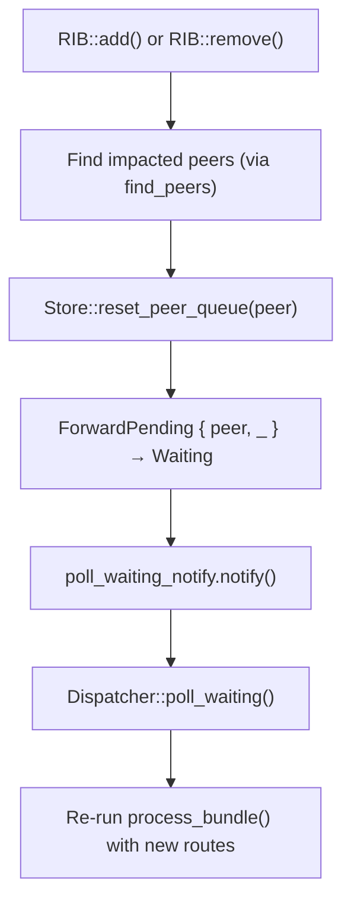
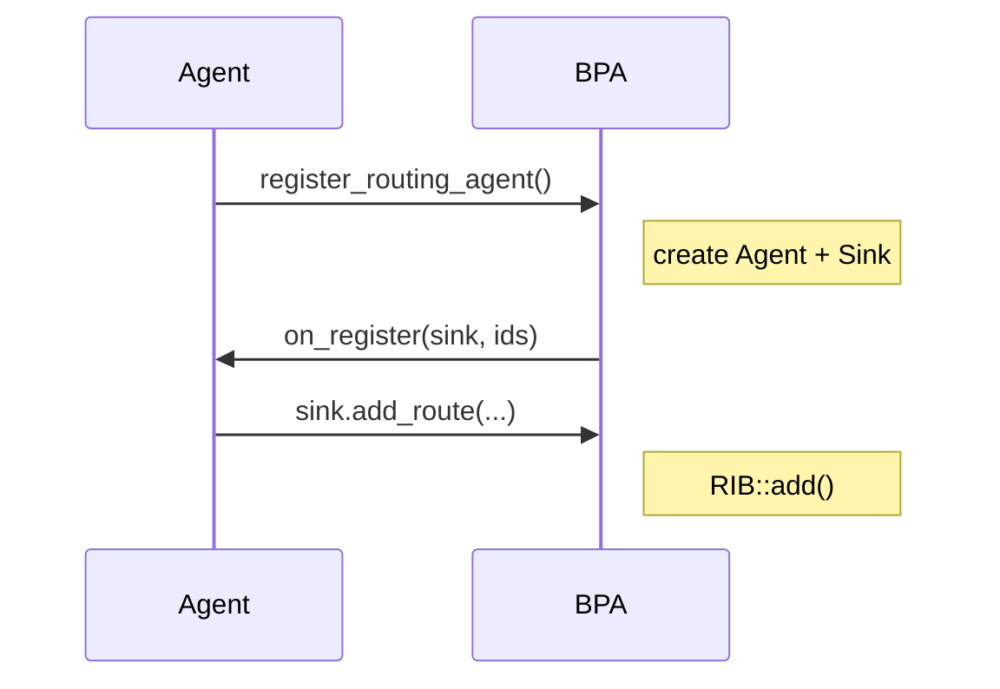

# Routing Design

This document describes the routing infrastructure in the Bundle Protocol Agent (BPA), including the RIB, peer management, and forwarding decisions.

## Related Documents

- **[Bundle State Machine Design](bundle_state_machine_design.md)**: Bundle status transitions and crash recovery
- **[Filter Subsystem Design](filter_subsystem_design.md)**: Filter hooks that run during routing and forwarding
- **[Policy Subsystem Design](policy_subsystem_design.md)**: Flow classification and queue management
- **[Storage Subsystem Design](storage_subsystem_design.md)**: Bundle and metadata persistence

## Overview

The BPA routing system consists of two interconnected components, driven by pluggable **Routing Agents** that push routes into the RIB via the `RoutingAgent` / `RoutingSink` trait pair (see `bpa/src/routes.rs`):

| Component | Purpose | Key Structure |
|-----------|---------|---------------|
| **RIB** | Unified pattern-based route storage and lookup | Priority-ordered BTreeMap of EidPatterns to Actions |
| **Peer Table** | Reachable neighbors via CLAs | HashMap of NodeId to ClaAddress to peer_id |

All routes — admin endpoints, service registrations, CLA peers, static routes, TVR contacts, and drop rules — live in a single priority-ordered table. There is no separate local table or FIB. Forwarding decisions are recorded in bundle metadata as `BundleStatus::ForwardPending { peer, queue }`.

## Architecture Diagram

```
                          ┌─────────────────────────────────────────────┐
                          │                    RIB                      │
                          │                                             │
┌──────────────────┐      │         ┌─────────────────────────┐         │
│ Route Sources    │      │         │   Unified Route Table   │         │
│                  │      │         │                         │         │
│  - Admin EPs     │      │         │ Priority →              │         │
│    (built-in)    │─────►│         │   Pattern →             │         │
│  - Services      │      │         │     Actions             │         │
│    (register)    │      │         │                         │         │
│  - CLA peers     │      │         │ - Drop(reason)          │         │
│    (add_peer)    │      │         │ - AdminEndpoint         │         │
│  - StaticRoutes  │      │         │ - Local(service)        │         │
│  - TVR contacts  │      │         │ - Forward(peer)         │         │
│  - Routing Agents│      │         │ - Reflect               │         │
└──────────────────┘      │         │ - Via(Eid)              │         │
                          │         └────────────┬────────────┘         │
                          │                      │                      │
                          │                      ▼                      │
                          │              ┌─────────────┐                │
                          │              │   find()    │                │
                          │              └─────────────┘                │
                          │                      │                      │
                          └──────────────────────│──────────────────────┘
                                                 │
                                                 ▼
                      ┌─────────────────────────────────────────────────────┐
                      │                     FindResult                      │
                      │                                                     │
                      │ AdminEndpoint / Deliver(svc) / Forward(peer) / Drop |
                      └─────────────────────────────────────────────────────┘
                                                │
                                                ▼
                          ┌─────────────────────────────────────────────┐
                          │              Peer Table                     │
                          │                                             │
                          │    peer_id → Peer { cla, queues }           │
                          │                                             │
                          │    CLA Registry:                            │
                          │    NodeId → ClaAddress → peer_id            │
                          └─────────────────────────────────────────────┘
```

## RIB (Routing Information Base)

### Data Structures

The RIB uses a single unified route table: `BTreeMap<priority, BTreeMap<EidPattern, BTreeSet<Entry>>>`. Lower priority numbers are checked first. Within a priority level, patterns are ordered by specificity score (most specific first), so the first matching pattern is always the best match.

Each route entry contains an action and a source identifier for debugging (e.g., "services", "neighbours", "static_routes").

### Route Actions

The internal `Action` enum covers all route types:

| Action | Description | Source |
|--------|-------------|--------|
| `Drop` | Discard bundle with optional reason code | Routing agents, static routes |
| `AdminEndpoint` | Deliver to the administrative endpoint | Built-in (priority 0) |
| `Local(service)` | Deliver to a registered local service | Service registration (configurable priority, default 1) |
| `Forward(peer)` | Forward to a CLA peer | CLA peer discovery (priority 0) |
| `Reflect` | Return to sender (previous node or source) | Routing agents, static routes |
| `Via(Eid)` | Forward toward the specified EID (recursive lookup) | Routing agents, static routes |

When multiple entries exist under the same pattern, precedence follows enum ordering: Drop > AdminEndpoint > Local > Forward > Reflect > Via. Across patterns at the same priority, the most specific matching pattern takes precedence (highest specificity score wins).

Routing agents (via the `RoutingSink` trait) can only create `Drop`, `Reflect`, and `Via` actions. `AdminEndpoint`, `Local`, and `Forward` are internal actions managed by the BPA itself.

### Route Priority Assignments

| Route Source | Default Priority | Configurable |
|-------------|-----------------|--------------|
| Admin endpoints | 0 | No |
| CLA peer forwards | 0 | No |
| Service registrations | 1 | Yes (`service-priority`) |
| Static routes | 100 | Yes (per-file `priority`) |
| TVR contacts | Agent-defined | Yes (`default_priority`) |

The `service-priority` configuration controls where service routes sit in the priority order. The default of 1 means services are checked after admin endpoints and CLA peers (priority 0) but before static routes (default priority 100). Operators can adjust this to allow higher-priority routing rules to override local service delivery — for example, to redirect traffic for a service range to another node.

### Default-to-Wait Behaviour

When no route matches a bundle's destination, the bundle waits (`BundleStatus::Waiting`) for a future route to appear. This applies uniformly — including bundles destined for local service numbers with no registered service. When a service registers, its route is added to the table, triggering `poll_waiting()` which re-dispatches waiting bundles.

Operators who want specific service ranges to be rejected rather than deferred can configure explicit `Drop` rules via static routes or TVR contact plans at a priority that will be checked before the (absent) service route.

## Peer Table

### Structure

The peer table maps auto-incrementing peer IDs to `Peer` structs. Each peer holds a weak reference to its CLA and a set of queue pollers (one per priority queue).

### CLA Registry Mapping

The CLA registry maintains a three-level lookup: `NodeId → ClaAddress → peer_id`. This allows multiple addresses per node (multi-homing) and multiple nodes per CLA.

### Peer Registration Flow

```
CLA discovers neighbor
        │
        ▼
Sink::add_peer(node_id, cla_addr)
        │
        ▼
┌───────────────────────────────┐
│  CLA Registry::add_peer()     │
│                               │
│  1. Create Peer struct        │
│  2. Allocate peer_id          │
│  3. Map: NodeId/ClaAddr → id  │
│  4. Start queue pollers       │
│  5. Add local forward route   │
└───────────────────────────────┘
        │
        ▼
RIB::add_forward(node_id, peer_id)
        │
        ▼
Route table: NodeId pattern → Forward(peer_id) at priority 0
```

## Route Lookup Algorithm

### Entry Point

`RIB::find(&bundle, &mut metadata) -> Option<FindResult>`

### Algorithm

1. **Search unified route table by priority**
   - Iterate priorities low to high (0, 1, 100, ...)
   - Within each priority, patterns are ordered by specificity score (descending)
   - The first matching pattern is the most specific match
   - Stop at first match

2. **Handle Via(eid) recursively**
   - Recursive lookup on the via EID
   - Detects loops via trail set
   - Collects all reachable peers

3. **ECMP selection** (if multiple peers)
   - Hash of: bundle source + destination + flow_label
   - Uses a per-instance `RandomState` (seeded once at RIB creation) for deterministic peer selection within a BPA instance

### Specificity Scoring

EID patterns have a Harmonized Specificity Score (see `eid-patterns` crate) that determines pattern ordering within a priority level. The score follows the formula `(IsExact × 256) + LiteralLength`, where IsExact is 1 if the pattern contains no wildcards, and LiteralLength measures the information content (bit depth for IPN, character count for DTN).

This gives a two-axis route selection model analogous to IP routing:

| Axis | Mechanism | Analogy |
|------|-----------|---------|
| **Primary** | Priority (lower = checked first) | Administrative distance |
| **Secondary** | Specificity score (higher = preferred) | Longest prefix match |

Priority provides inter-agent ordering (static routes vs DPP vs SAND). Specificity provides intra-priority ordering (more specific patterns win). An operator's explicit `Drop` at a low priority number overrides all learned routes regardless of specificity — a feature not available in IP routing without policy routing.

Patterns with non-monotonic structure (e.g., union sets) receive a specificity score of 0, sorting them with the broadest patterns.

### FindResult

The `FindResult` enum indicates the routing decision: `AdminEndpoint` for administrative bundles, `Deliver` for local services, `Forward` with a peer ID for remote destinations, or `Drop` with an optional reason code.

### Recursion and Via Resolution

When a route specifies `Via(eid)`, the lookup recurses:

```
Destination: ipn:200.42
Route: ipn:200.* via dtn://tunnel1

1. Match pattern ipn:200.*
2. Action: Via(dtn://tunnel1)
3. Recursive lookup: dtn://tunnel1
4. Priority 0: dtn://tunnel1 → Forward(peer_id=5)
5. Result: Forward(5), next_hop=dtn://tunnel1
```

The `next_hop` is stored in bundle metadata for egress filters.

## Forwarding Path

### Bundle Status Transitions

The bundle status tracks where a bundle is in the processing pipeline. See [Bundle State Machine Design](bundle_state_machine_design.md) for complete state transition details and crash recovery semantics.

```
         ┌─────────┐
         │   New   │  ← Ingress filter runs here (ingest_bundle_inner)
         └────┬────┘
              │ checkpoint after Ingress filter
              ▼
       ┌─────────────┐
       │ Dispatching │
       └──────┬──────┘
              │ process_bundle() / RIB::find()
              │
    ┌─────────┼─────────┬──────────┐
    ▼         ▼         ▼          ▼
┌───────┐ ┌───────┐ ┌────────┐ ┌─────────────────┐
│ Drop  │ │Deliver│ │Waiting │ │ ForwardPending  │
└───────┘ └───┬───┘ └───┬────┘ │ { peer, queue } │
              │         │      └────────┬────────┘
              │         │               │
     Deliver  │  route  │               │ queue poller
     filter → │  change │               │ dequeues
     service  │         │               │
              ▼         │               ▼
                        │        ┌─────────────────────────────┐
                        └───────►│ Egress filter + CLA.forward │
                                 └─────────────────────────────┘
```

### Queue Assignment

When `FindResult::Forward(peer_id)` is returned, the bundle enters the policy subsystem. See [Policy Subsystem Design](policy_subsystem_design.md) for full details.

1. Policy classifies bundle → queue_id (based on flow_label)
2. Bundle sent to queue channel (fast path) or storage (slow path with backpressure)
3. Status: `ForwardPending { peer, queue }`
4. Queue poller receives bundle
5. **Egress filters run** (see [Filter Subsystem Design](filter_subsystem_design.md))
6. CLA forwards to peer

### Route Change Handling

When routes change, affected bundles are re-routed. See [Bundle State Machine Design: CLA Forwarding Failures](bundle_state_machine_design.md#error-handling-and-recovery) for the `reset_peer_queue` mechanism.



## Example: Complete Forwarding Flow

See also: [Bundle State Machine Design](bundle_state_machine_design.md) for detailed state transitions and [Filter Subsystem Design](filter_subsystem_design.md) for filter hook details.

```
1. INGRESS
   Bundle arrives via tcpclv4
   Destination: ipn:200.42
   Status: New → Dispatching (after Ingress filter checkpoint)

2. ROUTE LOOKUP (process_bundle)
   RIB::find() searches unified table:
   - priority 0: no match (admin endpoints, CLA peers)
   - priority 100: ipn:200.* via dtn://tunnel1

3. VIA RESOLUTION
   Recursive lookup: dtn://tunnel1
   - priority 0: Forward(peer_id=5)

4. ECMP
   Only one peer, select peer_id=5
   Set metadata.next_hop = dtn://tunnel1

5. QUEUE ASSIGNMENT
   Policy: flow_label=None → queue=None (default)
   Send to peer 5's default queue
   Status: ForwardPending { peer: 5, queue: None }

6. QUEUE POLLER (forward_bundle)
   Dequeue bundle
   Update: Previous Node, Hop Count, Bundle Age
   Run Egress filters (BPSec, validation, etc.)

7. CLA FORWARD
   Lookup ClaAddress for peer 5
   CLA::forward(None, cla_addr, bundle_bytes)

8. COMPLETION
   Success: delete bundle, send forwarded report
   Failure: reset_peer_queue(5), bundle → Waiting
```

## Routing Agent API

External routing protocols interact with the RIB through the `RoutingAgent` / `RoutingSink` trait pair defined in `bpa/src/routes.rs`. This follows the same bidirectional Sink pattern used by CLAs and Services.

### Trait Overview

| Trait | Direction | Methods |
|-------|-----------|---------|
| `RoutingAgent` | BPA → Agent | `on_register(sink, node_ids)`, `on_unregister()` |
| `RoutingSink` | Agent → BPA | `add_route(pattern, action, priority)`, `remove_route(...)`, `unregister()` |

The Sink automatically injects the agent's registered name as the route `source`, so each agent can only manage its own routes. When the Sink is dropped, the BPA removes all routes from that agent.

### Registration Flow



### Built-in Agents

- **`StaticRoutingAgent`** — installs a fixed set of routes on registration. Used by `bpa-server/static_routes` and the `ping` tool.

### gRPC Support

Remote routing agents connect via `routing.proto` (bidirectional streaming), with server and client implementations in `proto/src/server/routing.rs` and `proto/src/client/routing.rs`.

## Synchronization

### Lock Strategy

| Component | Lock Type | Rationale |
|-----------|-----------|-----------|
| RIB | `RwLock` | Many readers (lookups), rare writers (route changes) |
| PeerTable | `spin::RwLock` | O(1) operations, minimal contention |
| CLA Registry | `spin::Mutex` | O(1) lookups, short critical sections |

### Notification Flow

Route changes trigger re-routing through a notification mechanism. When `add_route()` or `remove_route()` is called, affected peers have their queues reset via `reset_peer_queue()`, and the `poll_waiting_notify` signal wakes the background task. The dispatcher's `poll_waiting()` then re-evaluates bundles with the updated routes.
