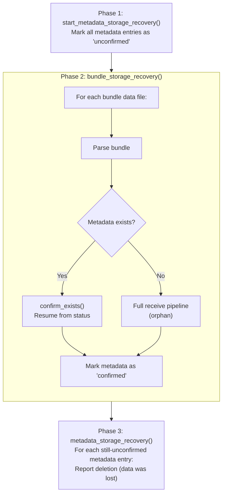

# Storage Subsystem Design

This document describes the storage subsystem in the BPA, covering the dual storage model, caching, expiration monitoring, and crash recovery.

## Related Documents

- **[Bundle State Machine Design](bundle_state_machine_design.md)**: Bundle status values stored in metadata
- **[Filter Subsystem Design](filter_subsystem_design.md)**: Filter checkpoint persistence
- **[Policy Subsystem Design](policy_subsystem_design.md)**: Hybrid channels for queue management
- **[Routing Design](routing_subsystem_design.md)**: Route changes trigger `reset_peer_queue()`

## Overview

The storage subsystem provides persistent and cached storage for bundles, coordinating between separate data and metadata backends:

| Component | Purpose |
|-----------|---------|
| **Store** | Central coordinator for all storage operations |
| **BundleStorage** | Binary bundle data persistence (blobs) |
| **MetadataStorage** | Bundle state and lifecycle tracking |
| **LRU Cache** | In-memory bundle data for fast access |
| **Reaper** | Lifetime expiration monitoring |
| **Channels** | Hybrid fast/slow path queue management |

## Architecture Diagram

```
┌─────────────────────────────────────────────────────────────────────┐
│                            Store                                    │
│                                                                     │
│  ┌─────────────────┐  ┌─────────────────┐  ┌─────────────────────┐  │
│  │   LRU Cache     │  │  Reaper Cache   │  │  Channel Manager    │  │
│  │  (bundle data)  │  │  (expiry times) │  │  (fast/slow path)   │  │
│  └────────┬────────┘  └────────┬────────┘  └──────────┬──────────┘  │
│           │                    │                      │             │
└───────────┼────────────────────┼──────────────────────┼─────────────┘
            │                    │                      │
            ▼                    ▼                      ▼
┌─────────────────────┐  ┌─────────────────┐  ┌─────────────────────┐
│   BundleStorage     │  │ MetadataStorage │  │   Dispatcher        │
│   (trait)           │  │ (trait)         │  │                     │
├─────────────────────┤  ├─────────────────┤  │  - drop_bundle()    │
│ - localdisk-storage │  │ - sqlite-storage│  │  - ingress_bundle() │
│ - bundle_mem        │  │ - metadata_mem  │  │  - poll_waiting()   │
└─────────────────────┘  └─────────────────┘  └─────────────────────┘
```

## Store Coordinator

The `Store` struct is the central coordinator for all storage operations. It holds references to both storage backends, manages the LRU cache and reaper cache, and coordinates recovery.

**Lock Strategy:**

- `spin::Mutex` for bundle_cache (O(1) operations, no blocking)
- Standard `Mutex` for reaper_cache (requires O(n) iteration)

## Storage Traits

The storage subsystem defines two core traits that backends must implement. See rustdoc for full API details.

### BundleStorage

The `BundleStorage` trait manages binary bundle data as opaque blobs. Implementations handle recovery (walking stored files), load/save by storage name, and deletion. The trait is designed for large data with infrequent access.

### MetadataStorage

The `MetadataStorage` trait manages bundle lifecycle state with indexed queries. Key operations include:

- **CRUD**: get, insert, replace, tombstone (prevents re-insertion)
- **Recovery**: start_recovery, confirm_exists, remove_unconfirmed
- **Queue management**: reset_peer_queue (ForwardPending → Waiting)
- **Polling**: poll_expiry, poll_waiting, poll_pending for background processing

### Streaming results via `Sender<T>`

Polling methods on both traits stream results back to the caller via a `Sender<T>` sink rather than returning a collection. The trait describes *what* is communicated — a sequence of bundles or recovery responses — without committing to any particular channel type for *how* they are delivered.

The trait's predecessor was a type alias resolving directly to `flume::Sender<T>`. Every implementation of `MetadataStorage` and `BundleStorage` therefore had to depend on flume directly, and a backend with a different internal model had no escape: localdisk-storage's recovery walk runs synchronously inside a blocking task and uses flume's blocking `send` + `is_disconnected` API, while the in-memory backends and the SQLite backend use only async sends. Coupling these two backend styles to a single channel API forced awkward compromises in either direction. It also propagated the BPA's channel choice into every backend crate, so any future change (such as the eventual flume → `hardy_async::channel` migration that motivated this redesign) would cascade through the whole workspace.

`Sender<T>` is a small trait with one async `send` method that returns an error wrapping the rejected item when the consumer has gone away. Each consumer implements the trait on whatever transport is convenient: a `hardy_async::channel::Sender` implements `Sender<T>` directly via a blanket impl, so BPA call sites pass one straight into a polling method; localdisk-storage's `recover()` keeps its blocking flume channel internally and runs a small bridge pump task that forwards items from the flume receiver to the external `Sender`; the shared test suite uses a `Mutex<Vec<T>>`-based collector for assertions. None of these implementations leak into the trait surface — they're free to evolve independently.

The trait is passed as `&dyn Sender<T>` rather than as a method-level generic parameter. A generic method would force `MetadataStorage` and `BundleStorage` to lose their object-safety, which would cascade through the BPA: the central `Store` holds storage backends as `Arc<dyn MetadataStorage>` (chosen at runtime based on configuration), and that pattern would no longer compile. The cost of `&dyn` is one indirect call per item streamed, which is negligible relative to anything the storage backend itself does.

#### Naming: `Sender`, not `Sink`

Hardy already uses the name `Sink` for a structurally different pattern: the long-lived, multi-method back-channels that CLAs, Services, and RoutingAgents receive when they register with the BPA. A `cla::Sink` lives for the duration of the registration and exposes several methods (forward, dispatch, error reporting). Reusing `Sink` for the storage abstraction would invite confusion between the two patterns even though their architectural intent — decouple the trait from the underlying transport — is the same.

`Sender<T>` mirrors [`hardy_async::channel::Sender`](../../async/src/channel.rs) deliberately: the trait is the abstract version of the same role at the channel layer (one async `send`, ownership-recovering error on disconnect), and most implementors wrap exactly such a channel. The name pairs naturally with a future `Receiver<T>` pull-side trait — the same Sender/Receiver split as `hardy_async::channel`, at the trait-level. (A `Receiver<T>` trait was introduced and then removed pending its first caller; it returns alongside the CLA streaming work.)

#### Connection to streaming chunks

The longer-term direction for BPA payload handling is end-to-end streaming: payload bytes flow through pipelines chunk-by-chunk rather than buffering whole bundles in memory. `Sender<T>` is the smallest expression of that direction — when the streaming pipeline lands, `Sender<Chunk>` is a natural shape using exactly the same trait.

## Dual Storage Model

Bundle data and metadata are stored separately:

```
┌─────────────────────────────────────────────────────────────────┐
│                         Bundle                                  │
│                                                                 │
│  ┌─────────────────────────┐  ┌──────────────────────────────┐  │
│  │     Binary Data         │  │        Metadata              │  │
│  │                         │  │                              │  │
│  │  - CBOR-encoded bundle  │  │  - storage_name (pointer)    │  │
│  │  - Stored by blob key   │  │  - status (New, Waiting...)  │  │
│  │                         │  │  - received_at               │  │
│  │  Backend:               │  │  - ingress_peer_node/addr    │  │
│  │  - localdisk-storage    │  │  - flow_label                │  │
│  │  - bundle_mem           │  │                              │  │
│  │                         │  │  Backend:                    │  │
│  │                         │  │  - sqlite-storage            │  │
│  │                         │  │  - metadata_mem              │  │
│  └─────────────────────────┘  └──────────────────────────────┘  │
│                                                                 │
│  Linked by: metadata.storage_name → bundle_storage key          │
└─────────────────────────────────────────────────────────────────┘
```

### Why Separate Storage?

1. **Different access patterns**: Metadata accessed frequently (status checks), data accessed rarely (forwarding)
2. **Different backends**: Relational (SQLite, PostgreSQL) for indexed queries, blob stores (filesystem, S3) for large data
3. **Independent scaling**: Metadata on fast SSD, data on high-capacity storage
4. **Crash safety**: Atomic operations on each backend independently

## Storage Backends

### Localdisk Storage (Bundle Data)

**Location:** `/workspace/localdisk-storage/src/storage.rs`

Directory structure with 2-level hierarchy:

```
store_dir/
  XX/
    XX/
      <storage_name>
```

**Features:**

- **Atomic writes** (with `fsync=true`): Write to `.tmp`, fsync, rename, fsync directory
- **Memory-mapped loading** (with `mmap` feature): Zero-copy via `memmap2::Mmap`
- **Parallel recovery**: Thread pool walks directories concurrently

Configuration includes the storage directory path and whether to use atomic writes (fsync). See the [localdisk-storage design doc](../../localdisk-storage/docs/design.md) for details.

### SQLite Storage (Metadata)

**Location:** `/workspace/sqlite-storage/src/storage.rs`

**Features:**

- Connection pool with write lock
- Prepared statement caching
- Status encoding as (code, param1, param2, param3) tuple

**Status Encoding:**

| Status | Code | Params |
|--------|------|--------|
| `New` | 0 | - |
| `Waiting` | 1 | - |
| `ForwardPending` | 2 | peer, queue |
| `AduFragment` | 3 | timestamp, sequence, source_eid |
| `Dispatching` | 4 | - |
| `WaitingForService` | 5 | -, -, service_eid |

Configuration includes the database directory and name. See the [sqlite-storage design doc](../../sqlite-storage/docs/design.md) for details.

### PostgreSQL Storage (Metadata)

**Location:** `/workspace/postgres-storage/src/storage.rs`

Implements `MetadataStorage` using PostgreSQL via `sqlx`, enabling shared metadata across multiple BPA instances. Uses connection pooling (`sqlx::PgPool`) and automatic schema migration. See the [postgres-storage design doc](../../postgres-storage/docs/design.md) for details.

### S3 Storage (Bundle Data)

**Location:** `/workspace/s3-storage/src/storage.rs`

Implements `BundleStorage` using the Amazon S3 API via `aws-sdk-s3`, storing each bundle as a separate object under a configurable prefix. Compatible with MinIO and other S3-compatible stores. See the [s3-storage design doc](../../s3-storage/docs/design.md) for details.

### In-Memory Storage (Testing)

**Bundle:** `src/storage/bundle_mem.rs` - byte-capacity LRU; when over capacity, least-recently-used bundles are evicted (a `min_bundles` floor, clamped to at least 1, protects the most recent saves).
**Metadata:** `src/storage/metadata_mem.rs` - bounded LRU keyed by bundle ID; tombstones are demoted to the LRU tail so capacity evictions consume them before any live bundle, and eviction of an already-expired bundle is accounted as housekeeping rather than data loss.

Both stores warn at startup that contents do not survive a restart, and emit edge-triggered `info` lines when occupancy crosses 95% of capacity and again when it falls back below 90%, so sustained pressure produces two log lines per episode rather than one per eviction.

## LRU Cache Management

The Store maintains an in-memory LRU cache for frequently accessed bundle data. Configuration controls the cache capacity (default: 1024 entries) and maximum bundle size to cache (default: 16 KB).

### Cache Operations

| Operation | Strategy | Cache Behavior |
|-----------|----------|----------------|
| **Load** | Cache-first | Check cache (peek without LRU update), fall back to backend |
| **Save** | Persist-first | Always persist to backend, cache if size ≤ `max_cached_bundle_size` |
| **Delete** | Cache-then-backend | Remove from cache, then delete from backend |

See `load_data()`, `save_data()`, and `delete_data()` in `src/storage/store.rs` for implementation.

## Reaper (Expiration Monitoring)

The reaper monitors bundle lifetimes and triggers deletion on expiry (`src/storage/reaper.rs`).

### Two-Level Cache Architecture

```
┌─────────────────────────────────────────────────────────────────┐
│                    Reaper Cache (in-memory)                     │
│                                                                 │
│  BTreeSet<CacheEntry> ordered by expiry time                    │
│  Limited size (= poll_channel_depth)                            │
│  Keeps bundles with soonest expiry                              │
│                                                                 │
│  When full: evict entry with latest expiry (keep soonest)       │
└─────────────────────────────────┬───────────────────────────────┘
                                  │ refill when empty
                                  ▼
┌─────────────────────────────────────────────────────────────────┐
│                  MetadataStorage (persistent)                   │
│                                                                 │
│  poll_expiry(tx, limit) returns bundles ordered by expiry       │
│  Full list of all bundles with lifetimes                        │
└─────────────────────────────────────────────────────────────────┘
```

### Cache Entries

Each cache entry tracks a bundle's expiry time, ID, and destination. The BTreeSet orders entries by expiry time → destination → ID for deterministic ordering.

### Reaper Loop

The reaper runs as a background task with the following behavior:

1. **Sleep** until the next bundle expiry (or indefinitely if cache is empty)
2. **Wake** on: shutdown signal, new bundle notification, or expiry timeout
3. **Expire** all bundles past their lifetime via `drop_bundle()`
4. **Refill** cache from storage when depleted

The reaper uses `select_biased!` to prioritize shutdown handling. See `run_reaper()` in `src/storage/reaper.rs` for implementation.

### Watch Bundle

When a bundle enters the system, it's registered with the reaper via `watch_bundle()`:

1. Create a `CacheEntry` with expiry time, bundle ID, and destination
2. Insert into the BTreeSet cache (evicts latest expiry if full)
3. Wake the reaper if this bundle has the soonest expiry

This ensures bundles with imminent expiry are always tracked in the in-memory cache.

## Crash Recovery

Three-phase recovery process on startup (`src/storage/recover.rs`):

### Phase 1: Start Recovery

Call `start_metadata_storage_recovery()` to prepare the metadata backend:

- **SQLite**: Marks all bundle entries as "unconfirmed"
- **In-memory**: No-op

### Phase 2: Bundle Storage Recovery

Call `bundle_storage_recovery()` to scan all stored bundle data:

1. Walk storage directory, emitting `(storage_name, timestamp)` pairs
2. For each bundle, call `restart_bundle()` to determine status:

| Condition | Result | Action |
|-----------|--------|--------|
| Data + metadata exist | `Valid` | Resume from status checkpoint |
| Data exists, no metadata | `Orphan` | Full receive pipeline (`process_received_bundle` + `ingress_bundle`) |
| Duplicate data found | `Duplicate` | Delete spurious copy |
| Data unparseable | `Junk` | Delete data |
| Data missing | `Missing` | Skip (race condition) |

### Phase 3: Metadata Recovery

Call `metadata_storage_recovery()` to find orphaned metadata:

1. Query for bundles still marked "unconfirmed" (data was lost)
2. Report each as deleted with `DepletedStorage` reason

See `src/storage/recover.rs` for implementation details.

### Recovery Diagram



## Crash Safety Properties

1. **Atomic store**: Bundle data saved before metadata; cleanup on failure
2. **Checkpoints**: Status transitions mark processing milestones (see [Bundle State Machine Design](bundle_state_machine_design.md))
3. **Tombstones**: Deleted bundles cannot be re-inserted
4. **Two-level verification**: Recovery cross-checks data + metadata existence
5. **Orphan detection**: Unconfirmed metadata entries reported with `DepletedStorage` reason

## Store/Load/Delete Operations

### Store (Two-Phase Atomic)

```
1. save_data(bytes)
   → bundle_storage.save(bytes) → returns storage_name
   → cache if size < max_cached_bundle_size

2. store(bundle, data)
   → save_data(data) → storage_name
   → bundle.metadata.storage_name = storage_name
   → metadata_storage.insert(bundle)
   → if insert fails (duplicate): delete_data(storage_name)
```

### Load

```
load_data(storage_name)
   → bundle_cache.peek(storage_name)? return cached
   → bundle_storage.load(storage_name)
```

### Delete

```
delete_data(storage_name)
   → bundle_cache.pop(storage_name)
   → bundle_storage.delete(storage_name)

tombstone(bundle_id)
   → metadata_storage.tombstone(bundle_id)
```

## Configuration

Each storage component is configured separately:

| Component | Key Settings |
|-----------|-------------|
| **Store** | LRU cache capacity (default: 1024), max cached bundle size (default: 16 KB) |
| **Localdisk** | Storage directory, atomic writes (fsync) |
| **SQLite** | Database directory and name |
| **In-memory** | Bundle: byte capacity, minimum bundle count; metadata: maximum entry count |

See rustdoc for `Config` structs and the respective storage backend design docs for configuration details.
