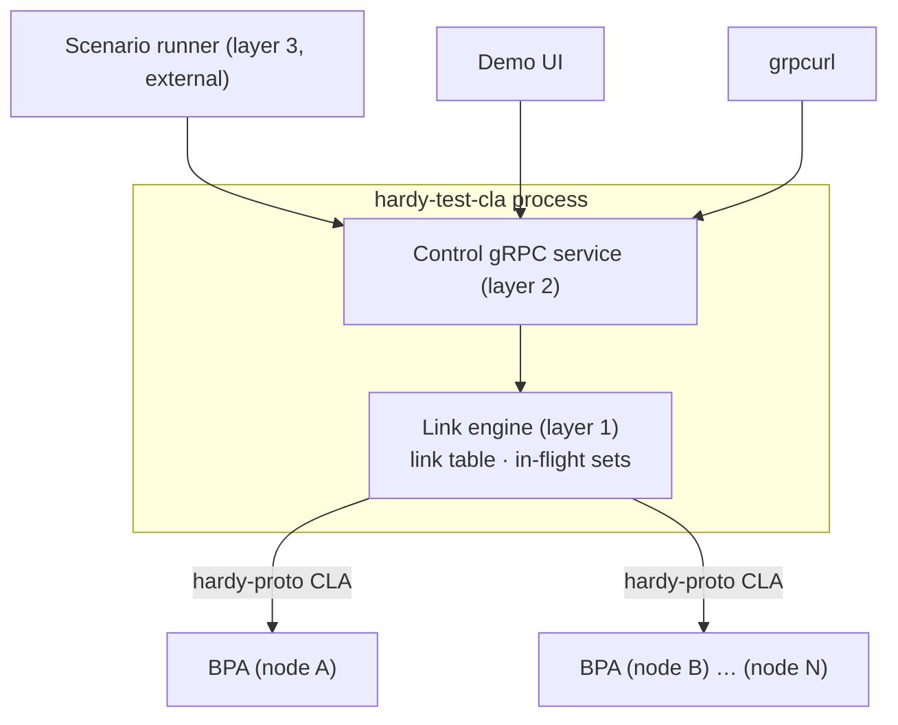

# Hardy TestCla — Design Document

**Status:** Draft for iteration — rev 3: CLA-interface facts verified against the codebase; ownership acknowledgement + deferred transfer outcomes adopted (§4.3, [`bpa/docs/design.md`](../bpa/docs/design.md#deferred-cla-transfer-outcomes))
**Crate:** `hardy-test-cla` (workspace member, alongside `file-cla` and `tcpclv4-server`)

---

## 1. Purpose

`hardy-test-cla` is a standalone process that presents itself to one or more Hardy BPAs as a Convergence Layer Adapter over the existing `hardy-proto` BPA↔CLA gRPC interface, while internally emulating a set of directed communication links with configurable delay, rate, loss, corruption, and contact schedules.

It exists for three reasons, in priority order:

1. **Instrumentation.** It is an instrument for *discovering* the implicit semantics of the BPA↔CLA contract — what a transfer failure licenses the BPA to conclude, what stream teardown means for outstanding transfers, how the BPA behaves under interleaved success/failure — and for pinning each answer as a documented requirement with an executable verification.
2. **Demonstration.** It allows representative multi-node DTN demonstrations, in particular direct execution of the [CCSDS DTN Reference Scenarios](https://github.com/esa/ccsds-dtn-reference-scenarios) (LEO, lunar, Mars), without root privileges, `tc`/netem, network namespaces, or any Linux-specific machinery. Runs anywhere, deterministic, CI-friendly.
3. **Adverse-condition testing.** Loss, corruption, reordering, and oversubscription at bundle granularity exercise Hardy's forwarding, storage, expiry, re-forwarding, fragmentation, and BPSec failure paths under exactly the conditions they exist for.

### 1.1 Non-goals

- **Not a CLA robustness tester.** A TestCla run says nothing about TCPCLv4 session recovery, segmentation, keepalives, or any real convergence-layer implementation under adverse transports. netem retains that role.
- **Not a router.** All forwarding, storage, retry-policy, and routing decisions remain in the BPA. The emulator makes none.
- **Not a buffer.** See Law 1.

---

## 2. Design laws

These are the invariants everything else is derived from. Changes here are architecture changes.

1. **The emulator is the channel, nothing more.** A bundle held by the emulator is a bundle *on the wire* (or in the declared receiver buffer, §4.4). During a contact gap, the bundle is in the BPA's store, not the emulator's. An emulator that buffers across outages is doing the BPA's job and the demonstration becomes a lie.
2. **The emulator lies only about time, never about possession or outcomes.** Hand-offs are real: acceptance means the emulator has taken responsibility for the bundle (§4.3), and a delivered bundle has actually been handed to the far BPA. On reliable links every accepted transfer's true outcome is reported back — at the instant the sender-side CL entity would physically learn it, never before. The event stream records everything either way.
3. **Every knob models one physical thing.** Channel properties (loss, BER, delay, rate) describe the channel. The link's reliability mode is the single interpretation function from channel truth to CLA-visible behaviour. No knob directly configures a CLA-visible symptom.
4. **Restart is a link flap.** The emulator holds no durable state. Killing it drops all gRPC streams: the BPAs see simultaneous total CLA loss, in-flight bundles are destroyed with the process, and every unresolved transfer resolves to outcome-unknown at the sender (§4.3) — retained, re-forwarded later, duplicates tolerated. This is honest and is itself a test scenario.
5. **Mechanism below, policy outside.** The link engine executes instantaneous imperative commands and knows nothing of scenario time or contact plans. All scheduling intelligence lives in external clients of the control API.

---

## 3. Architecture

Three layers. The first two live in the `hardy-test-cla` process; the third is external.



### 3.1 Layer 1 — Link engine

Pure mechanism. Owns:

- **Link table.** Each *directed* link `(from-node, to-node)` with its current parameters and contact state.
- **In-flight sets.** Per link, the set of `(bundle, arrival_instant, …)` entries currently "on the wire". Bounded by bandwidth × delay per link; held in RAM.
- **CLA-side gRPC clients** to each registered BPA (one held-open stream per BPA, per the existing `hardy-proto` pattern).
- **A clock.** Injectable/virtual in test builds (`tokio::time::pause` style) so engine-level integration tests step time explicitly with no real sleeps. Scope honestly: the virtual clock governs the *emulator's* time only — BPAs are separate processes on wall clock, so end-to-end tests involving real BPAs cannot step time and their expiry/timer behaviour runs at 1×.

Its internal API is imperative and instantaneous: create/destroy link, set parameters, open/close contact, plus a broadcast stream of events out. It does not know *why* a contact opened.

### 3.2 Layer 2 — Control gRPC service

A thin, faithful exposure of the link-engine API as a second gRPC service on the same process:

- Link CRUD and parameter mutation.
- Contact open/close.
- Server-streaming **event feed** (see §7).
- (Test builds) explicit clock advance — emulator clock only, per §3.1.

This is what makes the emulator scriptable from any language, drivable from a demo UI, and interactively abusable mid-demo ("watch what happens when I kill the relay contact early" from a `grpcurl` one-liner).

Multiple concurrent writers are expected (scenario runner + human operator). Precedence is simple: a **manual override pins a link** until explicitly released; runner writes to a pinned link are acknowledged-but-ignored and logged.

The control proto is versioned independently of scenario-file interpretation (§8) — a Yellow Book CSV schema change must not be a breaking proto change.

### 3.3 Layer 3 — Scenario runner (external)

A client of layer 2 that ships in the same repo (and plausibly the same binary as a convenience subcommand) but touches the engine *only* through the control API. It:

- Loads a CCSDS reference-scenario file (§8).
- Owns the **scenario clock**: epoch, time-scale factor, pause/resume. A 90-minute LEO orbit compresses to a 90-second demo at 60×. BPAs live in real time; bundle lifetimes must be set with the compression in mind — a documented demo parameter, not a hack.
- Translates the contact plan into timed control-API calls (contact open/close, per-contact OWLT and rate updates).
- **Drives Hardy's routing API in parallel.** The runner is responsible for the whole scenario, not just the channel: it installs and withdraws routes (directly, or by feeding `hardy-tvr` — see §4.2) in step with the same contact plan that drives the emulator. One scenario file, two consumers, one clock.

Keeping the runner external buys: deterministic CI (replace it with a test driver that steps the virtual clock), clean live mutation (runner and operator are just two clients), and a natural attachment point for a demo UI on the event feed.

**Skew as a feature.** Because routing knowledge and channel truth are driven separately, the runner can deliberately skew them — routes installed early/late relative to actual contacts — modelling clock error and stale contact plans. This is a first-class scenario parameter, not an accident.

---

## 4. The CLA face

### 4.1 Interface

The existing `hardy-proto` BPA↔CLA interface, unmodified: the single `Register` RPC opens a long-lived bidirectional stream per BPA, and every subsequent interaction is a correlated message pair on that stream (`proto/cla.proto`). Facts of the interface the design builds on, verified against the code:

- **Message set.** CLA→BPA requests: `dispatch`, `add_peer`, `remove_peer`; BPA→CLA requests: `forward`; each answered by a correlated response or `google.rpc.Status`. One message per bundle — there is **no chunking** on this interface (`bundle` is a single `bytes` field in both directions), which closes Q5.
- **Size ceiling.** `hardy-proto` caps stream messages at 16 MiB (`MAX_MESSAGE_SIZE`), pre-flight-checked on the dispatch path only (`proto/src/client/cla.rs`); an oversized *forward* is not pre-checked and risks an encode failure on the shared stream — indistinguishable from a total link flap. Scenario bundle sizes must respect this envelope, and Phase 0 pins the actual over-limit behaviour as a test.
- **Verdict vocabulary.** A forward is answered `sent`, `no_neighbour`, or an error `Status` (surfaced as a call failure at the BPA); the BPA currently treats the last two identically, resetting the *entire* peer queue to `Waiting` and re-dispatching only on its next routing event (`bpa/src/dispatcher/forward.rs`, `bpa/src/routing/rib.rs`) — see Q1/Q4. The deferred-outcome extension ([`bpa/docs/design.md`](../bpa/docs/design.md#deferred-cla-transfer-outcomes)) adds an `accepted` verdict plus an out-of-band outcome message keyed by bundle ID; reliable-mode emulation depends on it (§4.3).
- **Queues.** `ForwardBundleRequest.queue` is always absent today for gRPC-registered CLAs (no egress policy is attached at gRPC registration); the TestCla ignores it.
- **Address type.** The TestCla registers with `address_type` unset. The BPA's address-type handler map is last-writer-wins, so claiming `Private` would silently hijack address-literal route resolution from any other private-addressed CLA on the same node; the TestCla needs only `add_peer`-driven forwarding.

The interface gives a three-level failure taxonomy, which we adopt as doctrine:

| Signal | Meaning | BPA's licensed conclusion |
|---|---|---|
| Offer rejected (synchronous transfer failure) | This bundle never entered the channel; the link may still be standing | Not delivered; per-bundle policy (retry/re-route per BPA policy — *see Q1*) |
| Deferred `failed` (reliable links, §4.3) | The sending CL entity gave up on an accepted transfer | Re-forward; **not** proof of non-delivery — see below and Q3 |
| Stream teardown | CLA gone; all its peers gone; channel contents destroyed | All unresolved transfers → outcome **unknown** (see Q2) |

**A deferred failure does not assert non-delivery.** It may be delivered-but-acknowledgement-lost: failure-then-duplicate is a legal sequence and the emulator generates it deliberately (independent loss on the notional forward and return legs, §5.4). The BPA must tolerate the far end already holding the bundle it re-forwards. An *offer rejection*, by contrast, genuinely asserts non-delivery — the emulator refuses at the door or not at all.

### 4.2 Peer lifecycle — two modes

**Default: schedule-driven (TVR owns discovery).** Hardy already has the deployment-realistic division of labour: `hardy-tvr` (or the scenario runner directly) owns schedule knowledge and installs/withdraws routes; the CLA merely reflects link reality. In this mode the TestCla keeps peers registered for the scenario's duration and *enforces* contacts: transmission attempts outside a contact window are rejected with a transfer failure. Disagreement between the BPA's plan and channel truth surfaces as failures — which is the clock-skew / stale-plan test harness.

Note the shape this takes in the current BPA: a rejection parks the peer's queue in `Waiting` until the next routing event (the RIB's notify machinery). In schedule-driven operation those events are exactly the contact-boundary route updates, so skew scenarios read as *stall-until-plan-correction*, not a retry storm — the exposing observable is latency, and the event stream timestamps make it measurable.

**Alternate: discovery-driven.** The TestCla registers/deregisters peers at contact open/close, acting as the contact plan's voice. This exercises the opportunistic-routing path and CLA-peer-event handling. Explicitly the non-default mode; useful, but not how a scheduled deployment runs.

Per-link config selects the mode. Mechanics common to both:

- **Addressing.** Each far node is a distinct peer keyed by a minted `ClaAddress::Private` whose bytes are the scenario node name; the emulator demultiplexes `ForwardBundleRequest.address` back to the directed link.
- **Startup ordering.** The node-ids passed to `add_peer` are learned from each BPA's `RegisterClaResponse`, so the emulator registers with all configured BPAs first, then installs peers. This resolves the registration-ordering ambiguity at design time; what remains for Phase 0 is BPAs arriving late or restarting.
- **Rejection wire form.** Enforce-mode rejections are an error `Status` with a distinct code per cause (e.g. `FAILED_PRECONDITION` for closed contact, `RESOURCE_EXHAUSTED` for channel occupancy) — not `no_neighbour`, which would be a lie while the peer is deliberately still registered. `no_neighbour` is reserved for discovery mode, where a forward can legitimately race a peer withdrawal. The BPA reacts identically to all of these today; whether it *should* distinguish them is exactly Q7.

### 4.3 Transfer acknowledgement — ownership, then outcome

The forward exchange is split in two, per the **deferred-outcome extension** to the core contract ([`bpa/docs/design.md`](../bpa/docs/design.md#deferred-cla-transfer-outcomes)). This tool is the extension's motivating consumer, but the mechanism is core Hardy, not TestCla-specific — `tcpclv4` has the same problem today (it holds the forward call until the peer's final `XFER_ACK`) and adopts the same split.

1. **The offer verdict — synchronous.** The forward response returns as soon as the emulator has decided the offer; it is never withheld for channel time. Rejection means the bundle never entered the channel: admission (§5.3), contact enforcement (§4.2), and the sampled retry trajectory against the *scheduled* contact (§5.4) are all evaluated at the door. Acceptance transfers **ownership**: an unreliable link answers a terminal `sent` (fire and forget); a reliable link answers `accepted`.
2. **The transfer outcome — deferred, out-of-band.** For accepted transfers the emulator later reports `completed` or `failed` against the bundle ID (carried in the forward request and echoed back opaquely), at the instant the sender-side CL entity would physically learn the outcome: `completed` when the notional final acknowledgement returns (delivery instant plus return-leg OWLT), `failed` when the notional retry budget expires into silence or the sender-side contact view closes (§5.4, §5.6). This is the LTP-session-report analogue — reliable CLs *do* tell their BP agent how a transfer ended; they just don't hold a call open to do it.

Why the split, rather than withholding the response until the outcome is known (an earlier draft did): the wire permits arbitrarily late responses, but a pending call pins real resources — a `hardy-proto` client handler permit from a pool hardcoded to `available_parallelism()` (`proto/src/proxy.rs`), and a BPA processing-pool slot for the call's duration (`bpa/src/dispatcher/forward.rs`). Withholding for OWLT/RTT — minutes to hours in the scenarios this tool exists for — collapses both pools to pool-size-per-RTT throughput. The split keeps the pools fluid and loses nothing: outcomes arrive with physically correct timing on the existing stream.

The emulator's obligations under the extension: every `accepted` is resolved — `completed`, `failed`, or implicitly outcome-unknown at stream teardown — and outcome instants are physical (Law 2). The BPA-side semantics (bundle retained until outcome, per-bundle re-queue on `failed`, outcome-unknown sweep on teardown) are specified in the core design doc; the consequence worth naming for scenario design is that an accepted bundle is *retained by the sending BPA* until its outcome, so emulator restart (Law 4) costs re-transmission, not end-to-end loss.

### 4.4 Backpressure and receiver overrun

The channel delivers at the computed arrival instant regardless of the far BPA's readiness — a radio does not wait. Deliveries onto a stream are emitted in arrival-instant order, one `dispatch` message per bundle (no chunking, §4.1); the correlated `DispatchBundleResponse` is the hand-off instant the event stream records as delivery.

gRPC never surfaces "receiver not ready" as a send failure — bounded channels and HTTP/2 flow control give *soft* backpressure. So receiver overrun is measured, not detected: a **bounded, per-stream, explicitly configured** `receiver-buffer` models the real serial/radio-interface buffer a CLA would have, and its occupancy is the bytes delivered-but-not-yet-acknowledged by the far stream (outstanding dispatches) plus deliveries due. On overrun: unreliable mode drops the bundle (event: `receiver_overrun`); reliable mode redelivers — consuming retry budget and adding RTT latency — and on budget exhaustion reports a deferred `failed` (§4.3). Unbounded elastic delivery is forbidden — it would reintroduce the infinite buffer through the transport layer (Law 1).

---

## 5. Channel model

Per directed link. All of §5.2–§5.5 are Phase 1+; Phase 0 links are ideal.

### 5.1 Reliability mode

`reliable` | `unreliable`. The interpretation function (Law 3):

| Channel event | Reliable (LTP-red/TCPCL-like) | Unreliable (LTP-green/UDP-like) |
|---|---|---|
| Loss | Retransmission → added latency; budget exhaustion → deferred `failed` at the physically correct instant (§4.3, §5.4) | Bundle evaporates (sender already told "sent") |
| Bit corruption | Detected & retransmitted below the bundle layer → contributes to retry/latency model; corrupted bytes never reach the far BPA | Corrupted bundle **delivered** to the far BPA |
| Reordering | Legitimate (parallel sessions complete out of order) unless `in-order: true` | Natural |

### 5.2 Delay

Composed, not scalar:

- **Propagation** (OWLT): fixed per link per contact; piecewise function of scenario time in the internal model (real scenarios vary OWLT over the timeline) even if v1 config only reads constants.
- **Serialization:** `bundle_size / rate`.
- **Jitter:** per-bundle random term on top of propagation.

Reordering **is not a separate mechanism**: it falls out of jitter-induced overtaking, which is also the physically correct model. A per-link `in-order: true` flag clamps overtaking for byte-stream-like CLs.

Asymmetric links are native (two directed links, independent parameters).

### 5.3 Rate and admission control

No queueing (Law 1): rate manifests as **channel occupancy**. A transfer occupies the link for `size/rate`; a transfer offered while the channel is busy is rejected immediately with a transfer failure. The BPA is thereby forced to do its own rate-matching against contact volume — the "oversubscribed the pass" failure mode.

Interplay with the current BPA, so Q4's experiment confirms rather than surprises: the BPA answers any rejection by resetting the *whole* peer queue to `Waiting` — including sibling transfers concurrently in flight from its processing pool — so a single occupancy rejection amplifies into queue-wide churn plus a stall until the next routing event. Measuring that amplification is the point of the experiment.

### 5.4 Loss

- v1: Bernoulli, per bundle (per notional leg in reliable mode).
- v2: Gilbert–Elliott two-state burst model — space links fail in bursts, not IID. Worth the extra twenty lines.

In reliable mode, loss is not simulated retransmission-by-retransmission: sample the attempt count `k` from the geometric distribution at offer time and schedule the consequences. If `k ≤ retry-budget` and `OWLT + (k−1)·RTT` completes inside the scheduled contact, the bundle is delivered at that instant and `completed` is reported one return-leg OWLT later — the notional final acknowledgement coming home. If the trajectory exhausts the budget, `failed` is reported at the instant the sender-side CL entity would give up; and because the forward and return legs lose independently, the emulator samples whether a forward copy nonetheless arrived — budget exhaustion with a completed delivery is the delivered-but-acknowledgement-lost case, reported `failed` *and* delivered, producing the duplicate on re-forward that Q3 exists to study. Sampled at offer, reported on the physical schedule: cheap, correct in distribution, and it produces the canonical demo — 1% loss on a Mars link doesn't lose 1% of bundles, it adds forty minutes to the unlucky ones.

### 5.5 Corruption

- Modelled as a **bit-error rate**, not per-bundle probability: large bundles are proportionally more exposed (physically correct), which makes fragmentation demonstrable — crank the BER and watch whole bundles die while fragments trickle through.
- Only meaningful on unreliable links (see §5.1 table).
- This mode is, frankly, a structured fuzzer with a delivery mechanism: it exercises the streaming parser against malformed CBOR, per-block CRC failures, the CRC-none-but-BIB-protected divergence (BPSec verification failure vs parse failure), and discard-block vs discard-bundle flag logic. The event log records pre- and post-corruption bytes so every failure is reproducible.
- Optional flag: `allow-undetectable-corruption` — flips confined to payload bytes of a CRC-none, BIB-less bundle sail through to the application. The most honest outcome of all; also the kind of honesty that ruins demos.

### 5.6 Contact closure with bundles in flight

Photons don't queue. At contact close, in-flight bundles are destroyed in both modes, and the event stream records every destruction with its cause. On an unreliable link the bundle simply evaporates — the sender was told `sent` and nothing more is owed. On a reliable link the destruction surfaces as a deferred `failed` (§4.3) at the instant the sender-side CL entity concludes the transfer is dead — its own contact view closing, or its retry budget expiring into silence: the LTP session-cancel analogue. If delivery had completed but the notional acknowledgement had not come home, the result is `failed`-despite-delivered → a duplicate on the next contact (§5.4). Deliberate.

In enforce mode the *scheduled* close is already accounted for at the door: offers whose sampled trajectory cannot complete before the contact's planned end are rejected synchronously (§5.4). Deferred failures therefore arise only from *unscheduled* closure — a manual override mid-demo, a plan change, or plan-vs-channel skew — which is exactly when a real CL entity would be surprised too.

---

## 6. Configuration

Static, from file, at startup (Phase 0–1). Runtime mutation arrives only via the control service (Phase 2); restart-to-reconfigure until then.

Field naming follows the kebab-case serde convention of the other server binaries (`tcpclv4-server`). Shape from day one (so Phase 1 is purely additive — `#[serde(default)]` throughout the channel block):

```toml
name = "test-cla-1"                # CLA registration name (CLAs have no node-id)

[[bpa]]
name    = "earth-station"
address = "http://10.0.0.1:50051"

[[bpa]]
name    = "mars-relay"
address = "http://10.0.0.2:50051"

[[link]]
from    = "earth-station"
to      = "mars-relay"
# Phase 0: absence of [link.channel] ⇒ ideal (instant, reliable, always up)

[link.channel]                     # Phase 1, all defaulted
mode            = "reliable"       # "reliable" | "unreliable"
owlt            = "225s"           # propagation delay
jitter          = "50ms"           # per-bundle; drives reordering
rate            = "2Mbps"          # serialization + occupancy/admission
loss            = 0.01             # per notional leg
ber             = 0.0              # bit-error rate (unreliable only)
rtt             = "450s"           # for the reliable retry model
retry-budget    = 8
in-order        = false
receiver-buffer = "4MiB"           # bounded; overrun is a modelled event
contact-mode    = "enforce"        # "enforce" (default) | "discover" (§4.2)

# sugar: expands to two directed links with identical channels
[[link]]
between       = ["earth-station", "leo-sat"]
bidirectional = true
```

Directed links are the unit even while ideal links make direction invisible; `bidirectional` is pure sugar.

Scenario bundle sizes must respect the 16 MiB message ceiling of the gRPC CLA face (§4.1) — a documented envelope, not a channel parameter.

---

## 7. Observability — the lab notebook

The event stream is the primary product of an instrumentation run, designed for assertion first and prettiness second. It is also the **delivery ledger**: reliable links report outcomes at the interface too (§4.3), but the event stream holds every outcome — including unreliable-mode evaporation the interface never sees — timestamped with both the reporting instant and the physical instant.

- **Transport: OpenTelemetry**, riding the existing `hardy-otel` infrastructure rather than a bespoke schema. The goal is *one distributed trace* per bundle spanning sending BPA → emulator → receiving BPA: the emulator's transfer lifecycle as spans (channel occupancy, propagation, sampled retries as span events) hanging off the BPA's forwarding trace via propagated context. **This requires a small `hardy-proto` addition:** no context propagation exists today, and per-RPC tonic middleware cannot supply it — all traffic multiplexes over the single long-lived `Register` stream, so gRPC metadata is exchanged once at registration, not per bundle. Trace context must ride in the messages themselves (an optional `traceparent` field on `ForwardBundleRequest`/`DispatchBundleRequest`); a backward-compatible field addition, phased with the control service. Until it lands, spans correlate by bundle-id attribute rather than parent-child context. (This closes Q6 as a question and reopens it as a work item.)
- **Every state transition emits.** Register/deregister, contact open/close, transfer offered/accepted/rejected/delivered/failed/destroyed, receiver_overrun, corruption applied (with pre/post bytes), manual-override pin/release. Timestamped in both wall and scenario time.
- **Determinism.** Seeded RNG; seed, config hash, and scenario hash recorded in the run header. Any anomaly is re-runnable exactly.
- The control service's event feed (§3.2) and the demo UI consume the same telemetry — no parallel channel.
- Phase 0 may emit via `tracing` with the OTel span structure already in place; the discipline of "every transition emits" is established while there are four transitions, not retrofitted at twenty.

---

## 8. Scenario files

- The CCSDS reference-scenario CSV/JSON format (per the corresponding Yellow Book) is consumed **natively** as the scenario input format — no TOML dialect, no converter. The repo is early (CC BY 4.0, two commits); implementation-experience feedback ("this field is ambiguous", "rates in what units") should flow back to SIS-DTN while the format is wet. This tool is plausibly the format's first executable consumer.
- Scenario-file interpretation is versioned separately from the control proto (§3.2).
- The runner maps scenario node names to BPA endpoints and TVR/routing endpoints via a small local binding file — the scenario file stays pristine and shareable.

---

## 9. Phasing

### Phase 0 — Wiring (the instrument exists)

Ideal links only: instant, reliable, always up. Deliverables:

- Crate skeleton following `tcpclv4-server`'s structural pattern — the standalone CLA-process-over-gRPC binary (config/main split, `proto::client::register_cla`, optional OTEL feature, TaskPool signal handling). (`file-cla` is the *in-process library* CLA pattern and is not the template here.)
- Config parse (§6, degenerate channel); connect and register with all configured BPAs; learn each BPA's node-ids from its `RegisterClaResponse`; install peers (§4.2); answer forward offers with ownership verdicts; deliver on the far stream and record hand-off from the correlated dispatch response.
- Event emission for all (four-ish) transitions.
- **Acceptance:** `bp ping` through echo-service across two BPAs bridged by the TestCla; N bundles in → N out, in order, all transfers successful. This baseline is pinned as a test *before* any probabilistic behaviour exists — once loss is configurable, "the emulator ate it" is the permanent first suspect for every anomaly. Phase 0's real deliverable is **trust in the instrument**.
- Pin the >16 MiB forward behaviour (§4.1) as a test while the semantics are trivial — this failure must never be mistaken for a scenario event.

Phase 0 also flushes the plumbing ambiguities while semantics are trivial: late-arriving/restarting BPAs, clean shutdown mid-transfer, stream-drop behaviour. First experiments available immediately: `kill -9` with transfers outstanding (→ Q2), restart-as-flap. Phase 0 links are ideal and answer terminal `sent` — the deferred-outcome extension is not yet needed.

### Phase 1 — Channel model

**Prerequisite:** the deferred-outcome extension to `hardy-proto` and the BPA ([`bpa/docs/design.md`](../bpa/docs/design.md#deferred-cla-transfer-outcomes)) — reliable-mode semantics depend on it.

Per-link channel parameters and behaviours: delay composition + jitter, rate/occupancy/admission, Bernoulli loss with the sampled reliable-mode trajectory and deferred outcomes (§5.4), contact open/close (both lifecycle modes), receiver buffer, contact closure destruction. Run the discovery experiments (Q1–Q4); feed answers into `docs/requirements.md` as LLRs with TestCla scenarios as verification.

### Phase 2 — Control service

Layer 2 gRPC service; runtime mutation; manual-override pinning; virtual-clock control for tests; event feed as server-streaming RPC.

### Phase 3 — Scenario runner + reference scenarios

External runner: scenario clock/scaling, CCSDS file ingestion, parallel drive of routing (TVR) and channel, skew injection. Demo target: lunar scenario end-to-end, one command: `hardy-test-cla run --scenario lunar-communication/v1.0 --time-scale 60`.

### Later / stretch

- BER + corruption engine (the structured fuzzer), Gilbert–Elliott.
- Demo UI on the event feed.
- **Interop under adversity:** three-node chain `foreign impl —TCPCL→ Hardy relay —TestCla→ Hardy`, extending the existing interop suite. "Interoperability verified under emulated lunar/Mars channel conditions against N implementations" is a claim no one else in the interop table can currently make. The gateway topology is arguably *more* representative than direct links anyway.

---

## 10. Open questions (the discoverables log)

The point of the tool. Each answer, once decided, becomes an LLR in `docs/requirements.md` with the provoking TestCla scenario pinned as its verification. The tool tells us what *is*; the "should" step is manual and deliberate — current behaviour must not be canonised merely for being current. Where the code already predicts the answer, the prediction is recorded so the experiment confirms rather than surprises.

| # | Question | Generated by | Status |
|---|---|---|---|
| Q1 | On per-transfer failure (link up), does the BPA retry the same peer, back off, or re-route? Interleaved success/failure on a live link is the exposing pattern. *Predicted from code: a synchronous failure resets the entire peer queue to `Waiting` (`bpa/src/dispatcher/forward.rs`) and re-dispatch waits for the next RIB event — no per-bundle retry, no backoff. Deferred failures re-enter dispatch per-bundle by design (core extension), un-damped at the mechanism layer. The experiment characterises both paths.* | Phase 1, mid-range loss | Open |
| Q2 | On stream teardown with transfers outstanding: failed, or outcome-unknown (re-forward, tolerate duplicate)? *Outcome-unknown is now the specified behaviour of the core extension — unresolved transfers return to `Waiting`. The experiment verifies it, including the duplicate case where a transfer completed at the far end but was torn down before its outcome arrived.* | Phase 0, `kill -9` | Open |
| Q3 | Duplicate handling: after failure-then-duplicate (delivered-but-acknowledgement-lost, §5.4), what does the receiving BPA do? Interacts with the Echo Service draft's end-to-end concerns. | Phase 1, per-leg loss | Open |
| Q4 | Oversubscription: BPA behaviour when admission control rejects mid-contact — rate-match, back off, or thrash? *Predicted from code: one rejection resets the whole peer queue, including in-flight siblings — the experiment measures the amplification (§5.3).* | Phase 1, occupancy | Open |
| Q5 | ~~Does the CLA transfer path chunk bundles across stream messages?~~ **Answered by reading the code:** no — one message per bundle, 16 MiB ceiling (§4.1). Per-completion arrival scheduling is moot unless the proto grows segmenting later. | Reading `hardy-proto` | Closed |
| Q6 | ~~Does tonic middleware propagate OTel context across the CLA interface today?~~ **Answered:** no propagation exists, and middleware cannot supply it on a single long-lived stream. Reopened as a work item: optional `traceparent` field on the transfer messages (§7). | Phase 0 | Closed → work item |
| Q7 | Should transfer failure grow a structured reason vocabulary in `hardy-proto`, or is the three-level taxonomy (§4.1) sufficient? The emulator already emits distinct `Status` codes per rejection cause (§4.2) and the deferred `failed` carries a `google.rpc.Status`, so the trace evidence will exist; the BPA currently ignores the distinction. Decide only after Q1/Q4 evidence. | Phase 1 evidence | Open |

---

## 11. Naming

`hardy-test-cla`, sitting in the CLA section. "Test" mildly undersells it — it is a CLA with a channel model and a control face, and plausibly the first executable consumer of the CCSDS reference-scenario format — but it says truthfully what it is for, and the CLA framing (not "channel emulator") is correct: the CLA face is the point.
