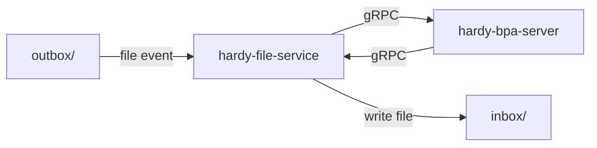
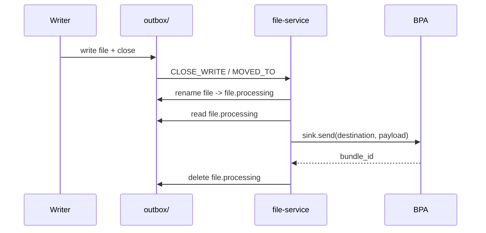
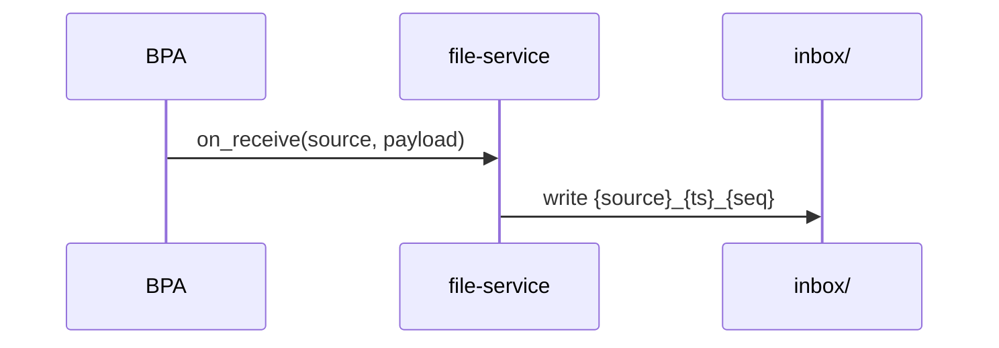

# hardy-file-service: Design Document

## Overview

hardy-file-service is a standalone gRPC application that bridges the filesystem
with a Hardy BPA. It registers as a BPv7 Application endpoint and provides two
filesystem interfaces:

- **Outbox** (send): a watched directory where files become bundle payloads
- **Inbox** (receive): a directory where incoming bundle payloads are written as files

It connects to the BPA via gRPC using the Application service.

## Architecture

### Outbox send flow

### Inbox receive flow

## Outbox Pipeline

### Event Detection

The outbox directory is monitored using Linux inotify via the `notify` crate.
Two event types trigger processing:

- `IN_CLOSE_WRITE`: a file was opened for writing and then closed.
  Covers `echo "data" > outbox/file` and `cp file outbox/`.
- `IN_MOVED_TO`: a file was renamed or moved into the directory.
  Covers `mv /tmp/file outbox/`.

### File Filtering

Files are skipped if:
- The filename starts with `.` (dotfiles). This allows atomic write patterns
  where a writer creates `.tmp_xyz` then renames to `final_name`.
- The filename ends with `.processing` (internal claim marker).
- The file is inside the `errors/` subdirectory.

### Claim and Send

When a file event is detected:

1. The file is atomically renamed from `name` to `name.processing`. This serves
   as a lock: if duplicate events fire for the same file, only the first rename
   succeeds.
2. The file content is read into memory.
3. The payload is sent to the BPA via `sink.send(destination, payload, lifetime)`.
4. On success: the `.processing` file is deleted.
5. On failure: the `.processing` file is moved to `outbox/errors/` for operator
   inspection.

### Concurrency

File sends are dispatched on a `BoundedTaskPool`, allowing multiple files to be
sent in parallel with backpressure.

### Shutdown

On cancellation signal the event loop exits and waits for all in-flight send
tasks to complete before returning.

## Inbox Pipeline

When the BPA delivers a bundle payload via `on_receive()`:

1. A unique filename is generated: `{source_eid}_{timestamp_nanos}_{seq}`.
2. The payload is written to the inbox directory.

## Limitations

- **Unique filenames required**: writers must use unique filenames. If a writer
  overwrites a file before the service claims it, the original payload is lost.
- **Linux only**: `IN_CLOSE_WRITE` is a Linux inotify event. The `notify` crate
  falls back to polling on non-Linux platforms.
- **Single destination**: all outbox files are sent to the same destination EID.
