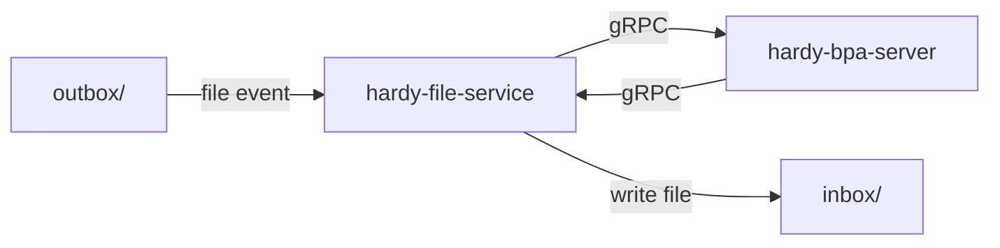
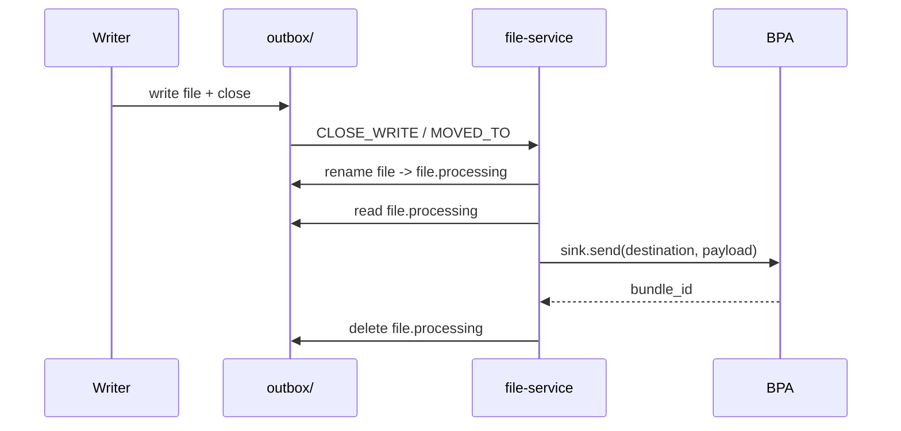
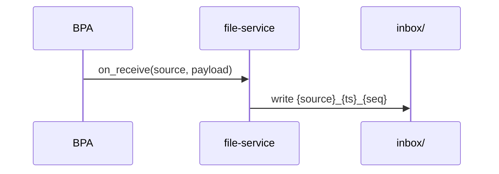

# hardy-file-service: Design Document

## Overview

hardy-file-service is a standalone gRPC application that bridges the filesystem
with a Hardy BPA. It registers as a BPv7 Application endpoint and provides two
filesystem interfaces:

- **Outbox** (send): a watched directory where files become bundle payloads
- **Inbox** (receive): a directory where incoming bundle payloads are written as files

It connects to the BPA via gRPC using the Application service.

Not to be confused with `hardy-file-cla`, which is a convergence layer adapter
that moves raw serialized bundles between the filesystem and the BPA. This crate
operates at the application layer, working with payloads rather than bundles.

## Architecture

### Outbox send flow

### Inbox receive flow

## Outbox Pipeline

### Startup Recovery

On startup, before the event loop begins:

1. The watcher is started (events begin queuing in the channel).
2. Orphaned `.processing` files from a previous crash are renamed back to their
   original names. The watcher catches these renames as `MOVED_TO` events.
   If the original file already exists, the `.processing` file is moved to
   the errors directory to avoid overwriting.
3. Pre-existing regular files are injected as synthetic `CLOSE_WRITE` events
   into the same channel.
4. The event loop starts and processes all queued events uniformly.

The rename claim in `process_file` deduplicates events from both the startup
scan and the watcher.

### Event Detection

The outbox directory is monitored using Linux inotify via the `notify` crate.
Two event types trigger processing:

- `IN_CLOSE_WRITE`: a file was opened for writing and then closed.
  Covers `echo "data" > outbox/file` and `cp file outbox/`.
- `IN_MOVED_TO`: a file was renamed or moved into the directory.
  Covers `mv /tmp/file outbox/`.

### File Filtering

Files are skipped if:
- The filename starts with `.` (dotfiles). This allows atomic write patterns
  where a writer creates `.tmp_xyz` then renames to `final_name`.
- The filename ends with `.processing` (internal claim marker).

### Claim and Send

When a file event is detected:

1. The file is atomically renamed from `name` to `name.processing`. This serves
   as a lock: if duplicate events fire for the same file, only the first rename
   succeeds.
2. The file content is read into memory.
3. The payload is sent to the BPA via `sink.send(destination, payload, lifetime)`.
4. On success: the `.processing` file is deleted.
5. On failure: the `.processing` file is moved to the errors directory for
   operator inspection. The errors directory defaults to `/tmp/hardy/errors`
   and can be configured separately from the outbox.

### Concurrency

File sends are dispatched on a `BoundedTaskPool`, allowing multiple files to be
sent in parallel with backpressure.

### Shutdown

On cancellation signal the event loop stops accepting new events. In-flight
sends are cancelled via the shared cancellation token: `process_file` takes
the cancel branch, renames `.processing` back to the original name, and
returns. The next startup recovers these files and resends them. Only genuine
send failures (BPA rejected the bundle) land in `errors/`.

## Inbox Pipeline

When the BPA delivers a bundle payload via `on_receive()`:

1. A unique filename is generated: `{source_eid}_{timestamp_nanos}_{seq}`.
2. The payload is written to the inbox directory.

## Limitations

- **Unique filenames required**: writers must use unique filenames. If a writer
  overwrites a file before the service claims it, the original payload is lost.
- **Empty files are discarded**: zero-byte files are deleted without sending.
  They are not moved to errors.
- **Inbox write is silent loss**: the Application trait's `on_receive` has no
  return value. If an inbox write fails, the BPA considers the bundle delivered.
  Monitor logs for `error!` level messages.
- **Linux only**: `IN_CLOSE_WRITE` is a Linux inotify event. Non-Linux
  platforms are not supported. Docker Desktop on macOS/Windows uses a VM
  that does not propagate inotify events across bind mounts. Native Linux
  Docker with bind mounts works correctly.
- **At-least-once delivery**: `select_biased!` prioritizes the send result
  over the cancel signal, so a completed send is always acknowledged. However,
  if the process is killed (SIGKILL) between a successful send and the file
  deletion, the next startup resends the file. Acceptable for DTN
  (at-least-once semantics).
- **Single destination**: all outbox files are sent to the same destination EID.
