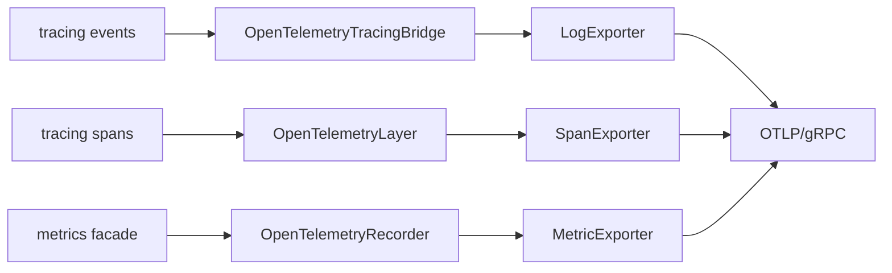

# hardy-otel Design

Consolidated OpenTelemetry integration providing logs, traces, and metrics export for all Hardy applications.

## Design Goals

- **Single telemetry library.** Provide one library that all Hardy applications use for observability. This ensures consistent telemetry configuration across the project and avoids duplicating OpenTelemetry setup code in each application.

- **Unified observability.** Connect all three telemetry signals (logs, traces, metrics) to an OpenTelemetry collector. Operators get a consistent view of system behaviour through standard tooling.

- **Hide complexity.** OpenTelemetry's Rust ecosystem involves multiple crates with non-trivial configuration. This library encapsulates the complexity into a single `init()` function.

- **Guard-based lifecycle.** Telemetry resources must be flushed and shut down properly. The `OtelGuard` ensures providers are cleaned up when the application exits.

## Architecture Overview

The library bridges Rust's telemetry crates to OpenTelemetry exporters:

Each signal type has its own SDK provider:
- **SdkTracerProvider** - Span collection and export
- **SdkMeterProvider** - Metrics aggregation and export
- **SdkLoggerProvider** - Log record export

All providers use OTLP export over gRPC (via tonic) to a collector at `localhost:4317` by default, configurable via `OTEL_EXPORTER_OTLP_ENDPOINT`.

## Key Design Decisions

### Single init() Entry Point

Rather than requiring applications to configure each provider separately, `init()` sets up all three signal types with sensible defaults. It returns an `OtelGuard` that the caller must keep alive; dropping the guard triggers provider shutdown with proper flushing.

This trades flexibility for simplicity - most Hardy applications need identical telemetry configuration. The `level` parameter sets the default log level, which can be overridden at runtime via the `RUST_LOG` environment variable (e.g. `RUST_LOG=debug` or `RUST_LOG=hardy_bpa=trace`).

### tracing as the Instrumentation Framework

Hardy uses the `tracing` crate exclusively for instrumentation. It provides both structured logging (events) and span-based tracing in a single API. The `tracing` macros (`info!`, `debug!`, `#[instrument]`) are used throughout the codebase.

The library connects `tracing` to OpenTelemetry in two ways:
- **OpenTelemetryTracingBridge** - Routes tracing events to the log exporter
- **OpenTelemetryLayer** - Exports spans to the trace exporter

### metrics Crate Facade

For metrics, Hardy uses the `metrics` crate facade. The `OpenTelemetryRecorder` implements `metrics::Recorder`, translating `metrics!` macro calls to OpenTelemetry instrument operations.

Instruments are lazily created and cached using `DashMap` for thread-safe concurrent access. Counter, gauge, and histogram types are supported.

### Gauge State Tracking via AtomicU64

The `metrics` crate's `GaugeFn` trait requires `increment(f64)` and `decrement(f64)`, but OpenTelemetry gauges only support `record(absolute_value)`. The recorder bridges this gap by maintaining an `AtomicU64` (storing `f64` bits via `to_bits()`/`from_bits()`) per gauge instrument. A compare-exchange loop atomically updates the value and calls `gauge.record()` with the result. `Relaxed` ordering is sufficient since gauges are observational snapshots, not synchronization primitives.

**Known race condition:** The CAS update of `current` and the subsequent `gauge.record()` call are not atomic together. Under concurrent updates, a thread could record a stale value after a newer value has already been recorded by another thread. The internal `current` state is always correct (the CAS guarantees this), but the OTEL-exported value could momentarily reflect a previous state. This self-corrects on the next gauge operation — the race window is nanoseconds versus the typical 60-second OTEL export interval. A future improvement would be to use an OTEL observable gauge (pull model), where a callback reads `current` at export time, eliminating the race entirely.

### Telemetry Loop Prevention

A common problem with OpenTelemetry integration is telemetry-induced-telemetry: the OTLP exporter uses HTTP/gRPC, which generates its own logs and traces, which get exported, creating an infinite loop.

The library filters out logs from crates used by the exporters:
- `reqwest`, `tonic`, `tower`, `h2` - HTTP/gRPC stack
- `opentelemetry` - Internal OpenTelemetry logs (on console output only)

This filtering is applied via `EnvFilter` directives. The trade-off is that logs from these crates are suppressed even when used outside the exporter context.

### Unfiltered Span Export

The `OpenTelemetryLayer` (span → trace export) has no level filter, unlike the log and console layers. This is intentional because span instrumentation is gated behind the opt-in `instrument` cargo feature — when disabled (the default), `#[cfg_attr(feature = "instrument", instrument(...))]` compiles away and no spans are created.

When `instrument` is enabled for debugging or profiling, all ~115 instrumented functions export spans to the collector. On a busy node this can generate significant trace volume. Trace volume should be controlled at the collector (via sampling or filtering pipelines) rather than at the application, since users enabling `instrument` typically want full visibility. The `SdkTracerProvider` also supports application-side sampling if needed (see the commented-out sampler configuration in `init_tracer`).

The longer-term intent is to support programmatic per-bundle tracing, where a filter inspects bundle content and sets metadata to mark individual bundles for tracing. Only marked bundles generate trace spans as they flow through the processing pipeline. This selective approach avoids the overhead of blanket instrumentation while providing full end-to-end visibility for bundles of interest. The unfiltered span export layer supports this model — every span for a traced bundle must reach the collector without being sampled away.

### Batch vs Periodic Export

Export strategies differ by signal type:
- **Traces and logs** use batch export - events accumulate and are sent in batches to reduce overhead
- **Metrics** use periodic export - aggregated values are sent at regular intervals

## Integration

### With hardy-bpa-server

When compiled with the `otel` feature, the server calls `hardy_otel::init()` at startup and holds the guard for its lifetime.

### With hardy-tcpclv4-server

Similar integration for the standalone TCPCLv4 server.

## Standards Compliance

This package does not implement a specific RFC or IETF standard. It integrates the [OpenTelemetry Specification](https://opentelemetry.io/docs/specs/otel/) (v1.x) for telemetry export, using the OTLP wire protocol over gRPC. The OTEL SDK crate versions (0.31.x) track the upstream specification.

## Dependencies

| Crate | Purpose |
|-------|---------|
| opentelemetry | Core OpenTelemetry API |
| opentelemetry-sdk | Provider implementations |
| opentelemetry-otlp | OTLP/gRPC exporters |
| tracing-opentelemetry | Span export bridge |
| opentelemetry-appender-tracing | Log export bridge |
| tracing-subscriber | Subscriber configuration and filtering |
| metrics | Metrics facade |
| dashmap | Thread-safe instrument caching |

## Testing

- [Unit Test Plan](unit_test_plan.md) - Metrics recorder bridge correctness for all three instrument types (counter, gauge, histogram), tested at the trait level, recorder level, and via `metrics::*!()` macros.
