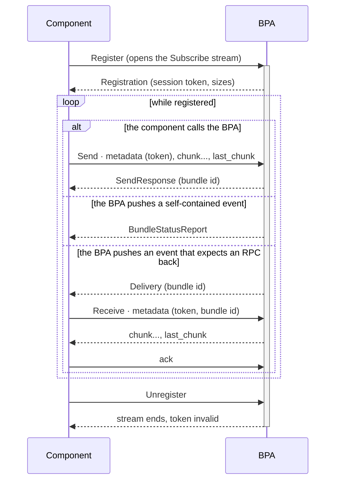

# hardy-proto

The gRPC wire contract of the Hardy BPA: the protobuf schemas and their generated types, with an optional BPA-side server and a component-side client SDK.

Part of the [Hardy](https://github.com/ricktaylor/hardy) DTN Bundle Protocol implementation.

## Installation

```toml
[dependencies]
hardy-proto = "0.3"
```

Published on [crates.io](https://crates.io/crates/hardy-proto).

## Overview

A BPA works through attached components: applications that exchange application data units (ADUs), services that exchange complete bundles, convergence-layer adapters (CLAs) that connect it to links, and routing agents that supply routes. `hardy-bpa` defines them as Rust traits for components in the same process as the BPA. This crate defines one gRPC API per kind of component, so that a component can run in another process, on another machine, or in another language.

The crate is three things in one package, selected by feature flags:

- **The contract** (no features): the four schemas under [`proto/`](./proto/), compiled into one Rust module each, with their tonic clients and servers and the wire constants. A component that speaks the wire directly needs nothing more.
- **The server** (`server`): one `*ServiceImpl` per API, implementing its generated tonic trait over `hardy_bpa::bpa::BpaRegistration`, for a host such as `hardy-bpa-server` to mount on its own tonic transport.
- **The client SDK** (`client`): `BpaClient`, which registers a local `hardy_bpa` component against a remote BPA. The component implements the same trait it would implement in-process and never sees gRPC.

## How a component talks to the BPA

A component registers with the BPA and stays registered while it works. During that time the BPA pushes events to it. On the wire, the registration is a *session*. Every API builds it from the same three pieces.

1. **The session is one `Subscribe` call.** The first request is `Register`. The first response is a `Registration` event carrying a session token and the sizes the session runs under. After that, the response stream carries only events. Bundle bytes never travel on this stream.
2. **Every other RPC presents the token.** Its first message carries the session token; that is all the BPA needs to find the session. The four streaming calls, `Send`, `Receive`, `Dispatch` and `Forward`, are the data plane: they move ADU or bundle bytes as `chunk` messages ended by `last_chunk`. The client abandons a transfer with `cancel`; the BPA abandons one by ending the call with a status.
3. **Some events expect an RPC back.** A `BundleStatusReport` is self-contained. A `Delivery` or `Forwarding` names a bundle by its RFC 9171 bundle id and expects the component to open `Receive` or `Forward` with that id; the component completes the exchange on that call, with an `ack` or a result. A bundle whose exchange never completes is not lost: the BPA keeps it and pushes the event again to a later registration.

`Unregister`, or closing the `Subscribe` stream, ends the registration and invalidates the token. The shape of an application session:



The APIs differ only in their events and calls.

| API | Events the BPA pushes | Data-plane calls | Other calls |
| --- | --- | --- | --- |
| `application` | `Delivery`, `BundleStatusReport` | `Send`, `Receive` | none |
| `service` | `Delivery`, `BundleStatusReport` | `Send`, `Receive` | none |
| `cla` | `Forwarding` | `Dispatch`, `Forward` | `AddPeer`, `RemovePeer`, `ReportTransferOutcome` |
| `routing` | none | none | `AddRoute`, `RemoveRoute` |

Errors are gRPC statuses, never message payloads. A failed call ends with a code and a short hand-written message, and nothing else: the code is what a client branches on, the message is a phrase for a developer reading a log, and nothing a client sent is ever reflected back in it. No Rust type reaches the wire. The comments in the schemas name the codes each call can end with; a code they do not name for a call came from the transport, not the BPA.

The comments in the schemas under [`proto/`](./proto/) are the wire contract. [`docs/design.md`](./docs/design.md) says why it is shaped as it is.

## Features

- One gRPC API per kind of component: `hardy.application.v1`, `hardy.service.v1`, `hardy.cla.v1`, `hardy.routing.v1`
- Chunked, cancellable streaming for every transfer, at a chunk size negotiated per session (1 MiB unless the client asks for less) under a 16 MiB message cap and an 8 GiB transfer cap, all announced in every `Registration`
- Session tokens, random and server-minted, opaque to the client, that every other call presents
- Server-side limits on stalled clients: handshake, idle, claim, grace and minimum-rate bounds, a per-API session ceiling, and a cap on the inbound transfers one session has open at once
- Feature flag: `server` -- the four `*ServiceImpl` types in `hardy_proto::server`
- Feature flag: `client` -- the `BpaClient` SDK in `hardy_proto::client`
- Feature flag: `instrument` -- `tracing` spans on SDK calls and server sessions

## Usage

Hosting the application API of a BPA (`server` feature):

```rust
use hardy_async::TaskPool;
use hardy_proto::server::ApplicationServiceImpl;
use tonic::transport::Server;

let tasks = TaskPool::new();
Server::builder()
    .add_service(ApplicationServiceImpl::new(bpa, tasks.clone()).into_server())
    .serve("[::1]:50051".parse()?)
    .await?;
tasks.shutdown().await;
```

Registering an application with a remote BPA (`client` feature):

```rust
use hardy_async::TaskPool;
use hardy_bpv7::eid::Service;
use hardy_proto::client::BpaClient;

let tasks = TaskPool::new();
let client = BpaClient::new("http://[::1]:50051", tasks.clone())?;
let registration = client.register_application(Service::Ipn(7), application).await?;
println!("registered as {}", registration.id());

// The application now runs through its callbacks. When it is time to stop:
tasks.shutdown().await;
registration.await?;
```

A component in another language compiles the schemas under [`proto/`](./proto/) with its own gRPC toolchain; the comments in the schemas are the wire contract.

## Documentation

- [Design](docs/design.md)
- [Test Coverage](docs/test_coverage_report.md)
- [Changelog](CHANGELOG.md)
- [API Documentation](https://docs.rs/hardy-proto)
- [User Documentation](https://ricktaylor.github.io/hardy/configuration/bpa-server/#grpc-management-interface)

## Licence

Apache 2.0 -- see [LICENSE](../LICENSE)
