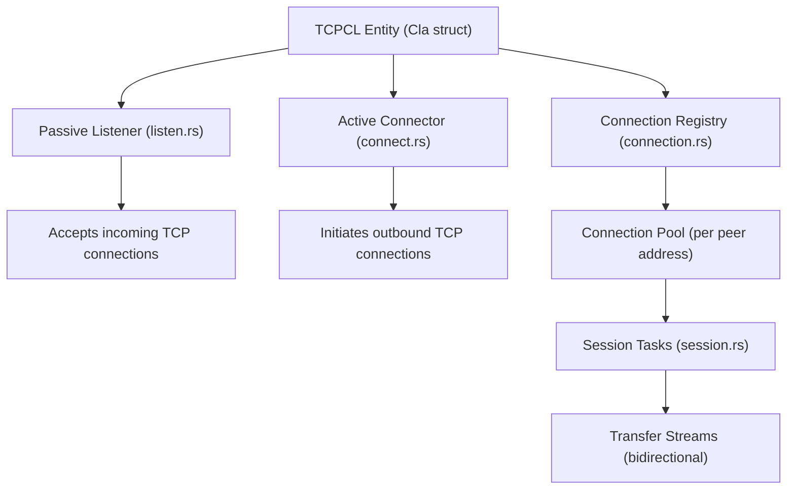
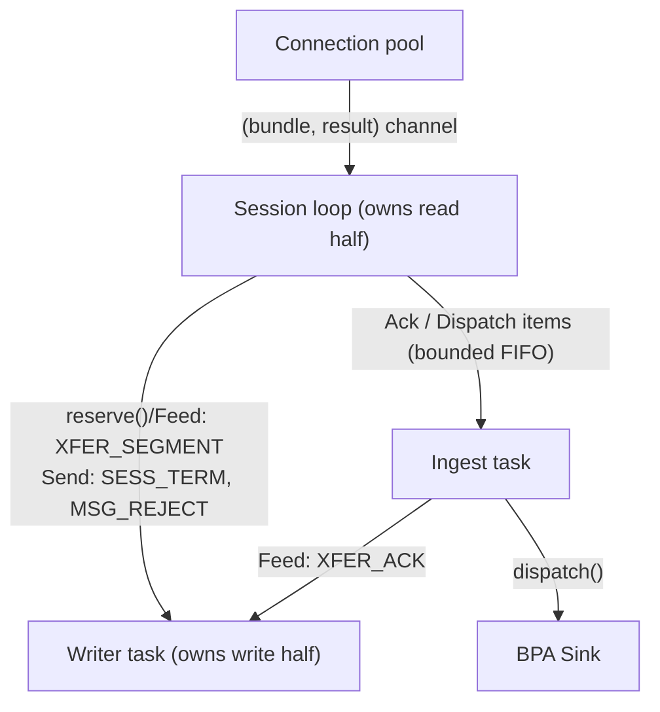

# hardy-tcpclv4 Design

TCP Convergence Layer Protocol Version 4 implementation for DTN bundle transport.

## Design Goals

- **RFC 9174 compliance.** Implement the complete TCPCLv4 specification including contact negotiation, session establishment, bidirectional transfer, and graceful termination.

- **High concurrency.** Handle many simultaneous connections efficiently. Each session runs as an independent async task, preventing slow transfers or network delays from blocking other sessions.

- **Connection reuse.** TCP, TLS, and TCPCLv4 handshakes are expensive. The implementation maintains a pool of idle connections per peer address, reusing established sessions when forwarding bundles to known peers.

- **TLS by default.** RFC 9174 Section 7.11 mandates TLS as mandatory-to-implement. The implementation requires TLS unless explicitly disabled by configuration.

## Architecture

The implementation follows the RFC's conceptual separation between TCPCL entities, sessions, and transfer streams:



### Layered Design

The code separates concerns across four layers:

**CLA Interface Layer** (`lib.rs`, `cla.rs`): Implements the `hardy_bpa::cla::Cla` trait. Receives forwarding requests from the BPA and manages the overall CLA lifecycle.

**Connection Management Layer** (`connection.rs`): Maps peer addresses to connection pools. Handles connection reuse decisions and peer registration with the BPA.

**Session Layer** (`session.rs`, `connect.rs`, `listen.rs`, `transport.rs`): Manages the TCPCLv4 session lifecycle from contact exchange through termination. Each session runs as an isolated async task.

**Codec Layer** (`codec.rs`): Encodes and decodes TCPCLv4 messages using tokio-util's framed I/O.

## Key Design Decisions

### Implicit Session State Machine

RFC 9174 Section 3.1 defines session states: Connecting, Contact Negotiating, Session Negotiating, Established, Ending, Terminated, and Failed. Rather than implementing an explicit state enum, the implementation represents states implicitly through code flow.

The contact exchange and session initialization occur in `Connector::connect()` and `Listener::new_contact()`. Once complete, control transfers to `Session::run()` which handles the Established state. Termination is handled by `Session::shutdown()` and `Session::on_terminate()`.

This approach was chosen because the state transitions are linear during setup, and the Established state requires different handling (bidirectional transfer loop) that maps naturally to a separate function.

### Connection Pooling Strategy

Each `ConnectionPool` maintains separate sets of idle and active connections. When forwarding a bundle:

1. Try an idle connection first, moving it to the active set
2. If no idle connections exist and the pool isn't at capacity, signal the caller to establish a new connection
3. If at capacity, queue to a random active connection
4. If establishing a new connection fails while sessions remain open, queue to a busy session anyway — a peer with asymmetric reachability (RFC 9174 Section 3.3) can hold a session open without being able to accept another

This balances connection reuse against parallelism. The `max_idle_connections` configuration (default: 6) limits memory usage from idle connections while allowing burst capacity. Concurrent forwards may each signal a dial before the first new session registers, briefly overshooting the bound; excess connections are shed after use when they fail the idle-return check.

### Tower Service for Listener

The TCP listener wraps connection acceptance as a Tower `Service`, enabling middleware composition:

```rust
tower::ServiceBuilder::new()
    .rate_limit(1024, Duration::from_secs(1))
    .service(ListenerService::new(listener))
```

This provides connection flood protection without modifying the core acceptance logic. Future security layers (IP blocking, authentication gates) can be composed as additional middleware.

### TLS Integration

TLS uses rustls with tokio-rustls for async operation. The contact header exchange (RFC 9174 Section 4.2) includes a CAN_TLS flag; if both peers indicate TLS support, the TLS handshake occurs before session initialization.

Server certificate validation supports three modes for the server name:
1. Configured server name (for certificates issued to domain names)
2. "localhost" for loopback connections
3. IP address (may fail if certificate is domain-issued)

A debug option allows accepting self-signed certificates for testing, with prominent warnings.

### TCPCLv3 Interoperability

When connecting to a peer that responds with protocol version 3, the implementation sends a TCPCLv3 SHUTDOWN message (`0x45, 0x01`) before closing. This allows legacy peers to clean up gracefully rather than interpreting the disconnect as an error.

## Session Task Architecture

Each established session runs as three cooperating tasks: the session loop, the writer task, and the ingest task. The split enforces one rule: **the session loop never awaits anything slower than the socket** — not transport writes, not BPA dispatch. Everything else in this section is a consequence of that rule.



**Session loop** (`Session::run`): reads and decodes frames, reassembles inbound transfers, matches inbound XFER_ACK/XFER_REFUSE against outstanding segment expectations, and drives outbound transfers accepted from the connection pool.

**Writer task** (`writer.rs`): owns the write half of the transport and sends keepalives when idle, so a stalled BPA or a long transfer can never cause a keepalive timeout. Commands come in two flavours with deliberately different contracts:

- `Send` carries a oneshot result and flushes — used for control messages (SESS_TERM, MSG_REJECT) where the caller needs a synchronous outcome.
- `Feed` is fire-and-forget — used for the data path (segments, acks). Per-message completion would cost an allocation and two task wake-ups per segment, fully serialized, and the completion await could not be safely raced against the reader in a select. Backpressure is the bounded command channel; write errors close the writer, which producers observe as a closed channel on their next command.

The writer flushes when its command queue runs dry, so consecutive segments stream into the transport without intermediate flushes while small tail messages never linger in the codec buffer.

`WriterHandle::reserve()` returns a `FeedPermit`: a cancel-safe, two-phase send. Reservation can be raced in a select (dropping it leaves the channel untouched), and committing the permit is synchronous. This is how the session loop writes segments while still polling the reader.

**Ingest task** (`run_ingest`): the ordered handoff to the BPA. Every XFER_ACK the session emits flows through its FIFO queue — not just final ones. The final segment of a transfer is queued as a `Dispatch` item carrying the reassembled bundle; its ack is only emitted after `sink.dispatch()` returns. Two bounds apply backpressure to the reader: a queue depth for small items, and a semaphore capping how many completed bundles may await dispatch. When either bound is hit the session loop stops draining the socket and backpressure reaches the peer through TCP — through the bounds, never by stalling the protocol loop.

### Why the session loop must not block

**On dispatch (inbound):** dispatch includes a storage write and can block on BPA ingress backpressure. If the reader awaited it inline, three things would stall behind a local disk write: acknowledgments of our own outbound transfers sitting in the TCP buffer, our outbound segment flow, and the remote sender's transfer cycle (which waits on our final ack and would otherwise include our storage latency on every bundle). With the ingest task, a pipelining peer can also stream its next transfer while the previous bundle is being stored.

**On writes (outbound):** `Session::send_segment` reserves writer capacity inside a biased select that keeps processing inbound messages. Without this, two peers sending large transfers simultaneously can fill both directions' socket buffers and deadlock: each side blocked writing, neither side reading, keepalives stopped, no timeout running.

### Transfer acknowledgment semantics

The final XFER_ACK of a transfer is a transfer of responsibility, not a transport receipt. The sending BPA deletes its stored copy of a bundle when the CLA reports the transfer complete, so this implementation interprets RFC 9174 Section 5.2.3's "fully processed" strictly: the final segment is acknowledged only after `sink.dispatch()` has returned, which in hardy-bpa means the bundle is durably stored, dedup-registered, and checkpointed.

Failure inverts safely. If dispatch fails, the ingest task exits without acknowledging, the session terminates, and the peer — which still owns the bundle — retransmits later. A crash after store but before ack produces a retransmission that the BPA's duplicate detection absorbs. The chain is at-least-once delivery with dedup, which composes to effectively exactly-once.

Acknowledgments are emitted in segment-arrival order, across transfer boundaries. Our own ack matcher pops expectations strictly FIFO and peers may be equally strict, so an ack for a later transfer's segment must not overtake the dispatch-gated final ack of an earlier transfer. The single FIFO ingest consumer provides this ordering by construction; it is the reason all acks route through the ingest queue rather than only final ones.

At session teardown, every terminal path converges on one epilogue: the ingest queue is closed and drained (dispatching any fully received bundles and flushing their acks), then the writer is closed. A bundle received but not yet dispatched at teardown is still delivered to the BPA; if its ack no longer reaches the peer, the resulting retransmission is deduplicated.

## Session Lifecycle

Following RFC 9174 Section 3.2, session establishment proceeds through:

1. **TCP Connection**: Active entity initiates, passive entity accepts
2. **Contact Exchange**: Both peers send the 6-byte contact header ("dtn!" magic, version 4, flags)
3. **TLS Negotiation**: If both peers indicated TLS support, perform TLS handshake
4. **Session Initialization**: Exchange SESS_INIT messages with keepalive interval, segment/transfer MRU, and node ID
5. **Established**: Bidirectional bundle transfer via XFER_SEGMENT/XFER_ACK

Session termination follows RFC 9174 Section 6: send SESS_TERM, continue receiving, await SESS_TERM reply, close. The implementation handles "terminations passing in the night" where both peers initiate termination simultaneously.

## Transfer Protocol

Large bundles are segmented per RFC 9174 Section 5.2.2, respecting the peer's Segment MRU (maximum receive unit). Each segment receives an acknowledgement (XFER_ACK). Transfer IDs are per-session counters; if exhaustion is imminent, the session terminates with ResourceExhaustion rather than risk ID reuse.

Peers may refuse transfers (XFER_REFUSE) for reasons including: already received (Completed), temporary overload (NoResources), or session ending (SessionTerminating). The implementation handles Retransmit by resending the bundle. A refusal matched to the in-flight transfer clears every outstanding acknowledgment expectation for that transfer, because RFC 9174 Section 5.2.2 forbids further XFER_ACK messages for a refused transfer — without this, stale expectations would desynchronise the strict-FIFO ack matcher.

## Configuration

| Option | Default | Description |
|--------|---------|-------------|
| `address` | `[::]:4556` | Listen address (RFC 9174 Section 8.1 assigns port 4556) |
| `segment_mru` | 16384 | Maximum segment payload size to receive |
| `transfer_mru` | 1GB | Maximum total bundle size to receive (assembled in memory) |
| `max_idle_connections` | 6 | Maximum idle connections per peer address |
| `connection_rate_limit` | 64 | Maximum incoming connections per second |
| `contact_timeout` | 15 | Seconds to wait for contact header |
| `keepalive_interval` | 60 | Keepalive interval in seconds (None to disable) |
| `must_use_tls` | true | Require TLS for all connections |

RFC 9174 timing recommendations are enforced via warnings:
- Contact timeout SHOULD NOT exceed 60 seconds (Section 4.3)
- Keepalive interval SHOULD NOT exceed 600 seconds (Section 5.1.1)

## Integration

### With hardy-bpa

Implements `hardy_bpa::cla::Cla` trait. The BPA provides a `Sink` for dispatching received bundles and registering discovered peers. When a session learns the peer's node ID during SESS_INIT, it registers the peer via `sink.add_peer()`.

### With hardy-bpa-server

When compiled with the `tcpclv4` feature, the BPA server runs TCPCLv4 in-process without gRPC overhead.

### With hardy-tcpclv4-server

A standalone application linking this library with hardy-proto for gRPC connectivity to a remote BPA instance.

## Dependencies

| Crate | Purpose |
|-------|---------|
| hardy-bpa | CLA trait definition |
| tokio, tokio-rustls | Async runtime and TLS |
| tokio-util | Framed codec I/O |
| rustls, rustls-pemfile | TLS implementation and certificate parsing |
| tower | Service pattern for listener middleware |

## Future Work

- **Mutual TLS (mTLS)**: Client certificate authentication is not yet implemented
- **Session Extensions**: Currently rejects all critical extensions per RFC 9174 Section 4.8
- **Transfer Extensions**: No transfer extensions have been published as of RFC 9174; support can be added when specifications emerge
- **Outbound transfer pipelining**: A session completes each outbound transfer (fully acknowledged) before accepting the next, so per-peer goodput is bounded by one bundle per round trip. RFC 9174 Section 3.7 explicitly permits pipelining transfers without waiting for acknowledgments. A transfer window is blocked on the BPA egress-policy work supplying more than one in-flight forward per peer; the strict-FIFO ack matcher and ingest ordering already generalise across concurrent transfers
- **Priority queues**: Exposing `Cla::queue_count()` priority queues, most likely mapped to parallel sessions per peer — RFC 9174 Section 3.2 names multiple sessions as the interleaving mechanism, and strict priority on a single session would conflict with the no-interleaving rule
- **Uniform writer-task tracking**: The active-side writer task is spawned on the CLA task pool while the passive-side writer is not, so unregistration does not wait for passive writers to finish their final flush

## Standards Compliance

- [RFC 9174](https://www.rfc-editor.org/rfc/rfc9174.html) - Delay-Tolerant Networking TCP Convergence-Layer Protocol Version 4

## Testing

- [Test Plan](test_plan.md) - Session lifecycle and protocol message handling
