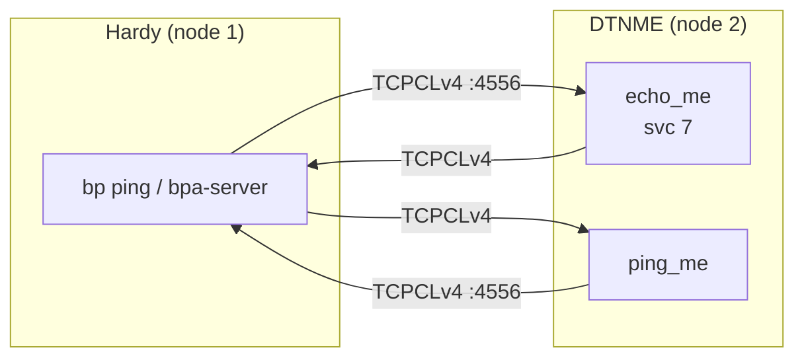

# DTNME Interoperability Test

Bidirectional BPv7 bundle exchange between Hardy and
[DTNME](https://github.com/nasa/DTNME) over TCPCLv4.

## Quick Start

```bash
# Full build + test
./tests/interop/DTNME/test_dtnme_ping.sh

# Skip Hardy rebuild
./tests/interop/DTNME/test_dtnme_ping.sh --skip-build

# Custom ping count
./tests/interop/DTNME/test_dtnme_ping.sh --skip-build --count 10
```

## What the Test Does

**Test 1 — Hardy pings DTNME:** Hardy sends BPv7 echo requests to
`ipn:2.7` via TCPCLv4.  DTNME's `echo_me` service responds.  Hardy
verifies round-trip delivery and reports RTT statistics.

**Test 2 — DTNME pings Hardy:** DTNME's `ping_me` tool sends BPv7
echo requests to `ipn:1.7` via TCPCLv4.  Hardy's echo service
responds.

## Architecture



## DTNME Modifications

None.  DTNME runs unmodified from upstream.

### Storage configuration

DTNME uses BerkeleyDB for bundle storage.  The database and payload
directories are pointed at `/dev/shm/dtnme/` (tmpfs) to avoid disk
I/O during benchmarks.

### Known workaround

Hardy must use `--no-payload-crc` when pinging DTNME, as DTNME
rejects bundles with payload CRC validation failures.

## Prerequisites

- Docker (builds the DTNME container image)
- Hardy `bp` and `hardy-bpa-server` binaries built

## Configuration

| Parameter | Value | Notes |
|-----------|-------|-------|
| DTNME node | `ipn:2.0` | Configurable via `NODE_ID` env var |
| Hardy node | `ipn:1.0` | |
| Echo service | 7 | Standard BPv7 echo service |
| TCPCLv4 port | 4556 | IANA standard; used by DTNME in Test 1, Hardy in Test 2 |
| TLS | Disabled | |
| Bundle signing | Disabled | `--no-sign` |
| Payload CRC | Disabled | `--no-payload-crc` (DTNME compatibility) |

## File Layout

```
DTNME/
  test_dtnme_ping.sh         # Test runner
  start_dtnme.sh             # Interactive launcher (build + run)
  docker/
    Dockerfile                # Multi-stage DTNME build from upstream
    start_dtnme               # Container entrypoint (generates runtime config)
    dtnme.cfg.template        # Reference config template
```
