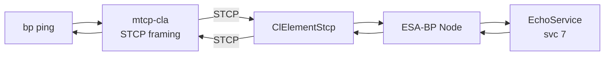
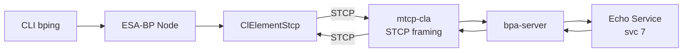

# ESA Bundle Protocol Interoperability Test

Bidirectional BPv7 bundle exchange between Hardy and ESA's
[Bundle Protocol](https://essr.esa.int/project/esa-bundle-protocol)
implementation over STCP (Simple TCP Convergence Layer).

## Quick Start

```bash
# Full build + test
./tests/interop/ESA-BP/test_esa_bp_ping.sh

# Skip Hardy rebuild (binaries already built)
./tests/interop/ESA-BP/test_esa_bp_ping.sh --skip-build

# Custom ping count
./tests/interop/ESA-BP/test_esa_bp_ping.sh --skip-build --count 10
```

## What the Test Does

**Test 1 — Hardy pings ESA-BP:** Hardy sends BPv7 echo requests to
`ipn:10.7` via STCP.  ESA-BP's echo service responds.  Hardy verifies
round-trip delivery and reports RTT statistics.

**Test 2 — ESA-BP pings Hardy:** ESA-BP's CLI `bping` command sends
BPv7 echo requests to `ipn:1.7` via STCP.  Hardy's echo service
responds.

## Architecture

### Test 1 — Hardy pings ESA-BP

Hardy's `bp ping` uses `mtcp-cla` (in STCP framing mode) to connect to
ESA-BP's custom STCP convergence layer element.  ESA-BP's `EchoService`
receives bundles via gRPC from the node and echoes them back to Hardy.



### Test 2 — ESA-BP pings Hardy

Hardy runs `hardy-bpa-server` with an echo service, and `mtcp-cla`
listening for STCP connections.  ESA-BP's CLI `bping` command sends
echo requests to `ipn:1.7` through the node's STCP element.



## ESA-BP Modifications

ESA-BP's core bundle-protocol code runs **unmodified**; only the
proprietary space-link convergence layers (SLE + generic-packetiser) are
stripped from the source before the build (see `strip-proprietary.sh`),
because they depend on gated ESA jars that aren't publicly resolvable and
Hardy interop only needs the STCP CL.  Two thin integration components
are then compiled against the ESA-BP API and loaded at runtime:

| Component | Purpose |
|-----------|---------|
| `ClElementStcp.java` | STCP convergence layer element — 4-byte big-endian length-prefix framing over TCP |
| `EchoService.java` | Minimal echo service — receives bundles via gRPC, echoes ADU back to source EID |

These are compiled in a Docker build stage against ESA-BP's own JARs
and loaded via the classpath at container startup.  All node
configuration (identity, routing, CL parameters) is generated
dynamically by the `start_esa_bp` entrypoint script.

### Storage configuration

ESA-BP's bundle store is pointed at `/dev/shm` (shared memory / tmpfs)
rather than disk.  ESA-BP does not offer an in-memory store
implementation, but its `BundleStoreImpl` accepts an arbitrary
`modelDir` path.  Using tmpfs avoids filesystem I/O during testing.

### Building without ESA credentials

`strip-proprietary.sh` (run automatically by the test script after
checkout) deletes the SLE and generic-packetiser CL sources and drops
their Maven coordinates, so the node builds entirely from open Maven
repositories — no GitHub PAT or ESA-GitLab access required.  It is
idempotent and touches only those CLs; the STCP CL Hardy uses is
unaffected.

## Prerequisites

- Docker (builds the ESA-BP images and runs the Maven build)
- Hardy `bp`, `hardy-bpa-server`, and `mtcp-cla` binaries built
- An ESA-BP source checkout at `$ESA_BP_SRC` (default `../esa-bp`).
  ESA-BP is ESA-hosted (`gitlab.esa.int`), not on public registries.
  There is no pre-built base image to obtain — the test script builds
  everything itself from the pinned source (`ESA_BP_REF`, default
  `f59410a90` = master `3.0.0.v20260521`):

  1. `strip-proprietary.sh` removes the proprietary space-link CLs;
  2. a Maven build (Java 21, via `maven:3.9-eclipse-temurin-21`) produces
     `dist/bp-packager.zip`;
  3. the base `esa-bp` image unpacks that zip, and the interop image
     layers the STCP CLE + echo service on top (`ARG BASE_IMAGE=esa-bp`).

## Configuration

| Parameter | Value | Notes |
|-----------|-------|-------|
| ESA-BP version | 3.0.0 (master `f59410a90`) | Pinned via `ESA_BP_REF`; built from source |
| ESA-BP node | `ipn:10.0` | Configurable via `NODE_ID` env var |
| Hardy node | `ipn:1.0` | |
| Echo service | 7 | Standard BPv7 echo service (both sides) |
| ESA-BP STCP port | 4558 | Configurable via `STCP_LISTEN_PORT` env var |
| Hardy STCP port | 4557 | Via `mtcp-cla` config |
| TLS | Disabled | |
| BPSec | Disabled | |

## File Layout

```
ESA-BP/
  test_esa_bp_ping.sh        # Test runner (builds the base image from pinned source)
  start_esa_bp.sh            # Interactive launcher (build + run)
  strip-proprietary.sh       # Removes proprietary SLE/packetiser CLs before the build
  docker/
    Dockerfile               # Multi-stage: compile STCP CLE + echo service against ESA-BP JARs
    start_esa_bp              # Container entrypoint (generates NODE/CL/DAEMON yml + routing table)
  stcp-cle/
    ClElementStcp.java       # STCP convergence layer element
    EchoService.java         # gRPC-based echo service
```
