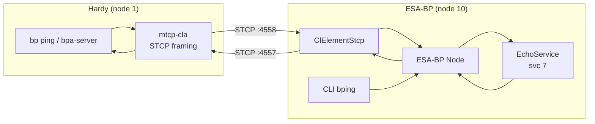

# ESA Bundle Protocol Interoperability Test

Bidirectional BPv7 bundle exchange between Hardy and ESA's
[Bundle Protocol](https://essr.esa.int/project/esa-bundle-protocol)
implementation over STCP (Simple TCP Convergence Layer).

## Quick Start

```bash
# Full build + test
./tests/interop/ESA-BP/test_esabp_ping.sh

# Skip Hardy rebuild (binaries already built)
./tests/interop/ESA-BP/test_esabp_ping.sh --skip-build

# Custom ping count
./tests/interop/ESA-BP/test_esabp_ping.sh --skip-build --count 10
```

## What the Test Does

**Test 1 — Hardy pings ESA-BP:** Hardy sends BPv7 echo requests to
`ipn:10.7` via STCP.  ESA-BP's echo service responds.  Hardy verifies
round-trip delivery and reports RTT statistics.

**Test 2 — ESA-BP pings Hardy:** ESA-BP's CLI `bping` command sends
BPv7 echo requests to `ipn:1.7` via STCP.  Hardy's echo service
responds.

## Architecture



### Test 1 — Hardy pings ESA-BP

Hardy's `bp ping` uses `mtcp-cla` (in STCP framing mode) to connect to
ESA-BP's custom STCP convergence layer element on port 4558.  ESA-BP's
`EchoService` receives bundles via gRPC from the node and echoes them
back to Hardy.

### Test 2 — ESA-BP pings Hardy

Hardy runs `hardy-bpa-server` with an echo service, and `mtcp-cla`
listening on port 4557.  ESA-BP's CLI `bping` command sends echo
requests to `ipn:1.7` through the node's STCP element.

## ESA-BP Modifications

ESA-BP's core Java binaries (`node.jar`, `cli.jar`) run **unmodified**.
Two thin integration components are compiled against the ESA-BP API
and loaded at runtime:

| Component | Purpose |
|-----------|---------|
| `ClElementStcp.java` | STCP convergence layer element — 4-byte big-endian length-prefix framing over TCP |
| `EchoService.java` | Minimal echo service — receives bundles via gRPC, echoes ADU back to source EID |

These are compiled in a Docker build stage against ESA-BP's own JARs
and loaded via the classpath at container startup.  All node
configuration (identity, routing, CL parameters) is generated
dynamically by the `start_esa_bp` entrypoint script.

### Storage configuration

ESA-BP's bundle store is pointed at `/dev/shm` (shared memory / tmpfs)
rather than disk.  ESA-BP does not offer an in-memory store
implementation, but its `BundleStoreImpl` accepts an arbitrary
`modelDir` path.  Using tmpfs avoids filesystem I/O during testing.

### Known workaround

ESA-BP's upstream Dockerfile has a `COPY` instruction missing a
trailing slash on the destination path.  The test script applies a
one-line sed fix before building the base image.

## Prerequisites

- Docker (builds the ESA-BP container images)
- Hardy `bp`, `hardy-bpa-server`, and `mtcp-cla` binaries built
- The `esa-bp` base Docker image, built from ESA's Bundle Protocol
  source distribution (not publicly available — must be obtained from
  ESA).  Build it first from the ESA source tree:

  ```bash
  cd <esa-bp-source> && docker build -t esa-bp -f docker/Dockerfile .
  ```

  The interop image layers on top via `ARG BASE_IMAGE=esa-bp`

## Configuration

| Parameter | Value | Notes |
|-----------|-------|-------|
| ESA-BP node | `ipn:10.0` | Configurable via `NODE_ID` env var |
| Hardy node | `ipn:1.0` | |
| Echo service | 7 | Standard BPv7 echo service (both sides) |
| ESA-BP STCP port | 4558 | Configurable via `STCP_LISTEN_PORT` env var |
| Hardy STCP port | 4557 | Via `mtcp-cla` config |
| TLS | Disabled | |
| BPSec | Disabled | |
| Bundle signing | Disabled | `--no-sign` |

## File Layout

```
ESA-BP/
  test_esabp_ping.sh        # Test runner
  start_esa_bp.sh            # Interactive launcher (build + run)
  docker/
    Dockerfile               # Multi-stage: compile STCP CLE + echo service against ESA-BP JARs
    start_esa_bp              # Container entrypoint (generates NODE/CL/DAEMON yml + routing table)
  stcp-cle/
    ClElementStcp.java       # STCP convergence layer element
    EchoService.java         # gRPC-based echo service
```
