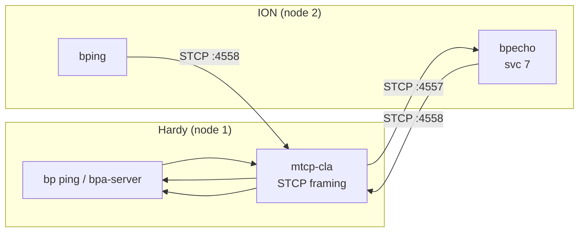

# ION Interoperability Test

Bidirectional BPv7 bundle exchange between Hardy and NASA JPL's
[ION](https://github.com/nasa/ION-DTN) implementation over STCP.

## Quick Start

```bash
# Full build + test
./tests/interop/ION/test_ion_ping.sh

# Skip Hardy rebuild
./tests/interop/ION/test_ion_ping.sh --skip-build

# Custom ping count
./tests/interop/ION/test_ion_ping.sh --skip-build --count 10
```

## What the Test Does

**Test 1 — Hardy pings ION:** Hardy sends BPv7 echo requests to
`ipn:2.7` via STCP.  ION's `bpecho` service responds.  Hardy
verifies round-trip delivery and reports RTT statistics.

**Test 2 — ION pings Hardy:** ION's `bping` tool sends BPv7 echo
requests to `ipn:1.7` via STCP.  Hardy's echo service responds.

## Architecture



Hardy uses the external `mtcp-cla` binary (in STCP framing mode) since
ION uses STCP rather than TCPCLv4.

## ION Modifications

None.  ION runs unmodified from upstream.  Configuration files are
generated by the `start_ion` entrypoint script.

ION uses SysV shared memory for its SDR (Simple Data Recorder), so
the container requires `--ipc=host` and `--privileged` flags.

## Prerequisites

- Docker (builds the ION container image)
- Hardy `bp`, `hardy-bpa-server`, and `mtcp-cla` binaries built

## Configuration

| Parameter | Value | Notes |
|-----------|-------|-------|
| ION node | `ipn:2.0` | Configurable via `NODE_ID` env var |
| Hardy node | `ipn:1.0` | |
| Echo service | 7 | Standard BPv7 echo service |
| ION STCP port | 4557 | |
| Hardy STCP port | 4558 | Via `mtcp-cla` |
| Storage | SDR in-memory | SysV shared memory (`--ipc=host`) |

## File Layout

```
ION/
  test_ion_ping.sh           # Test runner
  start_ion.sh               # Interactive launcher (build + run)
  docker/
    Dockerfile               # Multi-stage ION build from upstream
    start_ion                # Container entrypoint (generates ionrc/bprc/ipnrc configs)
```
