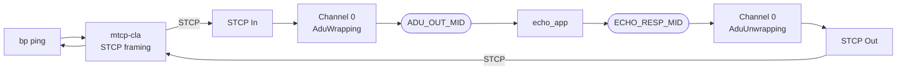
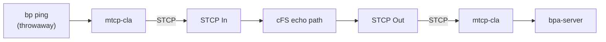

# NASA cFS BPNode Interoperability Test

Bidirectional BPv7 bundle exchange between Hardy and NASA's cFS BPNode
implementation over STCP (Simple TCP Convergence Layer).

## Quick Start

```bash
# Full build + test
./tests/interop/NASA-cFS/test_cfs_ping.sh

# Skip Hardy rebuild (binaries already built)
./tests/interop/NASA-cFS/test_cfs_ping.sh --skip-build

# Custom ping count
./tests/interop/NASA-cFS/test_cfs_ping.sh --skip-build --count 10
```

## What the Test Does

**Test 1 — Hardy pings cFS:** Hardy sends BPv7 echo requests to
`ipn:100.7` via STCP. cFS echoes them back from the same service EID.
Hardy verifies round-trip delivery and reports RTT statistics. This is
the primary interop test.

**Test 2 — cFS delivers to Hardy:** A standalone Hardy BPA server
receives echo bundles from cFS, verifying the reverse STCP path.
(Note: this test currently uses cFS-side log verification rather than
Hardy-side delivery checks — to be improved.)

## Architecture

Both tests use **Channel 0 (service 7)** for inbound and outbound,
ensuring the echo response source EID matches the pinged destination
per RFC 9171 §4.2.2.  The `echo_app` relays payloads through a second
SB message because the cFS Software Bus does not deliver messages back
to the publishing pipe.

### Test 1 — Hardy pings cFS



### Test 2 — cFS delivers to Hardy



## cFS Modifications

The Docker image builds cFS from upstream sources with the following
additions:

### New components

| Component | Purpose |
|-----------|---------|
| `stcpsock_intf/` | STCP convergence layer (PSP IODriver module) |
| `echo_app/` | SB relay for RFC 9171-compliant echo from a single service EID |

### BPNode bug fixes (candidates for upstream)

| Fix | File | Description |
|-----|------|-------------|
| ADU header stripping | `fwp_adup.c` | Completes an existing `TODO remove header` in the AduUnwrapping path |
| Table name truncation | `fwp_tablep.c` et al. | Shortens names exceeding the cFS 16-character table name limit |

### Test topology configuration

All remaining changes are table/config values pointing the test at
Hardy — no BPNode behavioural changes:

- **Contact 0** routed to Hardy (node 1, all services) instead of
  default node 200
- **Channel 0** AduWrapping/AduUnwrapping enabled, DestEID set to
  `ipn:1.128`
- **ADU proxy table** wired for echo_app relay (Channel 0 publishes
  `ADU_OUT_MID`, subscribes to `ECHO_RESP_MID`)
- **Mission config** sets PSP driver to `stcpsock_intf`
- **Startup script** includes `echo_app`; stops and restarts Channel 0
  after init to activate SB subscriptions

## Prerequisites

- Docker (builds the cFS container image)
- Hardy `bp`, `hardy-bpa-server`, and `mtcp-cla` binaries built

## File Layout

```
NASA-cFS/
  test_cfs_ping.sh          # Test runner
  start_cfs.sh              # Interactive launcher (build + run)
  docker/
    Dockerfile              # Multi-stage cFS build
    start_cfs               # Container entrypoint (init + BPNode commands)
  cfs-config/
    bpnode_mission_cfg.h    # PSP driver selection
    bpnode_adup.c           # ADU proxy echo wiring
    cfe_es_startup.scr      # App load order (includes echo_app)
    targets.cmake           # Build targets (includes echo_app)
    sch_lab_table.c         # Scheduler with BPNode wakeup
    ...                     # Other cFS platform config
  echo_app/
    CMakeLists.txt
    fsw/src/echo_app.c      # SB message relay (~40 lines)
  stcpsock_intf/
    CMakeLists.txt
    stcpsock_intf.c          # STCP PSP IODriver module
```
