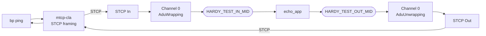
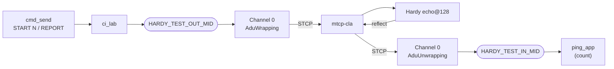

# NASA cFS BPNode Interoperability Test

Bidirectional BPv7 bundle exchange between Hardy and NASA's cFS BPNode
implementation over STCP (Simple TCP Convergence Layer).

## Quick Start

```bash
# Full build + test
./tests/interop/NASA-cFS/test_cfs_ping.sh

# Skip Hardy rebuild (binaries already built)
./tests/interop/NASA-cFS/test_cfs_ping.sh --skip-build

# Custom ping count
./tests/interop/NASA-cFS/test_cfs_ping.sh --skip-build --count 10
```

## What the Test Does

**Test 1 — Hardy pings cFS:** Hardy sends BPv7 echo requests to
`ipn:100.7` via STCP. cFS echoes them back from the same service EID.
Hardy verifies round-trip delivery and reports RTT statistics. This is
the primary interop test.

**Test 2 — cFS pings Hardy:** cFS is the originator. A `ping_app` (loaded
instead of `echo_app` via `TEST_MODE=ping`) is commanded to inject N ADUs
that Channel 0 wraps into bundles addressed to Hardy's echo service
(`ipn:1.128`). Hardy reflects each one back to `ipn:100.7`; `ping_app`
counts the replies and reports `sent`/`received` on a follow-up command.
The reverse mirror of Test 1, entirely over the software bus — no UDP
telemetry hop.

## Architecture

Both tests use **Channel 0 (service 7)** for inbound and outbound,
ensuring the response source EID matches the pinged destination per RFC
9171 §4.2.2.  A driver app bridges the Software Bus (which does not
deliver a message back to the publishing pipe): **`echo_app`** reflects
inbound ADUs in Test 1, **`ping_app`** originates and counts in Test 2.
Only one is loaded at a time — `start_cfs` picks the startup script from
the `TEST_MODE` env var (`echo`/`ping`). Both publish/subscribe the same
pair of MIDs: `HARDY_TEST_OUT_MID` (0x08A1, app→Channel 0→bundle) and
`HARDY_TEST_IN_MID` (0x08A0, Channel 0→app).

### Test 1 — Hardy pings cFS



### Test 2 — cFS pings Hardy



`ping_app` is the originator mirror of `echo_app`, reusing the same Channel 0 wiring. It is command-driven over `ci_lab` (UDP 1234):

- **START** (`--pktid=0x18A1 --cmdcode=0 --uint32=N`) → `ping_app` publishes N ADUs on `HARDY_TEST_OUT_MID`; Channel 0 wraps each into a bundle to `ipn:1.128`.
- Hardy's echo service reflects each back to the source `ipn:100.7`; Channel 0 unwraps them onto `HARDY_TEST_IN_MID`, which `ping_app` counts.
- **REPORT** (`--cmdcode=1`) → `ping_app` logs `PINGAPP: RESULT sent=X received=Y` to the cFS console; the harness asserts `received == sent == N`.

This is a count-based ping (delivery + reflection), not RTT/sequence-correlated like Test 1's `bp ping`. BPNode has no native originate (`BPNODE_PERFORM_SELF_TEST_CC` is `/* Deferred */`), hence the small app. An earlier design routed the return through `to_lab`→`tlm_recv` over UDP; `ping_app` removes that hop by counting on the bus directly.

## cFS Modifications

The Docker image builds cFS from upstream sources with the following
additions:

### New components

| Component | Purpose |
|-----------|---------|
| `stcpsock_intf/` | STCP convergence layer (PSP IODriver module) |
| `echo_app/` | SB relay for RFC 9171-compliant echo from a single service EID (Test 1) |
| `ping_app/` | SB originator that pings Hardy and counts the reflections (Test 2) |

### BPNode bug fixes (candidates for upstream)

| Fix | File | Description |
|-----|------|-------------|
| ADU header stripping | `fwp_adup.c` | Completes an existing `TODO remove header` in the AduUnwrapping path |
| Table name truncation | `fwp_tablep.c` et al. | Shortens names exceeding the cFS 16-character table name limit |

### Test topology configuration

All remaining changes are table/config values pointing the test at
Hardy — no BPNode behavioural changes:

- **Contact 0** routed to Hardy (node 1, all services) instead of
  default node 200
- **Channel 0** AduWrapping/AduUnwrapping enabled, DestEID set to
  `ipn:1.128`
- **ADU proxy table** (shared by both apps): Channel 0 publishes inbound
  ADUs on `HARDY_TEST_IN_MID`, subscribes to `HARDY_TEST_OUT_MID`
- **Mission config** sets PSP driver to `stcpsock_intf`
- **Startup scripts** — `cfe_es_startup_echo.scr` loads `echo_app`
  (Test 1), `cfe_es_startup_ping.scr` loads `ping_app` (Test 2);
  `start_cfs` selects one via the `TEST_MODE` env var. Both stop and
  restart Channel 0 after init to activate SB subscriptions

## Prerequisites

- Docker (builds the cFS container image)
- Hardy `bp`, `hardy-bpa-server`, and `mtcp-cla` binaries built

## File Layout

```
NASA-cFS/
  test_cfs_ping.sh          # Test runner
  start_cfs.sh              # Interactive launcher (build + run)
  docker/
    Dockerfile               # Multi-stage cFS build
    start_cfs                # Container entrypoint (selects startup by TEST_MODE)
  cfs-config/
    bpnode_mission_cfg.h     # PSP driver selection
    bpnode_adup.c            # Channel 0 ADU proxy wiring (shared)
    cfe_es_startup_echo.scr  # Test 1 app load order (echo_app)
    cfe_es_startup_ping.scr  # Test 2 app load order (ping_app)
    targets.cmake            # Build targets (echo_app + ping_app)
    sch_lab_table.c          # Scheduler with BPNode wakeup
    ...                      # Other cFS platform config
  echo_app/
    CMakeLists.txt
    fsw/src/echo_app.c       # SB relay — reflects (Test 1)
  ping_app/
    CMakeLists.txt
    fsw/src/ping_app.c       # SB originator — pings + counts (Test 2)
  stcpsock_intf/
    CMakeLists.txt
    stcpsock_intf.c          # STCP PSP IODriver module
```
