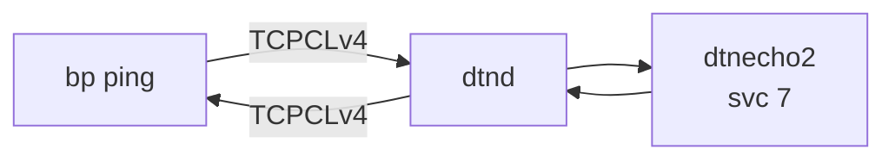
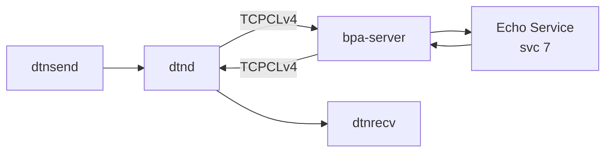

# dtn7-rs Interoperability Test

Bidirectional BPv7 bundle exchange between Hardy and
[dtn7-rs](https://github.com/dtn7/dtn7-rs) over TCPCLv4.

## Quick Start

```bash
# Full build + test
./tests/interop/dtn7-rs/test_dtn7rs_ping.sh

# Skip Hardy rebuild
./tests/interop/dtn7-rs/test_dtn7rs_ping.sh --skip-build

# Custom ping count
./tests/interop/dtn7-rs/test_dtn7rs_ping.sh --skip-build --count 10
```

## What the Test Does

**Test 1 — Hardy pings dtn7-rs:** Hardy sends BPv7 echo requests to
`ipn:23.7` via TCPCLv4.  dtn7-rs's `dtnecho2` service responds.
Hardy verifies round-trip delivery and reports RTT statistics.

**Test 2 — dtn7-rs pings Hardy:** dtn7-rs sends bundles to `ipn:1.7`
via TCPCLv4.  Hardy's echo service responds.  Verified via dtn7-rs's
`dtnsend`/`dtnrecv` tools.

## Architecture

### Test 1 — Hardy pings dtn7-rs



### Test 2 — dtn7-rs pings Hardy



## dtn7-rs Modifications

None.  dtn7-rs runs unmodified from upstream.

### Storage configuration

dtn7-rs working directory is set to `/dev/shm/dtn7` (tmpfs) to avoid
disk I/O during benchmarks.

## Prerequisites

- Docker (builds the dtn7-rs container image)
- Hardy `bp` and `hardy-bpa-server` binaries built

## Configuration

| Parameter | Value | Notes |
|-----------|-------|-------|
| dtn7-rs node | `ipn:23.0` | Configurable via `NODE_ID` env var |
| Hardy node | `ipn:1.0` | |
| Echo service | 7 | Standard BPv7 echo service |
| TCPCLv4 port | 4556 | IANA standard; used by dtn7-rs in Test 1, Hardy in Test 2 |
| TLS | Disabled | |
| Bundle signing | Disabled | `--no-sign` |

## File Layout

```
dtn7-rs/
  test_dtn7rs_ping.sh       # Test runner
  start_dtn7rs.sh            # Interactive launcher (build + run)
  docker/
    Dockerfile               # Multi-stage dtn7-rs build from upstream
    start_dtnd               # Container entrypoint
```
