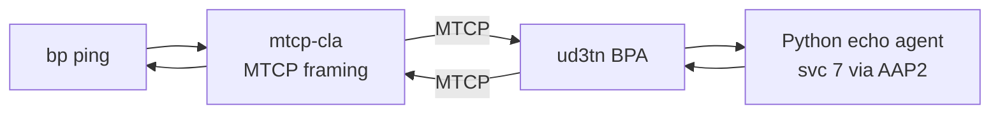
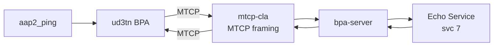

# ud3tn / D3TN Interoperability Test

Bidirectional BPv7 bundle exchange between Hardy and
[ud3tn](https://gitlab.com/d3tn/ud3tn) (by D3TN GmbH) over MTCP.

## Quick Start

```bash
# Full build + test
./tests/interop/ud3tn/test_ud3tn_ping.sh

# Skip Hardy rebuild
./tests/interop/ud3tn/test_ud3tn_ping.sh --skip-build

# Custom ping count
./tests/interop/ud3tn/test_ud3tn_ping.sh --skip-build --count 10
```

## What the Test Does

**Test 1 — Hardy pings ud3tn:** Hardy sends BPv7 echo requests to
`ipn:2.7` via MTCP.  A custom Python echo agent on ud3tn responds.
Hardy verifies round-trip delivery and reports RTT statistics.

**Test 2 — ud3tn pings Hardy:** ud3tn's `aap2_ping` tool sends BPv7
echo requests to `ipn:1.7` via MTCP.  Hardy's echo service responds.

## Architecture

### Test 1 — Hardy pings ud3tn



### Test 2 — ud3tn pings Hardy



Hardy uses the external `mtcp-cla` binary since ud3tn uses MTCP rather
than TCPCLv4.

## ud3tn Modifications

None.  ud3tn runs unmodified from upstream.

ud3tn does not ship a built-in echo service.  The test implements a
minimal Python echo agent using ud3tn's AAP2 (Application Agent
Protocol v2) API.  The agent receives bundles on service 7 and echoes
them back to the source EID.

### Storage

ud3tn uses in-memory bundle storage (no disk persistence).

## Prerequisites

- Docker (builds the ud3tn container image)
- Hardy `bp`, `hardy-bpa-server`, and `mtcp-cla` binaries built

## Configuration

| Parameter | Value | Notes |
|-----------|-------|-------|
| ud3tn node | `ipn:2.0` | |
| Hardy node | `ipn:1.0` | |
| Echo service | 7 | Python AAP2 echo agent |
| ud3tn MTCP port | 4557 | |
| Hardy MTCP port | 4558 | Via `mtcp-cla` |
| ud3tn AAP2 port | 4243 | Agent registration API |

## File Layout

```
ud3tn/
  test_ud3tn_ping.sh         # Test runner
  start_ud3tn.sh             # Interactive launcher (build + run)
  docker/
    Dockerfile               # ud3tn build from upstream GitLab
    start_ud3tn              # Container entrypoint
```
