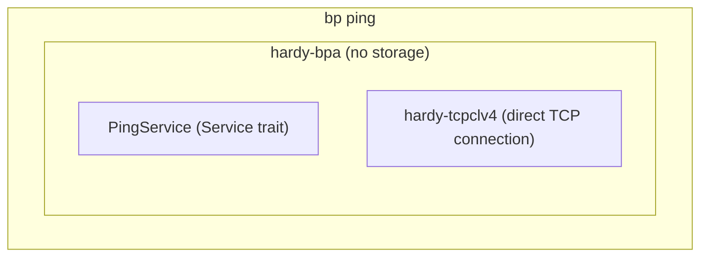

# hardy-tools Design

Command-line diagnostic and testing tools for Bundle Protocol networks.

## Design Goals

- **Self-contained operation.** Operate independently without requiring a full BPA deployment. The tools embed minimal BPA functionality with no persistent storage, enabling quick connectivity tests without infrastructure setup.

- **Network diagnostics.** Measure round-trip times and verify end-to-end connectivity for troubleshooting. Provides IP ping-style statistics (min/avg/max/stddev RTT and packet loss percentage) that network operators expect.

- **Path visibility.** When status reports are available, display the bundle's path through the network with timing at each hop. This reveals store-and-forward delays and helps identify where bundles are being dropped.

- **Round-trip integrity by default.** Each reflected payload is compared byte-for-byte against what was sent, detecting corruption in transit. This needs no key management and works against any conformant echo, which is not required to reflect BPSec blocks.

- **Interoperability.** Compatible with any "dumb reflector" echo service that preserves payloads unchanged. No special protocol or coordination required with the echo endpoint.

## Architecture Overview

The `bp` binary embeds a minimal BPA and TCPCLv4 CLA:



This architecture enables testing without deploying a full BPA server. The BPA has no storage backend - bundles exist only transiently during the ping operation.

## Key Design Decisions

### Embedded BPA Rather Than Client

The tool embeds a full BPA rather than acting as a client to an external BPA. This avoids deployment complexity - users can test connectivity without configuring a server. The BPA handles all bundle processing, routing, and CLA integration internally.

An alternative would be to connect to a running BPA via an API, but this would require:

- A running BPA instance
- An administrative interface to inject test bundles
- Coordination between the client and server for statistics

The embedded approach trades code reuse for operational simplicity.

### Service Trait for Raw Bundle Access

The ping service implements `Service` rather than `Application`. The `Application` trait provides a higher-level ADU (Application Data Unit) interface, but ping needs raw bundle access for:

- Payload extraction and byte-for-byte round-trip comparison
- Administrative-record (status report) parsing
- Full control over bundle structure and flags

### Local RTT Calculation

RTT is calculated using locally stored timestamps, not payload timestamps:

```
RTT = receive_time - sent_times[sequence_number]
```

This approach requires no clock synchronization between nodes and avoids serialization overhead in measurements. The alternative of embedding timestamps in the payload would require synchronized clocks and add parsing overhead to the critical measurement path.

### Round-Trip Integrity

The client retains the payload it sent for each sequence number and compares it byte-for-byte against the payload reflected by the echo. Any mismatch is counted as a corrupted response. This needs no BPSec, no per-bundle key, and no clock synchronization, and it works against any echo that reflects the payload unchanged — as the echo-service draft (`draft-taylor-dtn-echo-service`) requires. The draft does not require an echo to reflect BPSec blocks, so a BIB-based check would fail against conformant foreign echoes; local comparison does not.

The `--no-payload-crc` option is orthogonal: it disables the CRC on the payload block (keeping it on the primary block) to work around DTNME, which rejects bundles on payload-CRC validation failure despite not validating the CRC itself.

### Status Report Path Tracking

When status reports are enabled on the network, the ping tool collects them to build a picture of the bundle's path. Each status report type provides different information:

- **Received**: The node received the bundle
- **Forwarded**: The node passed the bundle to the next hop
- **Delivered**: The bundle reached its destination
- **Deleted**: The bundle was dropped (with reason code)

The time gap between "received" and "forwarded" at a node reveals store-and-forward delay, which is valuable in DTN networks where bundles may be held for extended periods waiting for contact opportunities.

On successful reply, the path is displayed with all status times:

```
path: ipn:3.0 (rcv 230ms, fwd 234ms) -> ipn:4.0 (rcv 450ms, fwd 456ms) -> ipn:2.7 (dlv 567ms)
```

For lost bundles (no reply received), the summary shows the last known location based on status reports received. This helps diagnose where bundles are being dropped or delayed. Note that status reporting is off by default on most BPA implementations, so this information may not always be available.

### Dumb Echo, Smart Client

Per the Bundle Protocol ping design principles, all intelligence belongs in the client:

- The echo service is a simple reflector that preserves payloads unchanged
- RTT calculation, statistics, and validation are client-side
- Session disambiguation uses unique endpoint IDs (not payload fields)

This design enables interoperability with any conformant echo service without coordination.

### Bundle Lifetime Calculation

Bundle lifetime is calculated from session parameters rather than using a fixed default. For finite ping sessions (`-c N`), the lifetime covers the entire session plus wait time. For infinite sessions, the timeout or a reasonable default (5 minutes) is used.

A 1-day default lifetime would cause bundles to persist in the network long after the ping session ended, wasting network resources and potentially causing confusion with status reports.

## Integration

### With hardy-bpa

The tool instantiates a `Bpa` with minimal configuration and no storage backend. Routes are added dynamically for the ping destination. Status reports are always requested; the receiver decides whether to generate them.

### With hardy-tcpclv4

TCPCLv4 is embedded for direct peer connection. The tool establishes a single connection to the specified peer address, sends ping bundles, and receives responses. TLS is supported via `--tls-insecure` and `--tls-ca` options.

### With hardy-bpv7

Uses the `Service` trait for raw bundle access: payload extraction, administrative-record (status report) parsing, and round-trip payload comparison. Bundle construction via `builder::Builder` with optional HopCount extension blocks.

## Standards Compliance

The echo-service draft (`draft-taylor-dtn-echo-service`) defines no payload wire format — the echo reflects the payload unchanged and never parses it. The structure below is the client's own internal format, carried only so responses can be matched to requests and to pad for MTU probing:

```cbor
[
  <sequence>,     // uint: Monotonically increasing counter
  <options>       // map: Optional fields (padding for MTU testing)
]
```

This format is compact (3 bytes minimum), self-describing, and extensible for future options.

The HopCount extension block (`--ttl` option) follows RFC 9171 Section 4.3, providing functionality analogous to IP TTL for limiting bundle propagation.

## Echo Service Interoperability

The ping tool works with any "dumb reflector" echo service that preserves payloads unchanged:

| Echo Service | Compatible | Notes |
|--------------|------------|-------|
| Hardy `echo-service` | Yes | Reference implementation |
| HDTN echo | Yes | Validated interoperability |
| dtn7-rs `dtnecho2` | Yes | Verified reflector |
| uD3TN `aap_echo` | Yes | Verified reflector |
| ION `bpecho` | **Partial** | Returns fixed response; breaks payload verification |
